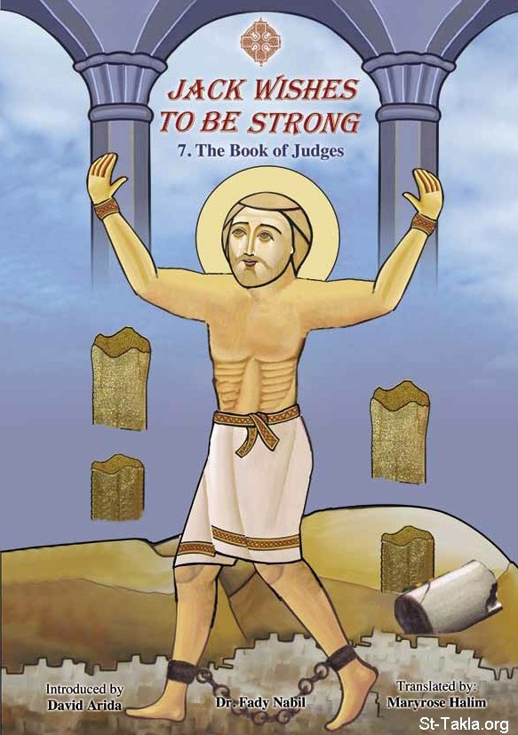

# جاك يريد أن يكون قويًا! 7: سفر القضاة للأطفال

**المؤلف / Author:** د. فادي نبيل
**المصدر / Source:** [st-takla.org](https://st-takla.org/books/fady-nabil/jack-wishes-to-be-strong-7-judges/index.html)
**الموضوعات / Topics:** —

📘 **[Download EPUB / تحميل الكتاب](jack-wishes-to-be-strong-7-judges.epub)**

## نبذة

نشكر د. فادي نبيل (المؤلف) و القمص تادرس يعقوب ملطي (الناشر) على السماح لنا في موقع الأنبا تكلا هيمانوت بوضع هذا الكتاب هنا. وهو مكتوب في صيغة قصة حوارية، ومناسب للأطفال من سن ابتدائي وإعدادي.

## الفصول / Chapters (6)

1. [مقدمة](chapters/01-introduction/)
2. [عيد ميلاد جاك الثامن](chapters/02-8th-birthday/)
3. [قصة سفر القضاة](chapters/03-judges/)
4. [دبورة القاضية والنبية](chapters/04-deborah/)
5. [جدعون القاضي](chapters/05-gideon/)
6. [شمشون القاضي](chapters/06-samson/)

---
*هذا الكتاب مجاني للنشر والتوزيع لخلاص كل نفس. This book is free to share and distribute for the salvation of every soul.*
