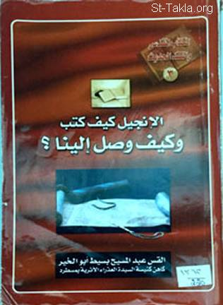

# الإنجيل كيف كتب؟ وكيف وصل إلينا؟

**المؤلف / Author:** القمص عبد المسيح بسيط أبو الخير
**المصدر / Source:** [st-takla.org](https://st-takla.org/Full-Free-Coptic-Books/FreeCopticBooks-012-Father-Abdel-Messih-Basiet-Abo-El-Kheir/006-Al-Engil-Kayfa-Koteb/The-Holy-Bible_Writing-n-Reaching-Us__000-index.html)
**الموضوعات / Topics:** —

📘 **[Download EPUB / تحميل الكتاب](al-engil-kayfa-koteb.epub)**

## نبذة

نشكر قدس أبونا القمص عبد المسيح بسيط أبو الخير على سماحه لنا في موقع الأنبا تكلاهيمانوت بوضع هذا الكتاب هنا. وهو من سلسلة "الكتاب المقدس والنقد الحديث" (3).

## الفصول / Chapters (105)

1. [الإنجيل: كيف كتب؟ وكيف وصل إلينا؟](chapters/01-The-Holy-Bible_Writing-n-Reaching-Us__001-intro/)
2. [الإنجيل ونوع الوحي فيه - كتاب الإنجيل: كيف كتب؟ وكيف وصل إلينا؟](chapters/02-The-Holy-Bible_Writing-n-Reaching-Us__002-Inspiration-1/)
3. [الوحي والسيد المسيح - كتاب الإنجيل: كيف كتب؟ وكيف وصل إلينا؟](chapters/03-The-Holy-Bible_Writing-n-Reaching-Us__003-Jesus/)
4. [الإنجيل، جوهره ومضمونه - كتاب الإنجيل: كيف كتب؟ وكيف وصل إلينا؟](chapters/04-The-Holy-Bible_Writing-n-Reaching-Us__004-Core/)
5. [آلام المسيح وصلبه وقيامته: جوهر البشارة - كتاب الإنجيل: كيف كتب؟ وكيف وصل إلينا؟](chapters/05-The-Holy-Bible_Writing-n-Reaching-Us__005-Passion-n-Resurrection/)
6. [إعلان الآب في الابن - كتاب الإنجيل: كيف كتب؟ وكيف وصل إلينا؟](chapters/06-The-Holy-Bible_Writing-n-Reaching-Us__006-The-Father-1/)
7. [إعلان الله في الابن هو الإعلان النهائي - كتاب الإنجيل: كيف كتب؟ وكيف وصل إلينا؟](chapters/07-The-Holy-Bible_Writing-n-Reaching-Us__007-The-Father-2/)
8. [إعلان الآب في الابن هو إعلان النسل الآتي - كتاب الإنجيل: كيف كتب؟ وكيف وصل إلينا؟](chapters/08-The-Holy-Bible_Writing-n-Reaching-Us__008-The-Father-3/)
9. [إعلان الآب في الابن هو إعلان المسيح المُنتَظَر - كتاب الإنجيل: كيف كتب؟ وكيف وصل إلينا؟](chapters/09-The-Holy-Bible_Writing-n-Reaching-Us__009-Messiah/)
10. [توالي النبوات عن المسيح - كتاب الإنجيل: كيف كتب؟ وكيف وصل إلينا؟](chapters/10-The-Holy-Bible_Writing-n-Reaching-Us__010-Prophecies/)
11. [إعلان الابن هو إعلان العهد الجديد - كتاب الإنجيل: كيف كتب؟ وكيف وصل إلينا؟](chapters/11-The-Holy-Bible_Writing-n-Reaching-Us__011-The-Son/)
12. [ملكوت الله في العهد القديم - كتاب الإنجيل: كيف كتب؟ وكيف وصل إلينا؟](chapters/12-The-Holy-Bible_Writing-n-Reaching-Us__012-OT-Heaven/)
13. [ملكوت الله في العهد الجديد - كتاب الإنجيل: كيف كتب؟ وكيف وصل إلينا؟](chapters/13-The-Holy-Bible_Writing-n-Reaching-Us__013-NT-Heaven/)
14. [تأسيس الملكوت والكنيسة - كتاب الإنجيل: كيف كتب؟ وكيف وصل إلينا؟](chapters/14-The-Holy-Bible_Writing-n-Reaching-Us__014-Church/)
15. [ملكوت الله في الحاضر وفي الدهر الآتي - كتاب الإنجيل: كيف كتب؟ وكيف وصل إلينا؟](chapters/15-The-Holy-Bible_Writing-n-Reaching-Us__015-Heaven/)
16. [أبناء الملكوت والعالم الحاضر - كتاب الإنجيل: كيف كتب؟ وكيف وصل إلينا؟](chapters/16-The-Holy-Bible_Writing-n-Reaching-Us__016-Men/)
17. [دخول ملكوت الله - كتاب الإنجيل: كيف كتب؟ وكيف وصل إلينا؟](chapters/17-The-Holy-Bible_Writing-n-Reaching-Us__017-Entering-Kingdom/)
18. [المعمودية، وظهور ملكوت الله وانتشاره - كتاب الإنجيل: كيف كتب؟ وكيف وصل إلينا؟](chapters/18-The-Holy-Bible_Writing-n-Reaching-Us__018-Baptism/)
19. [أعمال السيد المسيح، وظهور ملكوت الله وانتشاره - كتاب الإنجيل: كيف كتب؟ وكيف وصل إلينا؟](chapters/19-The-Holy-Bible_Writing-n-Reaching-Us__019-Jesus-Works/)
20. [التجلي وظهور ملكوت الله - كتاب الإنجيل: كيف كتب؟ وكيف وصل إلينا؟](chapters/20-The-Holy-Bible_Writing-n-Reaching-Us__020-Transfiguration/)
21. [ظهور ملكوت الله في الصليب والقيامة - كتاب الإنجيل: كيف كتب؟ وكيف وصل إلينا؟](chapters/21-The-Holy-Bible_Writing-n-Reaching-Us__021-Cross/)
22. [حلول الروح القدس وانتشار الملكوت - كتاب الإنجيل: كيف كتب؟ وكيف وصل إلينا؟](chapters/22-The-Holy-Bible_Writing-n-Reaching-Us__022-Penekost/)
23. [تلاميذ المسيح ورسله: حَمْل الإعلان وشهود المسيح للعالم أجمع - كتاب الإنجيل: كيف كتب؟ وكيف وصل إلينا؟](chapters/23-The-Holy-Bible_Writing-n-Reaching-Us__023-Proclamation/)
24. [التلاميذ - كتاب الإنجيل: كيف كتب؟ وكيف وصل إلينا؟](chapters/24-The-Holy-Bible_Writing-n-Reaching-Us__024-Disciples/)
25. [الرسل - كتاب الإنجيل: كيف كتب؟ وكيف وصل إلينا؟](chapters/25-The-Holy-Bible_Writing-n-Reaching-Us__025-Apostles/)
26. [بولس الرسول - كتاب الإنجيل: كيف كتب؟ وكيف وصل إلينا؟](chapters/26-The-Holy-Bible_Writing-n-Reaching-Us__026-St-Paul/)
27. [وحدة الرسل في الإعلان مع الآب والابن - كتاب الإنجيل: كيف كتب؟ وكيف وصل إلينا؟](chapters/27-The-Holy-Bible_Writing-n-Reaching-Us__027-Father-n-Son/)
28. [عمل الروح القدس وقيادته للكنيسة - كتاب الإنجيل: كيف كتب؟ وكيف وصل إلينا؟](chapters/28-The-Holy-Bible_Writing-n-Reaching-Us__028-Holy-Spirit/)
29. [حلول الروح القدس في الكنيسة - كتاب الإنجيل: كيف كتب؟ وكيف وصل إلينا؟](chapters/29-The-Holy-Bible_Writing-n-Reaching-Us__029-Church/)
30. [الرسل شهود المسيح للبشرية - كتاب الإنجيل: كيف كتب؟ وكيف وصل إلينا؟](chapters/30-The-Holy-Bible_Writing-n-Reaching-Us__030-Human/)
31. [الرسل والسلطان الرسولي الممنوح لهم - كتاب الإنجيل: كيف كتب؟ وكيف وصل إلينا؟](chapters/31-The-Holy-Bible_Writing-n-Reaching-Us__031-Power/)
32. [الإنجيل الشفوي والتسليم الرسولي - كتاب الإنجيل: كيف كتب؟ وكيف وصل إلينا؟](chapters/32-The-Holy-Bible_Writing-n-Reaching-Us__032-Written/)
33. [الرسل شهود عيان - كتاب الإنجيل: كيف كتب؟ وكيف وصل إلينا؟](chapters/33-The-Holy-Bible_Writing-n-Reaching-Us__033-Eye-Witnesses/)
34. [التسليم الرسولي](chapters/34-The-Holy-Bible_Writing-n-Reaching-Us__034-El-Takleed/)
35. [اللغة التي سلَّم بها الرسل التسليم الرسولي - كتاب الإنجيل: كيف كتب؟ وكيف وصل إلينا؟](chapters/35-The-Holy-Bible_Writing-n-Reaching-Us__035-Language/)
36. [جوهر التسليم الرسولي](chapters/36-The-Holy-Bible_Writing-n-Reaching-Us__036-Good-News/)
37. [كرازة بطرس الرسول](chapters/37-The-Holy-Bible_Writing-n-Reaching-Us__037-St-Peter/)
38. [كرازة بولس الرسول](chapters/38-The-Holy-Bible_Writing-n-Reaching-Us__038-St-Paul-Keraza/)
39. [الخطوط العامة في رسائل بولس الرسول عن السيد المسيح - كتاب الإنجيل: كيف كتب؟ وكيف وصل إلينا؟](chapters/39-The-Holy-Bible_Writing-n-Reaching-Us__039-El-Bules-Messages/)
40. [من التسليم الرسولي الشفوي إلى الإنجيل - كتاب الإنجيل: كيف كتب؟ وكيف وصل إلينا؟](chapters/40-The-Holy-Bible_Writing-n-Reaching-Us__040-Oral-to/)
41. [الحاجة إلى الإنجيل المكتوب - كتاب الإنجيل: كيف كتب؟ وكيف وصل إلينا؟](chapters/41-The-Holy-Bible_Writing-n-Reaching-Us__041-Writting-1/)
42. [رسائل العهد الجديد - كتاب الإنجيل: كيف كتب؟ وكيف وصل إلينا؟](chapters/42-The-Holy-Bible_Writing-n-Reaching-Us__042-Letters/)
43. [تدوين الإنجيل - كتاب الإنجيل: كيف كتب؟ وكيف وصل إلينا؟](chapters/43-The-Holy-Bible_Writing-n-Reaching-Us__043-Writting-2/)
44. [مصداقية الإنجيل بأوجهه الأربعة - كتاب الإنجيل: كيف كتب؟ وكيف وصل إلينا؟](chapters/44-The-Holy-Bible_Writing-n-Reaching-Us__044-4-Gospels/)
45. [وحدة الإنجيل في كل أسفار العهد الجديد - كتاب الإنجيل: كيف كتب؟ وكيف وصل إلينا؟](chapters/45-The-Holy-Bible_Writing-n-Reaching-Us__045-NT/)
46. [الأناجيل الثلاثة الأولى المتفقة - كتاب الإنجيل: كيف كتب؟ وكيف وصل إلينا؟](chapters/46-The-Holy-Bible_Writing-n-Reaching-Us__046-3-Gospels/)
47. [الاتفاق العام للإنجيل بأوجهه الأربعة - كتاب الإنجيل: كيف كتب؟ وكيف وصل إلينا؟](chapters/47-The-Holy-Bible_Writing-n-Reaching-Us__047-Similarity-4/)
48. [الاتفاق العام للإنجيل بأوجهه الثلاثة - كتاب الإنجيل: كيف كتب؟ وكيف وصل إلينا؟](chapters/48-The-Holy-Bible_Writing-n-Reaching-Us__048-Similarity-3/)
49. [اتفاقات وتماثل بين إنجيلين فقط - كتاب الإنجيل: كيف كتب؟ وكيف وصل إلينا؟](chapters/49-The-Holy-Bible_Writing-n-Reaching-Us__049-Similarity-2/)
50. [ما يتفق فيه إنجيل متى وإنجيل لوقا - كتاب الإنجيل: كيف كتب؟ وكيف وصل إلينا؟](chapters/50-The-Holy-Bible_Writing-n-Reaching-Us__050-Mathew-Luke/)
51. [ما يتفق فيه إنجيل متى وإنجيل مرقس - كتاب الإنجيل: كيف كتب؟ وكيف وصل إلينا؟](chapters/51-The-Holy-Bible_Writing-n-Reaching-Us__051-Mathew-Mark/)
52. [ما يتفق فيه إنجيل مرقس وإنجيل لوقا - كتاب الإنجيل: كيف كتب؟ وكيف وصل إلينا؟](chapters/52-The-Holy-Bible_Writing-n-Reaching-Us__052-Marc-Luke/)
53. [ما دوَّنه وتميَّز به كل إنجيل وحده - كتاب الإنجيل: كيف كتب؟ وكيف وصل إلينا؟](chapters/53-The-Holy-Bible_Writing-n-Reaching-Us__053-Marks-1/)
54. [ما دونه إنجيل مرقس وحده - كتاب الإنجيل: كيف كتب؟ وكيف وصل إلينا؟](chapters/54-The-Holy-Bible_Writing-n-Reaching-Us__054-Marks-2-Marc/)
55. [ما دونه إنجيل متى وحده - كتاب الإنجيل: كيف كتب؟ وكيف وصل إلينا؟](chapters/55-The-Holy-Bible_Writing-n-Reaching-Us__055-Marks-3-Matta/)
56. [ما دونه إنجيل لوقا وحده - كتاب الإنجيل: كيف كتب؟ وكيف وصل إلينا؟](chapters/56-The-Holy-Bible_Writing-n-Reaching-Us__056-Marks-4-Loka/)
57. [تقييم مدى ما اتفق فيه الإنجيليون وما تميز به كل واحد منهم بالأقسام والأعداد والكلمات - كتاب الإنجيل: كيف كتب؟ وكيف وصل إلينا؟](chapters/57-The-Holy-Bible_Writing-n-Reaching-Us__057-Evaluation-1/)
58. [التقييم بالأقسام - كتاب الإنجيل: كيف كتب؟ وكيف وصل إلينا؟](chapters/58-The-Holy-Bible_Writing-n-Reaching-Us__058-Evaluation-2-Sections/)
59. [التقييم بالأعداد - كتاب الإنجيل: كيف كتب؟ وكيف وصل إلينا؟](chapters/59-The-Holy-Bible_Writing-n-Reaching-Us__059-Evaluation-3-Numbers/)
60. [التقييم بالكلمات - كتاب الإنجيل: كيف كتب؟ وكيف وصل إلينا؟](chapters/60-The-Holy-Bible_Writing-n-Reaching-Us__060-Evaluation-4-Words/)
61. [نتائج التقييم بالأقسام والأعداد والكلمات - كتاب الإنجيل: كيف كتب؟ وكيف وصل إلينا؟](chapters/61-The-Holy-Bible_Writing-n-Reaching-Us__061-Evaluation-5-Results/)
62. [نظريات وافتراضات لتبرير الاتفاق والتمييز بين الأناجيل - كتاب الإنجيل: كيف كتب؟ وكيف وصل إلينا؟](chapters/62-The-Holy-Bible_Writing-n-Reaching-Us__062-Theories/)
63. [حقائق بين اتفاق وتميز الأناجيل - كتاب الإنجيل: كيف كتب؟ وكيف وصل إلينا؟](chapters/63-The-Holy-Bible_Writing-n-Reaching-Us__063-Facts/)
64. [وحي الإنجيل - كتاب الإنجيل: كيف كتب؟ وكيف وصل إلينا؟](chapters/64-The-Holy-Bible_Writing-n-Reaching-Us__064-Inspiration-2/)
65. [قانونية العهد الجديد - كتاب الإنجيل: كيف كتب؟ وكيف وصل إلينا؟](chapters/65-The-Holy-Bible_Writing-n-Reaching-Us__065-Legality/)
66. [شهادة الآباء الرسوليين لوحي الإنجيل وقانونيّته - كتاب الإنجيل: كيف كتب؟ وكيف وصل إلينا؟](chapters/66-The-Holy-Bible_Writing-n-Reaching-Us__066-Testimony-Apostolic-Fathers/)
67. [شهادة القديس إكليمندس الروماني لوحي الإنجيل - كتاب الإنجيل: كيف كتب؟ وكيف وصل إلينا؟](chapters/67-The-Holy-Bible_Writing-n-Reaching-Us__067-Testimony-St-Clement-Roman/)
68. [شهادة القديس أغناطيوس الأنطاكي لوحي الإنجيل - كتاب الإنجيل: كيف كتب؟ وكيف وصل إلينا؟](chapters/68-The-Holy-Bible_Writing-n-Reaching-Us__068-Testimony-St-Aghnatios-of-Antioch/)
69. [شهادة القديس بوليكاربوس أسقف أزمير لوحي الإنجيل - كتاب الإنجيل: كيف كتب؟ وكيف وصل إلينا؟](chapters/69-The-Holy-Bible_Writing-n-Reaching-Us__069-Testimony-St-Policarb-of-Azmir/)
70. [شهادة الديداكية (تعليم الرسل الإثنى عشر) لوحي الإنجيل - كتاب الإنجيل: كيف كتب؟ وكيف وصل إلينا؟](chapters/70-The-Holy-Bible_Writing-n-Reaching-Us__070-Testimony-Dediach/)
71. [شهادة رسالة برنابا لوحي الإنجيل - كتاب الإنجيل: كيف كتب؟ وكيف وصل إلينا؟](chapters/71-The-Holy-Bible_Writing-n-Reaching-Us__071-Testimony-Barnabas-Epistle/)
72. [شهادة رسالة إكليمندس الثانية لوحي الإنجيل - كتاب الإنجيل: كيف كتب؟ وكيف وصل إلينا؟](chapters/72-The-Holy-Bible_Writing-n-Reaching-Us__072-Testimony-Clement-Letter-II/)
73. [شهادة الهراطقة لوحي الإنجيل - كتاب الإنجيل: كيف كتب؟ وكيف وصل إلينا؟](chapters/73-The-Holy-Bible_Writing-n-Reaching-Us__073-Testimony-Heresies/)
74. [شهادة آباء الكنيسة في القرن الثاني لوحي الإنجيل - كتاب الإنجيل: كيف كتب؟ وكيف وصل إلينا؟](chapters/74-The-Holy-Bible_Writing-n-Reaching-Us__074-Testimony-2nd-Century/)
75. [شهادة القديس بابياس أسقف هيرابوليس لوحي الإنجيل - كتاب الإنجيل: كيف كتب؟ وكيف وصل إلينا؟](chapters/75-The-Holy-Bible_Writing-n-Reaching-Us__075-Testimony-St-Papias-of-Hirapolis/)
76. [شهادة الشهيد يوستينوس لوحي الإنجيل - كتاب الإنجيل: كيف كتب؟ وكيف وصل إلينا؟](chapters/76-The-Holy-Bible_Writing-n-Reaching-Us__076-Testimony-St-Yosteenos/)
77. [شهادة تاتيان السوري لوحي الإنجيل - كتاب الإنجيل: كيف كتب؟ وكيف وصل إلينا؟](chapters/77-The-Holy-Bible_Writing-n-Reaching-Us__077-Testimony-St-Tatian-the-Syrian/)
78. [شهادة الوثيقة الموراتورية لوحي الإنجيل - كتاب الإنجيل: كيف كتب؟ وكيف وصل إلينا؟](chapters/78-The-Holy-Bible_Writing-n-Reaching-Us__078-Testimony-The-Moratorian-Document/)
79. [شهادة كتابات قادة الهراطقة الغنوسيين لوحي الإنجيل - كتاب الإنجيل: كيف كتب؟ وكيف وصل إلينا؟](chapters/79-The-Holy-Bible_Writing-n-Reaching-Us__079-Gnostic-Heretics/)
80. [شهادة آباء الكنيسة في القرنين الثاني والثالث لوحي الإنجيل - كتاب الإنجيل: كيف كتب؟ وكيف وصل إلينا؟](chapters/80-The-Holy-Bible_Writing-n-Reaching-Us__080-Testimony-2nd-n-3rd-Centuries/)
81. [شهادة القديس إيريناؤس أسقف ليون لوحي الإنجيل - كتاب الإنجيل: كيف كتب؟ وكيف وصل إلينا؟](chapters/81-The-Holy-Bible_Writing-n-Reaching-Us__081-Testimony-St-Ireneos-of-Lion/)
82. [شهادة القديس إكليمندس الإسكندري لوحي الإنجيل - كتاب الإنجيل: كيف كتب؟ وكيف وصل إلينا؟](chapters/82-The-Holy-Bible_Writing-n-Reaching-Us__082-Testimony-St-Eklimondos-of-Alexadria/)
83. [شهادة العلامة ترتليانوس لوحي الإنجيل - كتاب الإنجيل: كيف كتب؟ وكيف وصل إلينا؟](chapters/83-The-Holy-Bible_Writing-n-Reaching-Us__083-Testimony-Tertelian/)
84. [شهادة هيبوليتوس الكاهن لوحي الإنجيل - كتاب الإنجيل: كيف كتب؟ وكيف وصل إلينا؟](chapters/84-The-Holy-Bible_Writing-n-Reaching-Us__084-Testimony-Priest-Hipolitos/)
85. [شهادة العلامة أوريجينوس لوحي الإنجيل - كتاب الإنجيل: كيف كتب؟ وكيف وصل إلينا؟](chapters/85-The-Holy-Bible_Writing-n-Reaching-Us__085-Testimony-Origanos/)
86. [شهادة يوسابيوس القيصري لوحي الإنجيل - كتاب الإنجيل: كيف كتب؟ وكيف وصل إلينا؟](chapters/86-The-Holy-Bible_Writing-n-Reaching-Us__086-Testimony-Yousabios-of-Caisareya/)
87. [شهادة القديس أثناسيوس الرسولي لوحي الإنجيل - كتاب الإنجيل: كيف كتب؟ وكيف وصل إلينا؟](chapters/87-The-Holy-Bible_Writing-n-Reaching-Us__087-Testimony-St-Athnasios-of-Alex/)
88. [القديس متى وإنجيله - كتاب الإنجيل: كيف كتب؟ وكيف وصل إلينا؟](chapters/88-The-Holy-Bible_Writing-n-Reaching-Us__088-Mathew-Gospel/)
89. [القديس متى هو كاتب الأنجيل الأول - كتاب الإنجيل: كيف كتب؟ وكيف وصل إلينا؟](chapters/89-The-Holy-Bible_Writing-n-Reaching-Us__089-Mathew-Gospel-Writter/)
90. [عالمية إنجيل متى - كتاب الإنجيل: كيف كتب؟ وكيف وصل إلينا؟](chapters/90-The-Holy-Bible_Writing-n-Reaching-Us__090-Mathew-Gospel-International/)
91. [إنجيل متى الآرامي واليوناني - كتاب الإنجيل: كيف كتب؟ وكيف وصل إلينا؟](chapters/91-The-Holy-Bible_Writing-n-Reaching-Us__091-Mathew-Gospel-Languages/)
92. [أهم مخطوطات الإنجيل للقديس متى - كتاب الإنجيل: كيف كتب؟ وكيف وصل إلينا؟](chapters/92-The-Holy-Bible_Writing-n-Reaching-Us__092-Mathew-Gospel-Manuscripts/)
93. [القديس مرقس وإنجيله - كتاب الإنجيل: كيف كتب؟ وكيف وصل إلينا؟](chapters/93-The-Holy-Bible_Writing-n-Reaching-Us__093-Mark-Gospel/)
94. [علاقة مرقس ببطرس وبقية الرسل - كتاب الإنجيل: كيف كتب؟ وكيف وصل إلينا؟](chapters/94-The-Holy-Bible_Writing-n-Reaching-Us__094-Mark-Gospel-Petre/)
95. [إنجيل مرقس شاهد عيان - كتاب الإنجيل: كيف كتب؟ وكيف وصل إلينا؟](chapters/95-The-Holy-Bible_Writing-n-Reaching-Us__095-Mark-Gospel-Eye-Witness/)
96. [إنجيل مرقص وشهادة الآباء - كتاب الإنجيل: كيف كتب؟ وكيف وصل إلينا؟](chapters/96-The-Holy-Bible_Writing-n-Reaching-Us__096-Mark-Gospel-Fathers/)
97. [هدف إنجيل مرقس ومكونات تدوينه - كتاب الإنجيل: كيف كتب؟ وكيف وصل إلينا؟](chapters/97-The-Holy-Bible_Writing-n-Reaching-Us__097-Mark-Gospel-Aim/)
98. [القديس لوقا وإنجيله - كتاب الإنجيل: كيف كتب؟ وكيف وصل إلينا؟](chapters/98-The-Holy-Bible_Writing-n-Reaching-Us__098-Luke-Gospel/)
99. [القديس لوقا الطبيب - كتاب الإنجيل: كيف كتب؟ وكيف وصل إلينا؟](chapters/99-The-Holy-Bible_Writing-n-Reaching-Us__099-Luke-Gospel-Writter/)
100. [خصائص إنجيل لوقا وأسلوبه - كتاب الإنجيل: كيف كتب؟ وكيف وصل إلينا؟](chapters/100-The-Holy-Bible_Writing-n-Reaching-Us__100-Luke-Gospel-Characteristics/)
101. [مصادر إنجيل لوقا وتاريخ تدوينه - كتاب الإنجيل: كيف كتب؟ وكيف وصل إلينا؟](chapters/101-The-Holy-Bible_Writing-n-Reaching-Us__101-Luke-Gospel-Sources/)
102. [الإنجيل للقديس يوحنا - كتاب الإنجيل: كيف كتب؟ وكيف وصل إلينا؟](chapters/102-The-Holy-Bible_Writing-n-Reaching-Us__102-John-Gospel/)
103. [برهان أن يوحنا هو كاتب إنجيله - كتاب الإنجيل: كيف كتب؟ وكيف وصل إلينا؟](chapters/103-The-Holy-Bible_Writing-n-Reaching-Us__103-John-Gospel-Writter/)
104. [برهان من داخل إنجيل يوحنا على كاتبه - كتاب الإنجيل: كيف كتب؟ وكيف وصل إلينا؟](chapters/104-The-Holy-Bible_Writing-n-Reaching-Us__104-John-Gospel-Proof/)
105. [مراجع البحث - كتاب الإنجيل: كيف كتب؟ وكيف وصل إلينا؟](chapters/105-The-Holy-Bible_Writing-n-Reaching-Us__105-References/)

---
*هذا الكتاب مجاني للنشر والتوزيع لخلاص كل نفس. This book is free to share and distribute for the salvation of every soul.*
