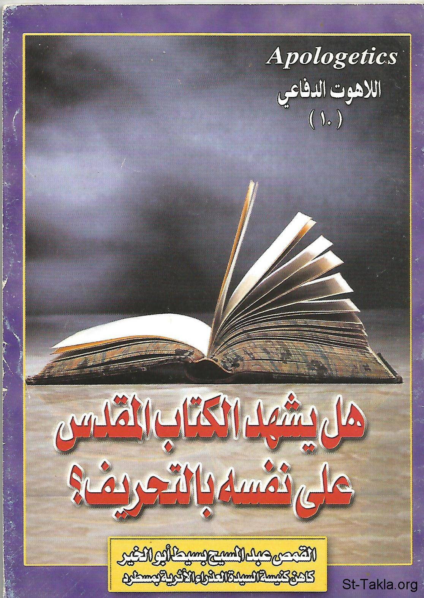

# هل يشهد الكتاب المقدس على نفسه بالتحريف؟!

**المؤلف / Author:** القمص عبد المسيح بسيط أبو الخير
**المصدر / Source:** [st-takla.org](https://st-takla.org/Full-Free-Coptic-Books/FreeCopticBooks-012-Father-Abdel-Messih-Basiet-Abo-El-Kheir/007-Al-Ketab-Yashhad-Bel-Ta7reef/Bible-Corruption-Statements__00-index.html)
**الموضوعات / Topics:** —

📘 **[Download EPUB / تحميل الكتاب](al-ketab-yashhad-bel-ta7reef.epub)**

## نبذة

نشكر قدس أبونا القمص عبد المسيح بسيط أبوالخير على سماحه لنا في موقع الأنبا تكلاهيمانوت بوضع هذا الكتاب هنا. وهو من سلسلة اللاهوت الدفاعي (10).

## الفصول / Chapters (8)

1. [تمهيد، ونص المقال الإسلامي - كتاب هل يشهد الكتاب المقدس على نفسه بالتحريف؟](chapters/01-Bible-Corruption-Statements__01-Article/)
2. [ما هو التحريف الذي أشار إليه داود النبي؟ - كتاب هل يشهد الكتاب المقدس على نفسه بالتحريف؟](chapters/02-Bible-Corruption-Statements__02-Dawoud/)
3. [ما هو التحريف الذي أشار إليه إرميا النبي؟ - كتاب هل يشهد الكتاب المقدس على نفسه بالتحريف؟](chapters/03-Bible-Corruption-Statements__03-Armia/)
4. [هل أشار سفرا الملوك وسفر إشعياء إلى وجود تحريف؟ - كتاب هل يشهد الكتاب المقدس على نفسه بالتحريف؟](chapters/04-Bible-Corruption-Statements__04-Moulok-Ash3eia/)
5. [هل التحذير من الزيادة أو النقص يعني حتمية حدوث التحريف؟ - كتاب هل يشهد الكتاب المقدس على نفسه بالتحريف؟](chapters/05-Bible-Corruption-Statements__05-Warnings/)
6. [مَنْ الذي حرف؟ ومتى وأين ولماذا؟!! - كتاب هل يشهد الكتاب المقدس على نفسه بالتحريف؟](chapters/06-Bible-Corruption-Statements__06-Who-When-Where-Why/)
7. [هل قال القديس بطرس بتحريف الكتاب المقدس؟ - كتاب هل يشهد الكتاب المقدس على نفسه بالتحريف؟](chapters/07-Bible-Corruption-Statements__07-Peter/)
8. [الكتاب المقدس يشهد عن نفسه بأنه كلمة الله المعصومة والتي يستحيل تحريفها - كتاب هل يشهد الكتاب المقدس على نفسه بالتحريف؟](chapters/08-Bible-Corruption-Statements__08-Vice-Versa/)

---
*هذا الكتاب مجاني للنشر والتوزيع لخلاص كل نفس. This book is free to share and distribute for the salvation of every soul.*
