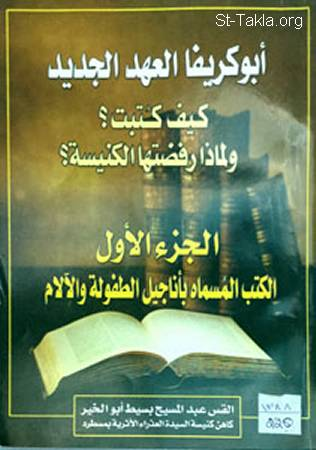

# ابو كريفا العهد الجديد: كيف كُتِبَت؟ ولماذا رفضتها الكنيسة؟ 1- الكتب المسماة بـ أناجيل الطفولة والآلام

**المؤلف / Author:** القمص عبد المسيح بسيط أبو الخير
**المصدر / Source:** [st-takla.org](https://st-takla.org/Full-Free-Coptic-Books/FreeCopticBooks-012-Father-Abdel-Messih-Basiet-Abo-El-Kheir/010-Anageel-Al-Tofoola/New-Testament-Apocrypha-I-00-index.html)
**الموضوعات / Topics:** —

📘 **[Download EPUB / تحميل الكتاب](anageel-al-tofoola.epub)**

## نبذة

نشكر قدس أبونا القمص عبد المسيح بسيط أبوالخير على سماحه لنا في موقع الأنبا تكلاهيمانوت بوضع هذا الكتاب هنا.

## الفصول / Chapters (62)

1. [مقدمة كتاب ابو كريفا العهد الجديد: كيف كُتِبَت؟ ولماذا رفضتها الكنيسة؟ 1- الكتب المسماة بـ أناجيل الطفولة والآلام](chapters/01-New-Testament-Apocrypha-I-01-Intro/)
2. [البدع والهرطقات.. لماذا وكيف ظهرت في فجر المسيحية؟](chapters/02-New-Testament-Apocrypha-I-02-Why/)
3. [ما معنى الهرطقات والبدع؟](chapters/03-New-Testament-Apocrypha-I-03-Meaning/)
4. [أصل الهرطقات والبدع وكيفية انتشارها، وعلاقتها بالمسيحية](chapters/04-New-Testament-Apocrypha-I-04-Origin/)
5. [كيف نشأت البدع والهرطقات وكيف تعامل معها الآباء؟](chapters/05-New-Testament-Apocrypha-I-05-How/)
6. [هرطقة الدوسيتية](chapters/06-New-Testament-Apocrypha-I-06-Docetism/)
7. [جماعة الغنوسية](chapters/07-New-Testament-Apocrypha-I-07-Gnosticism/)
8. [عقائد وهرطقات الدوستية عن المسيح](chapters/08-New-Testament-Apocrypha-I-08-Jesus/)
9. [أهم أفكار الدوسيتيين والغتوسيين كما نقلها القديس إيريناؤس](chapters/09-New-Testament-Apocrypha-I-09-Ideas/)
10. [عقيدة ساتورنينوس في خلق الكون](chapters/10-New-Testament-Apocrypha-I-10-Saturninus/)
11. [عقيدة باسيليدس في خلق الكون](chapters/11-New-Testament-Apocrypha-I-11-Basilides/)
12. [عقيدة كاربوكريتس في خلق الكون](chapters/12-New-Testament-Apocrypha-I-12-Carpocrates/)
13. [عقيدة ماركيون الخاطئة](chapters/13-New-Testament-Apocrypha-I-13-Marcion/)
14. [الأسفار القانونية والكتب الأبوكريفية](chapters/14-New-Testament-Apocrypha-I-14-Canon/)
15. [قانونية العهد الجديد وتأكيد وحيه](chapters/15-New-Testament-Apocrypha-I-15-New-Testament/)
16. [الرسل وقانونية العهد الجديد](chapters/16-New-Testament-Apocrypha-I-16-Apostles/)
17. [الآباء الرسوليون وأسفار العهد الجديد](chapters/17-New-Testament-Apocrypha-I-17-Fathers/)
18. [أهم وثائق قانونية العهد الجديد](chapters/18-New-Testament-Apocrypha-I-18-Documents/)
19. [استشهاد يوستينوس الشهيد بموضوعات من العهد الجديد](chapters/19-New-Testament-Apocrypha-I-19-Yostin/)
20. [استشهاد تاتيان السوري بموضوعات من العهد الجديد](chapters/20-New-Testament-Apocrypha-I-20-Tatian/)
21. [الوثيقة الموراتورية](chapters/21-New-Testament-Apocrypha-I-21-Muratori/)
22. [اقتباسات إيريناؤس أسقف ليون من الكتاب المقدس](chapters/22-New-Testament-Apocrypha-I-22-Erenaos/)
23. [اقتباسات القديس أكليمندس الإسكندري من العهد الجديد](chapters/23-New-Testament-Apocrypha-I-23-Eklimondos/)
24. [حديث العلامة ترتليان عن صحة ووحي الأناجيل والأسفار الجديدة](chapters/24-New-Testament-Apocrypha-I-24-Tertelian/)
25. [استشهاد هيبوليتوس بالعهد الجديد](chapters/25-New-Testament-Apocrypha-I-25-Hipolios/)
26. [كلام العلامة أوريجانوس عن وحي وقانونية العهد الجديد](chapters/26-New-Testament-Apocrypha-I-26-Oreeganos/)
27. [المؤرخ الكنسي يوسابيوس القيصري ووحي الإنجيل](chapters/27-New-Testament-Apocrypha-I-27-Yosabios/)
28. [اعتراف القديس أثناسيوس الرسولي بنفس أسفار العهد الجديد](chapters/28-New-Testament-Apocrypha-I-28-Athanasious/)
29. [قائمة أسفار العهد الجديد في القانون الجلاسياني](chapters/29-New-Testament-Apocrypha-I-29-Glasianic/)
30. [قائمة نيسيفوروس للكتب الأبوكريفية المنحولة](chapters/30-New-Testament-Apocrypha-I-30-Necephorus/)
31. [كلمة أبوكريفا؛ معناها وكيف استخدمت](chapters/31-New-Testament-Apocrypha-I-31-Apocrypha/)
32. [عوامل ظهور هذه الكتب الأبوكريفية ومصدرها](chapters/32-New-Testament-Apocrypha-I-32-Source/)
33. [هدف كتابة هذه الأبوكريفة](chapters/33-New-Testament-Apocrypha-I-33-Aim/)
34. [موقف الكنيسة من هذه الكتب](chapters/34-New-Testament-Apocrypha-I-34-Church/)
35. [أهم خصائص وصفات هذه الكتب الأبوكريفيا](chapters/35-New-Testament-Apocrypha-I-35-Characteristics/)
36. [من هم كتّاب هذه الأبوكريفا](chapters/36-New-Testament-Apocrypha-I-36-Who/)
37. [علماء العصر الحديث وموقفهم من هذه الكتب](chapters/37-New-Testament-Apocrypha-I-37-Scientists/)
38. [الأناجيل الأبوكريفية](chapters/38-New-Testament-Apocrypha-I-38-Gospels/)
39. [الكتب الأسطورية المسماة بأناجيل الميلاد والطفولة](chapters/39-New-Testament-Apocrypha-I-39-Mythical/)
40. [روايات الميلاد والطفولة الأبوكريفية ومخالفتها للإنجيل القانوني](chapters/40-New-Testament-Apocrypha-I-40-Birth/)
41. [كان المسيح في ميلاده وطفولته وصبوته ينمو كإنسان](chapters/41-New-Testament-Apocrypha-I-41-Growth/)
42. [أسباب تأليف روايات ومعجزات الطفولة الأبوكريفية](chapters/42-New-Testament-Apocrypha-I-42-Reasons/)
43. [لا معقولية معجزات وأساطير هذه الكتب الأبوكريفية](chapters/43-New-Testament-Apocrypha-I-43-Fake/)
44. [موقف آباء الكنيسة والهراطقة في القرون الأولى منها](chapters/44-New-Testament-Apocrypha-I-44-Start/)
45. [مولد مريم والطفل يسوع أو إنجيل يعقوب التمهيدي أو البدائي](chapters/45-New-Testament-Apocrypha-I-45-Mary/)
46. [مقدمة إنجيل يعقوب البدائي](chapters/46-New-Testament-Apocrypha-I-46-Yacoub/)
47. [مؤلف إنجيل يعقوب الأولي](chapters/47-New-Testament-Apocrypha-I-47-Yacoub-Author/)
48. [نص إنجيل يعقوب المنحول](chapters/48-New-Testament-Apocrypha-I-48-Yacoub-Gospel/)
49. [إنجيل توما الإسرائيلي المنحول](chapters/49-New-Testament-Apocrypha-I-49-Toma/)
50. [نص إنجيل توما المنحول](chapters/50-New-Testament-Apocrypha-I-50-Toma-Gospel/)
51. [أنجيل متى المنحول](chapters/51-New-Testament-Apocrypha-I-51-Matta/)
52. [نص إنجيل متى الغير قانوني](chapters/52-New-Testament-Apocrypha-I-52-Matta-Gospel/)
53. [إنجيل الطفولة العربي](chapters/53-New-Testament-Apocrypha-I-53-Childhood/)
54. [نص إنجيل الطفولة العربي المنحول](chapters/54-New-Testament-Apocrypha-I-54-Childhood-Gospel/)
55. [إنجيل مولد مريم](chapters/55-New-Testament-Apocrypha-I-55-Mary-Birth/)
56. [نص إنجيل مولد مريم المنحول](chapters/56-New-Testament-Apocrypha-I-56-Mary-Birth-Gospel/)
57. [إنجيل بطرس المنحول](chapters/57-New-Testament-Apocrypha-I-57-Peter/)
58. [أخطاء إنجيل بطرس الرسول الأبوكريفي](chapters/58-New-Testament-Apocrypha-I-58-Peter-Wrong/)
59. [نص إنجيل بطرس الغير قانوني](chapters/59-New-Testament-Apocrypha-I-59-Peter-Gospel/)
60. [إنجيل نيقوديموس المنحول](chapters/60-New-Testament-Apocrypha-I-60-Nikodimous/)
61. [نص إنجيل نيقوديموس المنحول](chapters/61-New-Testament-Apocrypha-I-61-Nikodimous-Gospel/)
62. [الحواشي والمراجع](chapters/62-New-Testament-Apocrypha-I-62-References/)

---
*هذا الكتاب مجاني للنشر والتوزيع لخلاص كل نفس. This book is free to share and distribute for the salvation of every soul.*
