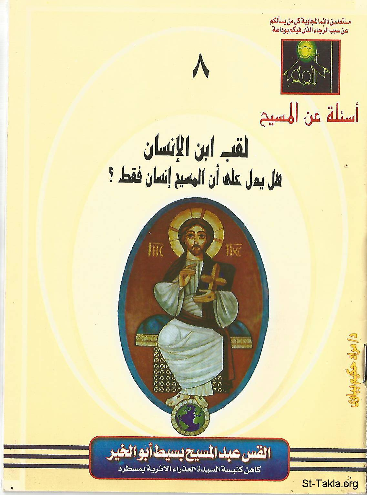

# لقب ابن الإنسان: هل يدل على أن المسيح إنسان فقط؟!

**المؤلف / Author:** القمص عبد المسيح بسيط أبو الخير
**المصدر / Source:** [st-takla.org](https://st-takla.org/Full-Free-Coptic-Books/FreeCopticBooks-012-Father-Abdel-Messih-Basiet-Abo-El-Kheir/004-Ibn-Al-Insan/Son-of-Man__00-index.html)
**الموضوعات / Topics:** —

📘 **[Download EPUB / تحميل الكتاب](ibn-al-insan.epub)**

## نبذة

نشكر قدس أبونا القمص عبد المسيح بسيط أبوالخير على سماحه لنا في موقع الأنبا تكلاهيمانوت بوضع هذا الكتاب هنا. وهو من سلسلة أسئلة عن المسيح (8).

## الفصول / Chapters (7)

1. [لقب ابن الإنسان](chapters/01-Son-of-Man__01-intro/)
2. [ابن الإنسان في سفر دانيال - كتاب لقب ابن الإنسان](chapters/02-Son-of-Man__02-Daniel/)
3. [شبه ابن الإنسان، الأول والآخر، الديان - كتاب لقب ابن الإنسان](chapters/03-Son-of-Man__03-Like/)
4. [ابن الإنسان الجالس عن يمين العظمة في الأعالي - كتاب لقب ابن الإنسان](chapters/04-Son-of-Man__04-Right/)
5. [ابن الإنسان في التقليد اليهودي المعاصر للمسيح - كتاب لقب ابن الإنسان](chapters/05-Son-of-Man__05-Jewish/)
6. [ابن الإنسان كما لقَّب به الرب يسوع نفسه - كتاب لقب ابن الإنسان](chapters/06-Son-of-Man__06-Jesus-1/)
7. [لقب ابن الإنسان كما استخدمه المسيح - كتاب لقب ابن الإنسان](chapters/07-Son-of-Man__07-Jesus-2/)

---
*هذا الكتاب مجاني للنشر والتوزيع لخلاص كل نفس. This book is free to share and distribute for the salvation of every soul.*
