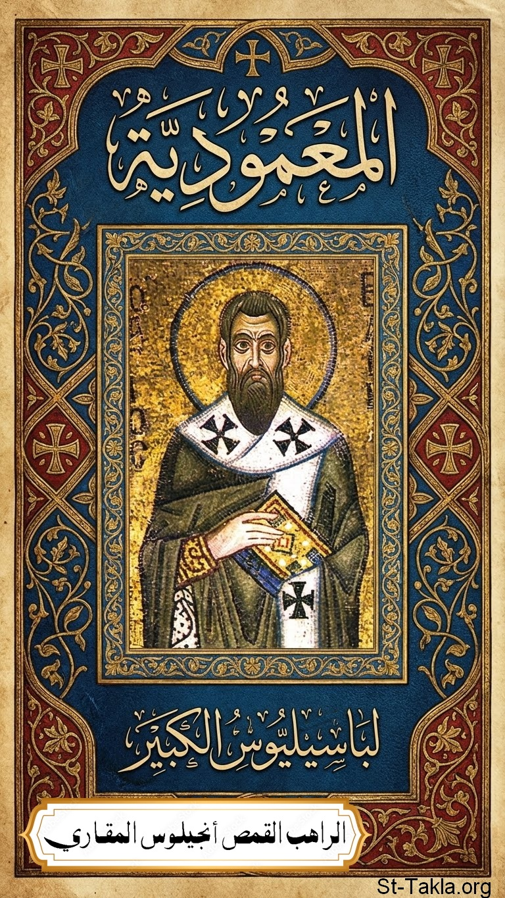

# المعمودية: للقديس باسيليوس الكبير

**المؤلف / Author:** القمص أنجيلوس المقاري
**المصدر / Source:** [st-takla.org](https://st-takla.org/books/fr-angelos-almaqary/basil-baptism/index.html)
**الموضوعات / Topics:** —

📘 **[Download EPUB / تحميل الكتاب](basil-baptism.epub)**

## نبذة

نشكر قدس أبونا القمص أنجيلوس المقاري على السماح لنا في موقع الأنبا تكلا هيمانوت بوضع هذا الكتاب هنا. وقد تمت الترجمة نقلًا عن:

## الفصول / Chapters (19)

1. [المقدمة](chapters/01-introduction/)
2. [الكتاب الأول](chapters/02-book-one/)
3. [ينبغي أولًا التتلمذ للرب قبل التقدم إلى المعمودية المقدسة](chapters/03-discipleship/)
4. [كيف يتم العماد بالمعمودية التي بحسب إنجيل ربنا يسوع المسيح](chapters/04-according-to-the-gospel/)
5. [من ولد من جديد بنعمة المعمودية المقدسة ينبغي له من الآن فصاعدًا أن يغتذي من الأسرار المقدسة](chapters/05-holy-sacraments/)
6. [الكتاب الثاني](chapters/06-book-two/)
7. [ما إذا كان كل فرد نال المعمودية بحسب إنجيل يسوع المسيح مُلزم بأن يموت للخطية ويحيا لله في المسيح يسوع؟](chapters/07-die-to-sin/)
8. [هل هو أمر عديم الخطورة عندما لا يكون للإنسان قلب نقي من ضمير الإثم والنجاسة أو الدنس ويتقدم ليؤدي الوظائف الكهنوتية؟](chapters/08-priestly-functions/)
9. [هل هو أمر عديم الخطورة عندما نأكل جسد الرب ونشرب دمه دون أن نكون طاهرين من كل دنس الجسد والروح؟](chapters/09-being-cleansed/)
10. [هل ينبغي علينا أن نطيع ونصدق كل كلمة ونحن في ملء الثقة أنها تعبّر عن الحق حتى لو حدث أن قابلتنا كلمة أخرى أو فعل ما من الرب نفسه أو من (الرسل) القديسين تبدو أنها متناقضة معها؟](chapters/10-believe-every-word/)
11. [هل عصيان كل كلمة لله يستحق الغضب والموت حتى لو لم يرتبط التهديد بالعقاب لكل حالة عصيان للكلمة؟](chapters/11-punishment/)
12. [هل العصيان كامن في تنفيذ أمر ممنوع أم هو كامن أيضًا في إهمال الأمر المستحسن؟](chapters/12-disobedience/)
13. [هل من الممكن والمُستحب والمقبول لدى الله أن عبد الخطية يعمل عملًا بارًا بحسب قانون التقوى الذي يراعيه القديسون؟](chapters/13-righteous-deed/)
14. [هل تنفيذ الوصايا مقبول عند الله إن كان إتمامها يتعارض مع أحد وصايا الله؟](chapters/14-commandments-conflicts/)
15. [هل يجب أن اختلط بالمتعدين على الشريعة و(فاعلي) أعمال الظلمة غير المثمرة وخصوصًا إذا كان هؤلاء المتعدون لا ينتمون إلى المجموعة التي عُهد بها إليّ؟](chapters/15-aggressors/)
16. [هل هو دائمًا أمر خطير أن نُعثر أحدًا؟](chapters/16-stumble/)
17. [هل ممكن أن يكون رفض (تنفيذ) أمر إلهي بلا مخاطر، (وذلك) بمنع من تلقاه من إتمامه، والتساهل مع من يبدي هذا المنع خصوصًا إذا كان من يعيق هذا التنفيذ ذا إيمان صالح أو إن كان هناك سبب وجيه في مظهره يتعارض مع هذا الأمر؟](chapters/17-refusal/)
18. [هل ينبغي للمرء أن يهتم بالكل في كل الظروف أم يهتم فقط بمن هم موكلين إليه وبقدر الموهبة التي نالها من الله بتوسط الروح القدس؟](chapters/18-concerned-with-all/)
19. [لأجل حفظ الطاعة الواجبة لله. هل ينبغي احتمال أي ضيقة حتى لو كانت تشكل تهديدًا بالموت وخصوصًا عند انشغالنا بمن هو موكل إلينا أمر رعايتهم؟](chapters/19-obedience/)

---
*هذا الكتاب مجاني للنشر والتوزيع لخلاص كل نفس. This book is free to share and distribute for the salvation of every soul.*
