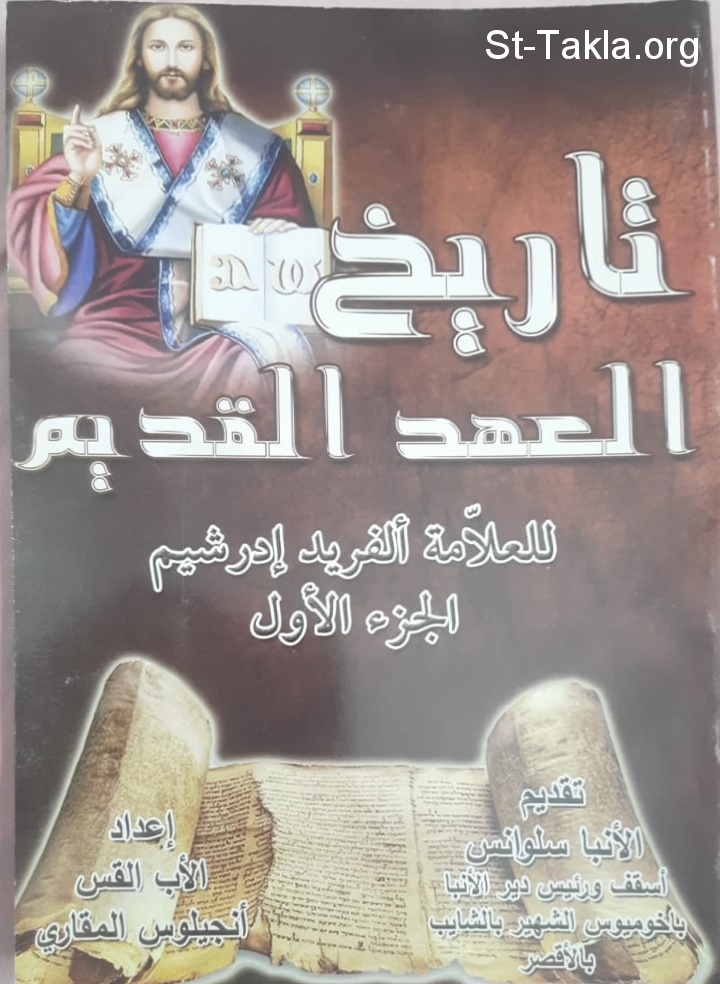

# تاريخ العهد القديم للعلامة ألفريد إدرشيم: الجزء الأول: عالم ما قبل الطوفان وتاريخ رؤساء الآباء الأولين

**المؤلف / Author:** القمص أنجيلوس المقاري
**المصدر / Source:** [st-takla.org](https://st-takla.org/books/fr-angelos-almaqary/bible-history-edersheim-1/index.html)
**الموضوعات / Topics:** —

📘 **[Download EPUB / تحميل الكتاب](bible-history-edersheim-1.epub)**

## نبذة

نشكر قدس أبونا القمص أنجيلوس المقاري على السماح لنا في موقع الأنبا تكلا هيمانوت بوضع هذا الكتاب هنا.

## الفصول / Chapters (27)

1. [مقدمة بقلم الأنبا سلوانس](chapters/01-introduction/)
2. [مقدمة عامة للسلسلة](chapters/02-general-introduction/)
3. [تاريخ الأحداث المسجلة في سفر التكوين بحسب هاليس، أشير، كايل](chapters/03-events-recorded/)
4. [مقدمة هذا المجلد](chapters/04-volume-1/)
5. [الخلقة - الإنسان في جنة عدن - السقوط (تك1-3)](chapters/05-creation/)
6. [قايين وهابيل - طريقان وجنسان (تك4)](chapters/06-cain-abel/)
7. [شيث وذريته - نسل قايين (تك4)](chapters/07-seth-cain-offspring/)
8. [سلسلة أنساب المؤمنين من نسل شيث (تك5)](chapters/08-genealogy-seth/)
9. [الفساد العام للإنسان - الإعداد للطوفان (تك6)](chapters/09-corruption-of-man/)
10. [الطوفان (تك 7: 1 - 8: 15)](chapters/10-flood/)
11. [تاريخ رؤساء الآباء (تك 8: 15- 9: 28): ما بعد الطوفان - ذبيحة نوح - خطية نوح - ذرية نوح](chapters/11-patriarchs-noah/)
12. [سلسلة أنساب الأمم - بابل - تبلبل الألسنة (تك 10: 1- 11: 10)](chapters/12-babylon/)
13. [الأمم وديانتها - أيوب](chapters/13-gentiles/)
14. [الجدول الزمني للتاريخ المبكر للكتاب المقدس - بداية تاريخ معاملات الله مع إبراهيم ونسله](chapters/14-timeline-abraham/)
15. [دعوة إبراهيم - وصوله إلى أرض كنعان، ورحيله مؤقتًا إلى مصر (تك 11: 27 - 13: 4)](chapters/15-call-of-abraham/)
16. [انفصال أبرام ولوط - أبرام في حبرون - نهب سدوم- إنقاذ لوط - اللقاء مع ملكي صادق (تك13-14)](chapters/16-abram-lot-melchizedek/)
17. [وعد مضاعف بنسل لإبراهيم - إسماعيل - الرب يزور إبراهيم - خراب سدوم - إقامة إبراهيم في جرار - عهده مع أبيمالك (تك15-20؛ 21: 22-34)](chapters/17-ishmael-sodom-abimelech/)
18. [ميلاد إسحق - صرف إسماعيل- امتحان إيمان إبراهيم بتقديم إسحق ذبيحة - موت سارة - موت إبراهيم (تك 21: 1 - 25: 18)](chapters/18-isaac-ishmael-sarah/)
19. [زواج إسحق - ميلاد عيسو ويعقوب - عيسو يبيع بكوريته - إسحق في جرار - زواج عيسو (تك 24؛ 25: 19 - 26: 35)](chapters/19-isaac-jacob-esau/)
20. [يعقوب ينال بركة إسحق بالغش - حزن عيسو - العواقب الشريرة لغلطتهما لكل أعضاء الأسرة - إرسال يعقوب إلى لابان - إسحق يجدد ويمنح بركة إبراهيم ليعقوب تامة (تك 27: 1 - 28: 9)](chapters/20-jacob-mistake-laban-isaac/)
21. [رؤيا يعقوب في بيت إيل - وصوله إلى بيت لابان - زواج وعبودية ثنائية ليعقوب - هربه من حاران - مطاردة لابان ومصالحته مع يعقوب (تك 28: 10 - 31: 55)](chapters/21-jacobs-vision/)
22. [يعقوب في محنايم - ليلة المصارعة - المصالحة بين يعقوب وعيسو - يعقوب يستقر في شكيم - يعقوب يتقدم إلى بيت إيل ليوفي نذره - موت راحيل - يعقوب يستقر في حبرون (تك32-36)](chapters/22-jacob-mahanaim/)
23. [حياة يوسف المبكرة - بيع إخوته له كعبد - يوسف في بيت فوطيفار - يوسف في السجن (تك37-39)](chapters/23-joseph/)
24. [يوسف في السجن - حلم موظفي فرعون - حلم فرعون - ترقية يوسف - حكمه لمصر (تك 40-41؛ 47: 13-26)](chapters/24-joseph-pharaoh-dream/)
25. [أبناء يعقوب يصلون إلى مصر ليشتروا قمح - يوسف يتعرف على إخوته - سجنه لشمعون - أبناء يعقوب يأتون مرة ثانية إلى مصر ويحضرون بنيامين معهم - يوسف يمتحن إخوته - يوسف يعرّفهم بنفسه - يعقوب وأسرته يستعدون للنزول إلى مصر (تك42-45)](chapters/25-jacob-sons-egypt/)
26. [رحيل يعقوب وأسرته إلى مصر - مقابلة يعقوب مع فرعون - مرضه الأخير ووصيته بدفنه في كنعان - تبني أفرايم ومنسى بين بني إسرائيل (تك46-48)](chapters/26-jacob-depart-egypt/)
27. [البركة الأخيرة ليعقوب - موت يعقوب - موت يوسف (تك49-50)](chapters/27-jacob-final-blessing/)

---
*هذا الكتاب مجاني للنشر والتوزيع لخلاص كل نفس. This book is free to share and distribute for the salvation of every soul.*
