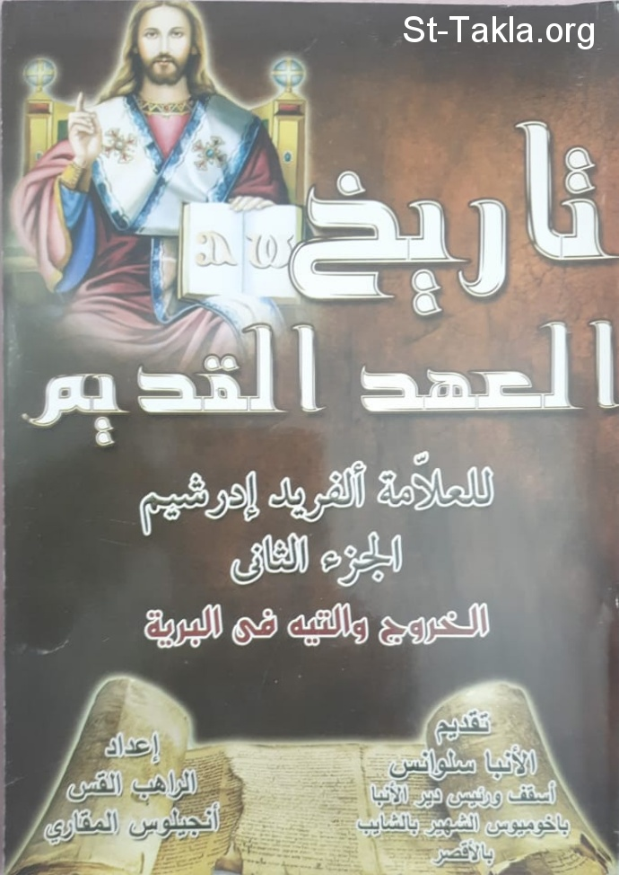

# تاريخ العهد القديم للعلامة ألفريد إدرشيم: الجزء الثاني: الخروج والتيه في البرية

**المؤلف / Author:** القمص أنجيلوس المقاري
**المصدر / Source:** [st-takla.org](https://st-takla.org/books/fr-angelos-almaqary/bible-history-edersheim-2/index.html)
**الموضوعات / Topics:** —

📘 **[Download EPUB / تحميل الكتاب](bible-history-edersheim-2.epub)**

## نبذة

نشكر قدس أبونا القمص أنجيلوس المقاري على السماح لنا في موقع الأنبا تكلا هيمانوت بوضع هذا الكتاب هنا.

## الفصول / Chapters (22)

1. [مقدمة للجزء الثاني](chapters/01-introduction/)
2. [الخروج: مصر وتاريخها أثناء فترة مكوث بني إسرائيل فيها كما يشرحها الكتاب المقدس والآثار القديمة (خر 1: 1-7)](chapters/02-exodus/)
3. [بني إسرائيل في مصر - مساكنهم وأعمالهم وترتيباتهم الاجتماعية، قوامهم ودينهم - قيام ملك جديد لم يعرف يوسف (سفر الخروج بأكمله)](chapters/03-israelites-egypt/)
4. [ميلاد موسى وتدريبه في مصر وفي مديان كإعداد لدعوته (خر2)](chapters/04-moses-egypt/)
5. [دعوة موسى - رؤيا العليقة المشتعلة - إرساله إلى فرعون وإلى إسرائيل - والثلاثة آيات ومعانيها (خر 2: 23؛ 4: 17)](chapters/05-moses-burning-bush/)
6. [موسى يعود إلى مصر - صرف صفورة - موسى يلتقي بهارون - قبول بني إسرائيل لهما وتصديقهما - ملاحظات على تقسية قلب فرعون (خر 4: 18-31)](chapters/06-moses-zipporah-pharaoh/)
7. [موسى وهارون سلّما رسالتهما لفرعون ليزيد من ظلمه لإسرائيل - إحباط موسى - هارون يُظهر آية - رؤية هامة وتحليل لكل واحدة من الضربات العشر (خر 5: 1 - 12: 30)](chapters/07-moses-aaron/)
8. [الفصح وفروضه - بني إسرائيل غادروا مصر - أول موضع راحة لهم، عمود السحاب والنار - تعقب فرعون لهم عبر البحر الأحمر - إهلاك فرعون وجيشه - أنشودة الجانب الآخر من البحر الأحمر (خر 12: 1 - 15: 21)](chapters/08-passover-red-sea/)
9. [: الفصل الثامن: برية شور - شبه جزيرة سيناء، منظرها ونباتاتها، إمكانيات إعالتها لشعب، عيون موسى - مسيرة ثلاثة أيام إلى ماره - طريق عيلام إلى برية سين - تذمر إسرائيل - توفير إمداد إعجازي للسلوى - المن (خر 15: 22 - 16: 36)](chapters/09-wilderness-sinai-quail-manna/)
10. [رفيديم - هزيمة عماليق ومغزاها - زيارة يثرون ومغزاها الرمزي (خر17-18)](chapters/10-rephidim-amalek/)
11. [إسرائيل عند سفح جبل سيناء - الاستعداد للعهد - الوصايا العشر ومعناها (خر 19: 1 - 20: 17)](chapters/11-israel-ten-commandments/)
12. [فرائض مدنية واجتماعية لإسرائيل كشعب لله - فرائضهم الدينية في وجهها القومي - العهد عُمل بذبيحة، وليمة ذبائحية عربون القبول (خر 20: 18 - 24: 12)](chapters/12-israel-covenant/)
13. [نموذج الخيمة الذي تم رؤيته على الجبل، الكهنوت والخدمات في ترتيبها والمعنى النموذجي لخطية العجل الذهبي - الحكم الإلهي وتشفع موسى - غفران الله الكريم ورؤية مجد الله التي مُنحت لموسى (خر 24: 12؛ 25-33)](chapters/13-tabernacle/)
14. [موسى مرة ثانية على الجبل - عند عودته كان وجهه يلمع - إقامة خيمة الاجتماع وتكريسها بحضور مرئي للرب (خر34-40)](chapters/14-moses-face/)
15. [تحليل لسفر اللاويين، خطية ناداب وأبيهو، الحكم على المجدف (سفر اللاويين)](chapters/15-leviticus/)
16. [تحليل لسفر العدد - تعداد إسرائيل واللاويين - الترتيب في المحلة ومغزاه الرمزي - المسيرة في البرية (عد1-4؛ 10: 1-11)](chapters/16-numbers-census/)
17. [تقدمة الرؤساء - إفراز اللاويين - الاحتفال الثاني بالفصح](chapters/17-levites-passover/)
18. [الرحيل من جبل سيناء - المسير في برية فاران - عند تبعيرة وقبروت هتأوة (عد 10: 29 - 11: 35)](chapters/18-sinai-paran/)
19. [تذمر مريم وهارون - إرسال جواسيس إلى كنعان وتقريرهم السيئ - تمرد الشعب والحكم الذي صدر عليهم - هزيمة إسرائيل في حرمة (عد12-14)](chapters/19-miriam-aaron-canaan/)
20. [ثمان وثلاثين سنة في البرية - كاسر السبت - مقاومة قورح ورفقائه المتذمرين من الشعب - الضربة وكيف أزهرت عصا هارون وأنضجت لوزًا (عد15؛ 33: 19-37؛ 16-17؛ تث 1: 46 - 11: 15)](chapters/20-sabbath-korah/)
21. [تجمع إسرائيل ثانية في قادش - خطية موسى وهارون - بعثة إلى أدوم - موت هارون - انسحاب إسرائيل من حدود أدوم - هجوم ملك عراد الكنعاني (عد20؛ 21: 1-3)](chapters/21-kadesh/)
22. [مسيرة بني إسرائيل حول أرض أدوم - الحيات المحرقة والحية النحاسية - إسرائيل تدخل أرض الآموريين - الانتصار على سيحون وعوج ملكي الآموريين - إسرائيل يعسكر في عربات موآب بالقرب من نهر الأردن (عد 21: 3-35؛ 33: 35-49؛ تث2-3)](chapters/22-edom-fiery-serpent/)

---
*هذا الكتاب مجاني للنشر والتوزيع لخلاص كل نفس. This book is free to share and distribute for the salvation of every soul.*
