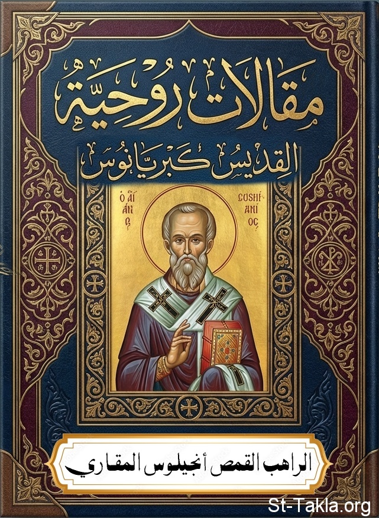

# مقالات روحية: للقديس كبريانوس

**المؤلف / Author:** القمص أنجيلوس المقاري
**المصدر / Source:** [st-takla.org](https://st-takla.org/books/fr-angelos-almaqary/cyprian-treatises/index.html)
**الموضوعات / Topics:** —

📘 **[Download EPUB / تحميل الكتاب](cyprian-treatises.epub)**

## نبذة

نشكر قدس أبونا القمص أنجيلوس المقاري على السماح لنا في موقع الأنبا تكلا هيمانوت بوضع هذا الكتاب هنا. وقد تمت الترجمة نقلًا عن كتاب:

## الفصول / Chapters (10)

1. [مقدمة](chapters/01-introduction/)
2. [رداء العذارى](chapters/02-garment-of-virgins/)
3. [الجاحدون](chapters/03-deniers/)
4. [حث على الاستشهاد](chapters/04-exhortation-to-martyrdom/)
5. [وبأ الموت Mortality](chapters/05-plague-of-mortality/)
6. [فضيلة الصبر](chapters/06-virtue-of-patience/)
7. [الغيرة والحسد](chapters/07-jealousy-envy/)
8. [الأعمال والصدقة](chapters/08-works-almsgiving/)
9. [الصلاة الربانية](chapters/09-lords-prayer/)
10. [وحدة الكنيسة الجامعة](chapters/10-unity-of-church/)

---
*هذا الكتاب مجاني للنشر والتوزيع لخلاص كل نفس. This book is free to share and distribute for the salvation of every soul.*
