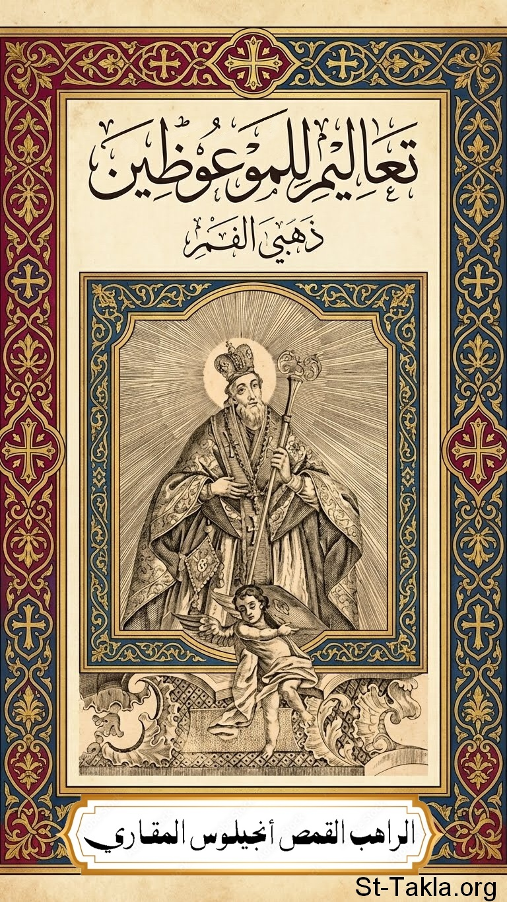

# تعاليم للموعوظين: للقديس يوحنا ذهبي الفم

**المؤلف / Author:** القمص أنجيلوس المقاري
**المصدر / Source:** [st-takla.org](https://st-takla.org/books/fr-angelos-almaqary/john-chrysostom-baptismal-instructions/index.html)
**الموضوعات / Topics:** —

📘 **[Download EPUB / تحميل الكتاب](john-chrysostom-baptismal-instructions.epub)**

## نبذة

نشكر قدس أبونا القمص أنجيلوس المقاري على السماح لنا في موقع الأنبا تكلا هيمانوت بوضع هذا الكتاب هنا. وقد تمت الترجمة عن:

## الفصول / Chapters (85)

1. [مقدمة](chapters/01-introduction/)
2. [إلى الموعوظين المقبلين على العماد](chapters/02-1st-discourse/)
3. [الموعوظين مدعوون إلى الزيجة الروحانية](chapters/03-spiritual-marriage/)
4. [الزواج هو سر عظيم](chapters/04-marriage/)
5. [عقد وعطايا الزواج الروحاني](chapters/05-marriage-covenant-gifts/)
6. [آمنوا بالآب والابن والروح القدس](chapters/06-trinity/)
7. [اعتنقوا نير المسيح](chapters/07-yoke-of-christ/)
8. [صورة الإنسان الوديع والمتواضع القلب](chapters/08-meek-humble/)
9. [الزينة الحقيقية للمرأة](chapters/09-adornment/)
10. [تحذير من التشاؤم والحلفان والمشاهدات الخليعة](chapters/10-pessimism-swearing-lewd-views/)
11. [شرفوا اسم المسيح](chapters/11-honor-christ-name/)
12. [الحديث التعليمي الثاني](chapters/12-2nd-discourse/)
13. [للموعوظين](chapters/13-catechumens/)
14. [عمل (تصرف) الله من جهة الإنسان الأول](chapters/14-first-man/)
15. [النظر بعين الإيمان](chapters/15-eyes-of-faith/)
16. [خطاب إلى الأشابين](chapters/16-godfathers/)
17. [جحد الشيطان والالتصاق بالمسيح](chapters/17-renouncing-satan/)
18. [دهن (مسح) الموعوظين (بالزيت) وعمادهم](chapters/18-anointing-baptizing/)
19. [خطاب الختام: طلبات وصلوات](chapters/19-petitions-prayers/)
20. [الحديث التعليمي الثالث إلى الموعوظين](chapters/20-3rd-discourse/)
21. [عظة موجهة إلى المعمدين حديثًا: مقارنة المتنصرين الجدد بالنجوم الجديدة](chapters/21-newly-baptized/)
22. [النعم العظيمة التي للمعمودية](chapters/22-graces-of-baptism/)
23. [الجهاد ضد إبليس](chapters/23-struggle-against-satan/)
24. [قوة دم المسيح](chapters/24-power-of-christs-blood/)
25. [الكنيسة تكونت من جنب المسيح](chapters/25-the-church/)
26. [مقارنة المعمودية بالرحيل من مصر](chapters/26-exodus-from-egypt/)
27. [الحديث التعليمي الرابع: إلى الموعوظين](chapters/27-4th-discourse/)
28. [الموعوظين هم فرحة الكنيسة](chapters/28-joy-of-church/)
29. [بولس نموذج كامل للموعوظ (المتنصر حديثًا)](chapters/29-paul/)
30. [الإيمان بالمسيح والمعمودية هما الخليقة الجديدة](chapters/30-faith-in-christ/)
31. [المتنصر عليه أن يضيء بسلوكه على وجه الخصوص](chapters/31-the-converts/)
32. [تذكير بعقد المعمودية](chapters/32-baptismal-pledge/)
33. [حث المتنصرين للامتناع عن التراخي والبذخ والسُكر بل التعقل في كل الأشياء](chapters/33-5th-discourse/)
34. [ليتنا لا نجد أي حجة للتراخي في عيد الفصح](chapters/34-no-laxity/)
35. [تحاشي السكر بالخمر والأهواء](chapters/35-avoid-drunkenness/)
36. [السكر هو اختيار طوعي للشيطان](chapters/36-drunkenness/)
37. [مخاطر الاسترخاء والكسل مبرهنة من سلوك اليهود](chapters/37-dangers-of-laziness/)
38. [مثال بولس ودرس (عبرة) سيمون الساحر](chapters/38-paul-simon-magus/)
39. [المعتمدين القدامى يمكنهم أن ينالوا براءتهم بتوبة خالصة](chapters/39-sincere-repentance/)
40. [إلى المتنصرين انتقادًا لأولئك الذين تركوا القداس والعظة وذهبوا إلى حلبات السباق والمسارح، وعن مدى الاهتمام الذي ينبغي أن نبديه نحو المهملين من إخوتنا](chapters/40-6th-discourse/)
41. [بعض المسيحيين غادروا الكنيسة للذهاب إلى المسارح (والملاهي)](chapters/41-theaters-nightclubs/)
42. [ماذا تعني عبارة "اصنعوا كل شيء لمجد الله"](chapters/42-glory-of-god/)
43. [خطورة العثرة وواجب التقويم الأخوي](chapters/43-fraternal-correction/)
44. [المعتمد حديثًا ينبغي أن يظل -متنصرًا حديثًا- كل أيام حياته](chapters/44-new-convert/)
45. [الحديث التعليمي السابع: الموجه إلى الموعوظين](chapters/45-7th-discourse/)
46. [المتنصرين حديثًا اجتمعوا مرة ثانية عند قبور الشهداء](chapters/46-graves-of-martyrs/)
47. [الشهداء هم الأطباء الروحيين الذين يشفون علل النفس والجسد](chapters/47-spiritual-physicians/)
48. [ارغبوا فقط في السماويات](chapters/48-desire-heavenly-things/)
49. [لنطلب الأشياء التي فوق على مثال الشهداء](chapters/49-seek-things-above/)
50. [لنطلب الأشياء التي فوق لأن الذي اعتمد قد مات عن العالم](chapters/50-die-to-world/)
51. [الصلاة والصدقة وسيلتان قويتان لحفظ رداء المعمودية بهيًا](chapters/51-prayer-almsgiving/)
52. [مثال كرنيليوس قائد المئة](chapters/52-cornelius-the-centurion/)
53. [الحديث التعليمي الثامن: الموجه إلى الموعوظين](chapters/53-8th-discourse/)
54. [ترحيب ومدح لأولئك الذين جاءوا من المناطق المجاورة](chapters/54-neighboring-regions/)
55. [تفضيل الخيرات الروحية: مثال إبراهيم](chapters/55-abraham/)
56. [بطلان الخيرات الدنيوية](chapters/56-vanity-of-worldly-goods/)
57. [البرنامج اليومي للمعتمدين حديثًا](chapters/57-daily-program/)
58. [حث أخير: لنعتني بالروح أولًا ونترك اهتماماتنا المادية لله](chapters/58-care-for-spirit/)
59. [الحديث التعليمي التاسع](chapters/59-9th-discourse/)
60. [إلى أولئك الذين يؤجلون المعمودية إلى ساعة الوفاة](chapters/60-dont-postpone-baptism/)
61. [المعمودية هي ميلاد حميم الميلاد الثاني](chapters/61-intimate-birth/)
62. [الفرق بين تطهير اليهود والمعمودية](chapters/62-jewish-purification-vs-baptism/)
63. [المعمودية تجدد طبيعتنا تمامًا](chapters/63-renews-our-nature/)
64. [البرنامج التدريبي للموعوظين](chapters/64-training-program/)
65. [عدد وبشاعة خطايا اللسان](chapters/65-sins-of-tongue/)
66. [(توجيه) ضد عادة القسم](chapters/66-swearing/)
67. [كيف نتحاشى الحلفان](chapters/67-avoid-swearing/)
68. [الحديث التعليمي العاشر](chapters/68-10th-discourse/)
69. [موسم المعمودية](chapters/69-season-of-baptism/)
70. [المعمودية هي صليب وموت وقيامة](chapters/70-cross-death-resurrection/)
71. [لماذا أمضى المسيح ثلاثة أيام في القبر؟](chapters/71-christ-3-days/)
72. [التعزيم](chapters/72-incantation/)
73. [(عودة إلى) الحلفان مرة أخرى](chapters/73-swear/)
74. [قسم هيرودس ونتائجه](chapters/74-herods-oath/)
75. [تباركت يا الله!](chapters/75-blessed-be-god/)
76. [الحديث التعليمي الحادي عشر](chapters/76-11th-discourse/)
77. [التوجيهات الأخيرة إلى المقبلين على المعمودية](chapters/77-final-directives/)
78. [رداء العروس](chapters/78-brides-garment/)
79. [لقب المؤمنون](chapters/79-title-of-believers/)
80. [جحد الشيطان والعهد مع المسيح](chapters/80-covenant-with-christ/)
81. [مسح الموعوظون](chapters/81-anointing-catechumens/)
82. [المعمودية](chapters/82-baptism/)
83. [صلوا لأجل الكنيسة](chapters/83-pray-for-church/)
84. [القبلة المقدسة](chapters/84-holy-kiss/)
85. [الحديث التعليمي الاثني عشر](chapters/85-12th-discourse/)

---
*هذا الكتاب مجاني للنشر والتوزيع لخلاص كل نفس. This book is free to share and distribute for the salvation of every soul.*
