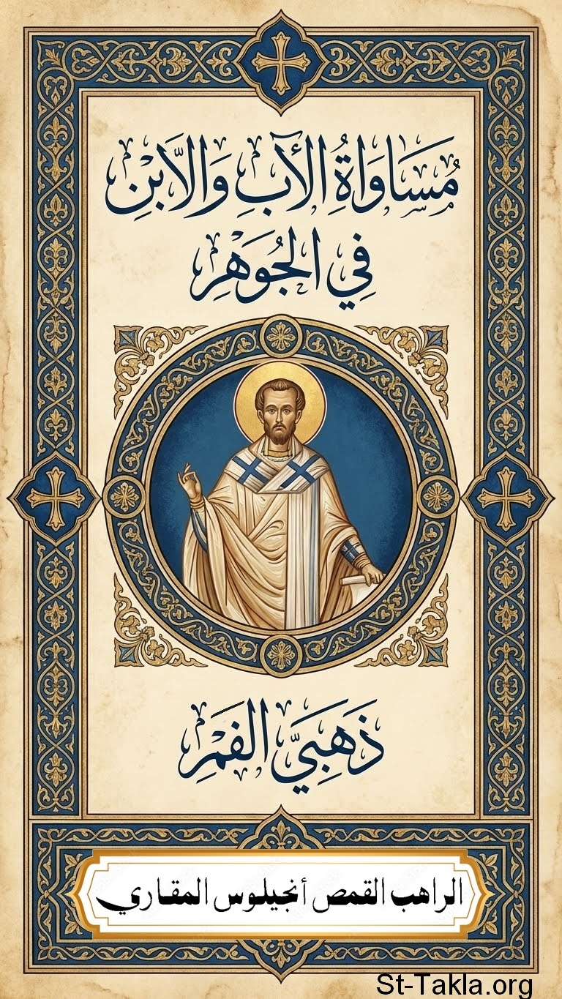

# مساواة الآب والابن في الجوهر: للقديس يوحنا ذهبي الفم

**المؤلف / Author:** القمص أنجيلوس المقاري
**المصدر / Source:** [st-takla.org](https://st-takla.org/books/fr-angelos-almaqary/john-chrysostom-father-son-equality/index.html)
**الموضوعات / Topics:** —

📘 **[Download EPUB / تحميل الكتاب](john-chrysostom-father-son-equality.epub)**

## نبذة

نشكر قدس أبونا القمص أنجيلوس المقاري على السماح لنا في موقع الأنبا تكلا هيمانوت بوضع هذا الكتاب هنا.

## الفصول / Chapters (7)

1. [مقدمة](chapters/01-introduction/)
2. [المسيح ابن](chapters/02-christ-the-son/)
3. [في سلطان المسيح](chapters/03-authority-of-christ/)
4. [حديث على موت لعازر لمدة أربعة أيام](chapters/04-death-of-lazarus/)
5. [تذكار مدائح الشهداء](chapters/05-christ-prays/)
6. [داود وجليات](chapters/06-david-and-goliath/)
7. [تبارك الله](chapters/07-miracles-of-christ/)

---
*هذا الكتاب مجاني للنشر والتوزيع لخلاص كل نفس. This book is free to share and distribute for the salvation of every soul.*
