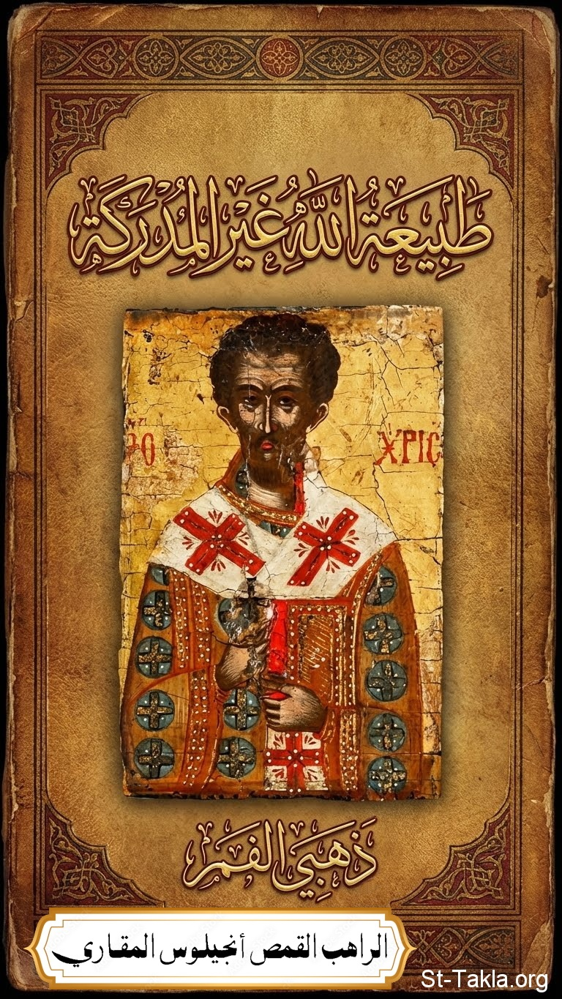

# طبيعة الله غير المدركة: للقديس يوحنا ذهبي الفم

**المؤلف / Author:** القمص أنجيلوس المقاري
**المصدر / Source:** [st-takla.org](https://st-takla.org/books/fr-angelos-almaqary/john-chrysostom-incomprehensible-nature-of-God/index.html)
**الموضوعات / Topics:** —

📘 **[Download EPUB / تحميل الكتاب](john-chrysostom-incomprehensible-nature-of-God.epub)**

## نبذة

نشكر قدس أبونا القمص أنجيلوس المقاري على السماح لنا في موقع الأنبا تكلا هيمانوت بوضع هذا الكتاب هنا. وقد تمت الترجمة من سلسلة كتب:

## الفصول / Chapters (6)

1. [مقدمة](chapters/01-introduction/)
2. [التلمذة الحقيقية](chapters/02-discipleship-love/)
3. [ضد الأنوميين عن عدم إدراك الله](chapters/03-anomoeanism/)
4. [عن عدم إدراك الله وكيف أنه حتى رؤيته كان أمرًا غير محتمل بالنسبة للسيرافيم](chapters/04-comprehending-god/)
5. [معرفة الكائنات لله محدودة](chapters/05-limited-knowledge/)
6. [الابن والروح القدس يعرفان الآب](chapters/06-father-son-holy-spirit/)

---
*هذا الكتاب مجاني للنشر والتوزيع لخلاص كل نفس. This book is free to share and distribute for the salvation of every soul.*
