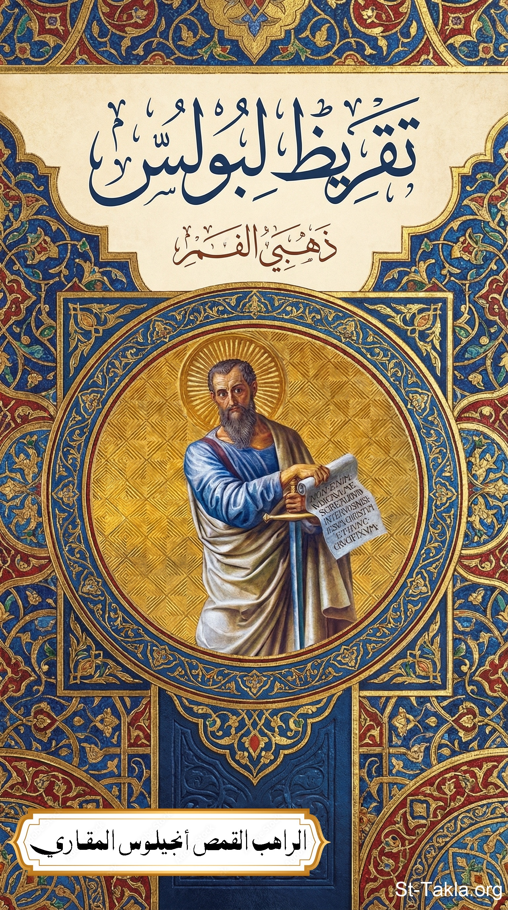

# تقريظ ومدح للقديس بولس الرسول: عن عظات للقديس يوحنا ذهبي الفم

**المؤلف / Author:** القمص أنجيلوس المقاري
**المصدر / Source:** [st-takla.org](https://st-takla.org/books/fr-angelos-almaqary/john-chrysostom-paul-praise/index.html)
**الموضوعات / Topics:** —

📘 **[Download EPUB / تحميل الكتاب](john-chrysostom-paul-praise.epub)**

## نبذة

نشكر قدس أبونا القمص أنجيلوس المقاري على السماح لنا في موقع الأنبا تكلا هيمانوت بوضع هذا الكتاب هنا. وقد تمت الترجمة نقلًا عن:

## الفصول / Chapters (12)

1. [مقدمةمقدمة](chapters/01-introduction/)
2. [نصان يحملان نفس سمات العظات السابقةنصان يحملان نفس سمات العظات السابقة](chapters/02-texts/)
3. [بولس يطلب التمثل به: كونوا متمثلين بيبولس يطلب التمثل به: كونوا متمثلين بي](chapters/03-imitatation/)
4. [أنا الأسير في الربأنا الأسير في الرب](chapters/04-prisoner-in-the-lord/)
5. [مع المسيحمع المسيح](chapters/05-with-christ/)
6. [سمو القديس بولس الرسول على كافة القديسينسمو القديس بولس الرسول على كافة القديسين](chapters/06-all-saints/)
7. [القديس بولس الرسول نموذج فائق للفضيلةالعظة الثانية: القديس بولس الرسول نموذج فائق للفضيلة](chapters/07-model-of-virtue/)
8. [محبة بولس الرسول تجاه الناسمحبة بولس الرسول تجاه الناس](chapters/08-love-for-people/)
9. [دعوة بولس - الانتشار العجيب للإنجيل](chapters/09-spread-of-the-gospel/)
10. [سلوكيات القديس بولس الرسول (المختلفة)](chapters/10-behaviors/)
11. [تكفيك نعمتي](chapters/11-my-grace/)
12. [جاهدت الجهاد الحسن](chapters/12-fought-the-good-fight/)

---
*هذا الكتاب مجاني للنشر والتوزيع لخلاص كل نفس. This book is free to share and distribute for the salvation of every soul.*
