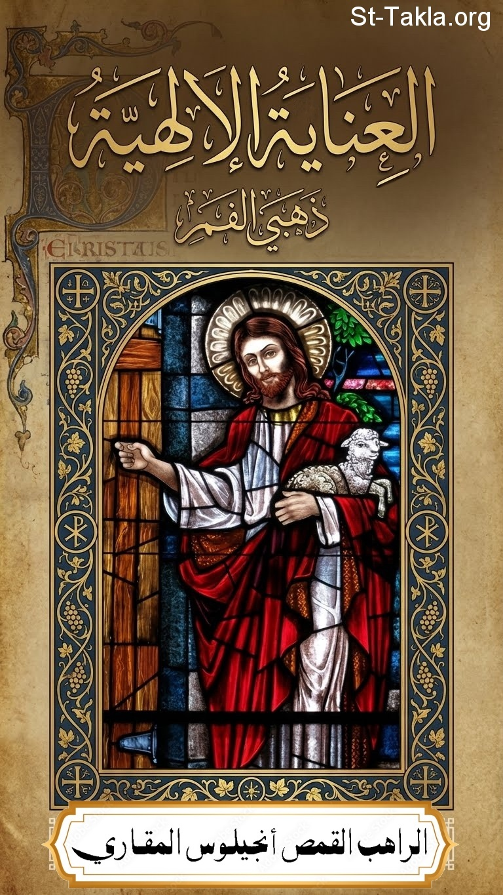

# العناية الإلهية: للقديس يوحنا ذهبي الفم

**المؤلف / Author:** القمص أنجيلوس المقاري
**المصدر / Source:** [st-takla.org](https://st-takla.org/books/fr-angelos-almaqary/john-chrysostom-providence-of-god/index.html)
**الموضوعات / Topics:** —

📘 **[Download EPUB / تحميل الكتاب](john-chrysostom-providence-of-god.epub)**

## نبذة

نشكر قدس أبونا القمص أنجيلوس المقاري على السماح لنا في موقع الأنبا تكلا هيمانوت بوضع هذا الكتاب هنا. وقد تمت الترجمة عن كتاب:

## الفصول / Chapters (26)

1. [مقدمة](chapters/01-introduction/)
2. [مقدمة الكتاب للقديس يوحنا ذهبي الفم](chapters/02-foreword/)
3. [ينبغي ذكر سبب من أين تتولد العثرة](chapters/03-missteps/)
4. [محاولة الاستفسار والاجتهاد في فحص حكمة الله التي لا تُسبر هو أمر خطير وممتلئ طياشة](chapters/04-wisdom-of-God/)
5. [اللاهوت غير مُدرك، ليس فقط لنا، بل وللقوات السماوية أيضًا](chapters/05-divinity/)
6. [موسى النبي قطع الفضول الخطير بكلمة (واحدة) في بدء الكتاب المقدس](chapters/06-moses/)
7. [ينبغي أن نصدق أن الله ساهر على كل الأشياء، ولمن يشكّوا في ذلك فإن برهان الخليقة هو أعظم دليل](chapters/07-god-watches/)
8. [الحب الإلهي يفوق بلا نهاية كل حب (آخر)](chapters/08-divine-love/)
9. [برهان عناية الله من الخليقة](chapters/09-creation/)
10. [دليل عناية الله بنا أنه أعطانا الناموس الطبيعي والناموس المكتوب، وأخيرًا صار أساس كل الخيرات في نوال النعمة بمجيء الابن الوحيد](chapters/10-natural-law/)
11. [لا ينبغي السعي لفحص الأحداث بل يلزم الانتظار إلى النهاية](chapters/11-wait/)
12. [أبرار العهد القديم انتظروا نهاية الأحداث](chapters/12-bible-saints/)
13. [تحقيق الوعود لا يتم في الحال وانظر كيف أن القديسين لم يعثروا رغم أن الأحداث كانت مناقضة للوعود](chapters/13-promises/)
14. [لماذا سمح الله بوجود الأشرار والشياطين في العالم؟](chapters/14-existence-of-evildoers/)
15. [لا شيء يسبب ضررًا وعثرة لمن هم يقظون](chapters/15-being-vigilant/)
16. [هل عثرت النفوس بسبب الاضطهادات في العصر الرسولي؟](chapters/16-persecutions/)
17. [الجهلاء عثروا حتى بأعظم الخيرات، أقصد الصليب الذي به تم خلاص العالم](chapters/17-ignorants-vs-cross/)
18. [لا أحد يؤذي من لم يؤذي نفسه](chapters/18-harm/)
19. [الصليب دليل على عظم اهتمام وصلاح وحب الله](chapters/19-cross/)
20. [هذه الأحداث كانت مكسبًا غير قليل للكنيسة](chapters/20-church-gain/)
21. [شهداء كثيرون عاشوا وماتوا في هذا الرجاء](chapters/21-martyrs/)
22. [في عصر الرسل حدثت أشياء متعبة جدًا](chapters/22-troubling-things/)
23. [توجد تجارب كثيرة في كل من العهد القديم والجديد](chapters/23-many-trials/)
24. [التجارب ليس فقط لن تعثر من كانوا مهيأين حسنًا، بل هي أيضًا مفيدة لهم، حتى لو كانوا من اليونانيين (أي من الوثنيين وغير المؤمنين)](chapters/24-beneficial-trials/)
25. [ما حدث هو علامة عظيمة على مجد الكنيسة، وكثيرون انتفعوا به](chapters/25-glory-of-church/)
26. [الذين اقترفوا المظالم قد عوقبوا](chapters/26-injustice-punishment/)

---
*هذا الكتاب مجاني للنشر والتوزيع لخلاص كل نفس. This book is free to share and distribute for the salvation of every soul.*
