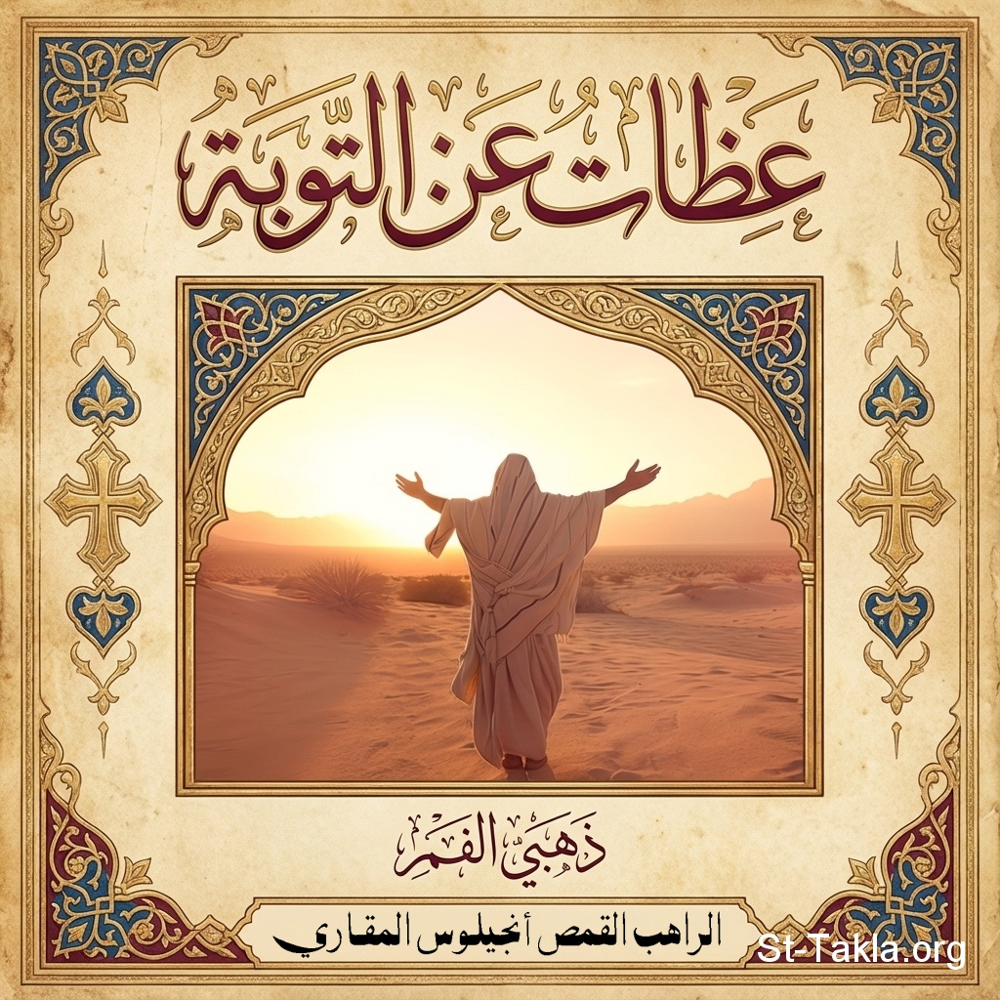

# عظات عن التوبة: للقديس يوحنا ذهبي الفم

**المؤلف / Author:** القمص أنجيلوس المقاري
**المصدر / Source:** [st-takla.org](https://st-takla.org/books/fr-angelos-almaqary/john-chrysostom-repentance/index.html)
**الموضوعات / Topics:** —

📘 **[Download EPUB / تحميل الكتاب](john-chrysostom-repentance.epub)**

## نبذة

نشكر قدس أبونا القمص أنجيلوس المقاري على السماح لنا في موقع الأنبا تكلا هيمانوت بوضع هذا الكتاب هنا. والعظات مُتَرْجَمَة عن كتاب:

## الفصول / Chapters (8)

1. [عقب عودته من الريف](chapters/01-return-countryside/)
2. [توبة الملك آخاب ويونان النبي](chapters/02-ahab-jonah/)
3. [الصدقة - مثل العشر عذارى](chapters/03-almsgiving-ten-virgins/)
4. [الصلاة](chapters/04-prayer/)
5. [يونان النبي - دانيال - الثلاثة فتية](chapters/05-jonah-daniel/)
6. [أُلقيت في الأسبوع السادس من الصوم الكبير](chapters/06-great-lent/)
7. [عن التوبة والندم وكيف أن الله يسرع لنجدتنا ويتمهل على معاقبتنا](chapters/07-god-is-quick-to-help/)
8. [الكنيسة](chapters/08-church-sin/)

---
*هذا الكتاب مجاني للنشر والتوزيع لخلاص كل نفس. This book is free to share and distribute for the salvation of every soul.*
