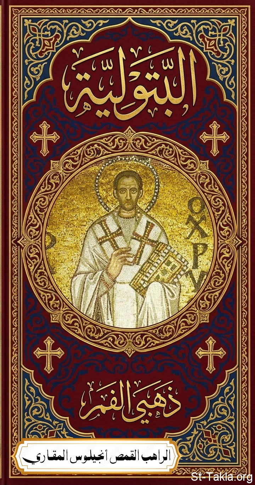

# البتولية: للقديس يوحنا ذهبي الفم

**المؤلف / Author:** القمص أنجيلوس المقاري
**المصدر / Source:** [st-takla.org](https://st-takla.org/books/fr-angelos-almaqary/john-chrysostom-virginity/index.html)
**الموضوعات / Topics:** —

📘 **[Download EPUB / تحميل الكتاب](john-chrysostom-virginity.epub)**

## نبذة

نشكر قدس أبونا القمص أنجيلوس المقاري على السماح لنا في موقع الأنبا تكلا هيمانوت بوضع هذا الكتاب هنا. وقد تمت الترجمة عن كتاب:

## الفصول / Chapters (85)

1. [مقدمة](chapters/01-introduction/)
2. [بتولية الهراطقة لا تستوجب أي مكافأة](chapters/02-heretics/)
3. [الهراطقة سيُعاقبون من أجل ممارستهم البتولية](chapters/03-punishment-of-heretics/)
4. [الاشمئزاز من الزواج علامة على شيطنة غير إنسانية](chapters/04-disgust-at-marriage/)
5. [الهراطقة الذين يراعون البتولية أسوأ حظًا من اليونانيين](chapters/05-heretics-who-observe-celibacy/)
6. [بتولية الهراطقة أكثر نجاسة من تلك التي للزناة](chapters/06-celibacy-of-heretics/)
7. [الهراطقة الذين يمارسون البتولية يدنسون ليس فقط أرواحهم بل أجسادهم أيضًا](chapters/07-heretics-who-practice-celibacy/)
8. [ينبغي أن نقيّم البتولية لا بحسب اللبس الخارجي ولكن بحسب الكيان الداخلي](chapters/08-inner-character/)
9. [إنه ضرر للعذراء أن تُظهر ما بالداخل للمتزوجين](chapters/09-virgin/)
10. [فلنمدح البتولية دون أن نمنع الزواج](chapters/10-praise/)
11. [الذين يحقّرون من شأن الزواج يسيئون إلى البتولية](chapters/11-dont-despise-marriage/)
12. [البتولية تحول الرجال الذين يعتنقونها عن إخلاص إلى ملائكة](chapters/12-transforms-men/)
13. [عندما قال بولس الرسول: "بالنسبة للآخرين أقول لهم أنا وليس الرب" لا يعبّر هذا الكلام عن نصيحة صادرة من إنسان](chapters/13-i-speak/)
14. [لماذا كتب أهل كورنثوس لبولس الرسول بخصوص البتولية ولماذا لم يوجّه لهم بولس الرسول نصائح بشأنها من قبل](chapters/14-corinthians/)
15. [اعتراضات الذين يرفضون البتولية ويدحضونها](chapters/15-objections/)
16. [ليس بالتزاوج يزداد الجنس البشري](chapters/16-human-race/)
17. [الزواج ما هو إلا تعطف وتنازل conescendance](chapters/17-marriage-conescendance/)
18. [عن التعطف الإلهي](chapters/18-divine-concession/)
19. [ليست البتولية ولكن الخطية هي التي ستقرض الجنس البشري](chapters/19-sin/)
20. [الزواج في السابق كان له هدفان ولكن في الوقت الحاضر هدفًا واحدًا](chapters/20-marriage-purposes/)
21. [الاستهزاء بالبتولية ليس بلا مخاطر، واتجاه مثل هذا -مع ذلك- ليس مأمون الجانب](chapters/21-mocking/)
22. [خطر عظيم يتربص بمن يستهزأ بالبتولية](chapters/22-great-danger/)
23. [هلاك الأطفال في عهد أليشع كان درسًا مفيدًا](chapters/23-elisha-children/)
24. [لماذا نفس الأخطاء لا تتلقى نفس العقوبات](chapters/24-same-sins-different-punishments/)
25. [الخطاة حتى ولو ظلوا غير مُعاقبين، فلا يجب أن يكون هذا مدعاة للأمان بل بالحري للخوف](chapters/25-unpunished-sinners/)
26. [الزواج ضروري للضعفاء](chapters/26-importance-of-marriage/)
27. [من هو قادر على حفظ البتولية ويتزوج، يسبب لنفسه أضرارًا جسيمة](chapters/27-keep-celibacy/)
28. [البتولية خير عظيم ومصدر توزيع لخيرات هائلة](chapters/28-great-benefit/)
29. [ما يقوله بولس الرسول عن الزواج إنما هو مشجع على البتولية](chapters/29-paul-sayings-about-marriage/)
30. ["لا يسلب أحدكم الآخر" هي حض على البتولية](chapters/30-exhortation/)
31. [لماذا إن كان الزواج حسنًا ومعتبر في حد ذاته، فلماذا أوصى الرسول الذين يصومون أن يكونوا ضابطين لأنفسهم](chapters/31-fasting/)
32. [بولس الرسول كان مضطرًا للنهي عن العلاقات الزيجية لمن يريدون تكريس وقتهم للصلاة](chapters/32-prayer-vs-marital-relations/)
33. [التهاون في الصلاة ليس فقط لا يجعلنا مرضيين عند الله بل نغضبه](chapters/33-prayer/)
34. [تكرار بولس الرسول لنفس الموضوع إنما هو تمثل بالمسيح](chapters/34-repetition/)
35. [البتولية شيء يستحق الإعجاب وتستحق أكاليل عديدة](chapters/35-admirable-worthy/)
36. [بولس الرسول كان مُجبرًا أن يقدم نفسه كمثال للبتولية](chapters/36-paul-example/)
37. [إنه من باب التواضع أن الرسول أطلق على البتولية أنها هبة إلهية](chapters/37-divine-gift/)
38. [الزواج الثاني يسبب كثير من الضيق](chapters/38-second-marriage/)
39. [لماذا عامل بولس الرسول المتزوجين بكثير من التساهل ولم يعمل شيئًا لوقف حروب وتجارب العذراء](chapters/39-leniency/)
40. [من هي الأرملة ومن هي العذراء اللتان أجاز بولس الرسول لهما الزواج](chapters/40-widow-and-virgin/)
41. [ثقيلة وحتمية هي عبودية الزواج](chapters/41-bondage-of-marriage/)
42. [لماذا صرّح الله لليهود بتطليق زوجاتهم؟](chapters/42-divorce/)
43. [عن تواضع بولس الرسول](chapters/43-humility-of-paul/)
44. [ما الذي يقصده بولس الرسول بالضيق الحاضر](chapters/44-present-distress/)
45. [الحصول على ملكوت السموات بالبتولية أسهل بكثير مما بالزواج](chapters/45-kingdom-of-heaven/)
46. [الذين يخترعون مصاعب زائدة لن يمكنهم انتظار أي مكافأة عنها](chapters/46-unnecessary-difficulties/)
47. [إن كان حقًا أن المرأة هي معوق لإدراك الحياة الكاملة، فلماذا دعاها الكتاب معين لزوجها؟](chapters/47-woman-as-helper/)
48. [كيف تكون المرأة معينًا للرجل في الأمور الروحية؟](chapters/48-woman-help/)
49. [المرأة التي تتعفف ضد رغبة زوجها ستتحمل عقوبة شديدة جدًا إن عاش زوجها في الزنا](chapters/49-chaste-woman-in-marriage/)
50. [لماذا يريد بولس الرسول تحويل أنظارنا عن ملذات هذه الحياة ليقتادنا نحو البتولية؟](chapters/50-from-pleasures-to-repentance/)
51. [في العهد القديم كما في الجديد حياة الملذات ممنوعة](chapters/51-bible/)
52. [حتى لو كانت حياة الملذات مباحة، فإن مضايقات الزواج كافية لتلاشي المسرّة التي نبحث عنها](chapters/52-pleasure-vs-troubles/)
53. [الغيرة خطب عظيم](chapters/53-jealousy/)
54. [زواج الغنىَ أبعد من أن يكون مثار حسد، ومتعب أكثر من زواج الفقر](chapters/54-rich-marriage/)
55. [إن أمكن للرجل إخضاع المرأة الغنية لأوامره فأيضًا سيكون الوضع غير مقبول بالأكثر](chapters/55-marriage-richer-woman/)
56. [إنه شيء مستطير الزواج من رجل أكثر غنى](chapters/56-marriage-richer-man/)
57. [المتزوجة لديها أسباب كثيرة لحزن](chapters/57-married-grieve/)
58. [عن المنغصات التي تصحب الزواج دائمًا](chapters/58-troubles-of-marriage/)
59. [الزواج حتى ولو لم يُصب بأي ضيقات، فليس هذا بالشيء العظيم](chapters/59-not-a-great-thing/)
60. [العذراء وخيرات العريس السماوي](chapters/60-blessings-of-heavenly-bridegroom/)
61. [البتولية لا تحتاج للأشياء التي لا تتوقف علينا](chapters/61-no-need--for-things/)
62. [التحلي بالذهب (وتكديسه) يسبب خوف يفوق بكثير بهجته](chapters/62-adorning-with-gold/)
63. [التحلي بالذهب يسيء إلى الجمال بل يُظهر القبح](chapters/63-gold/)
64. [ما هي حليّ وزينة البتول وما هو جمالها](chapters/64-beauty/)
65. [ما نتحمله لأجل المسيح حتى لو كان متعبًا فله بهجته](chapters/65-endure-for-christ/)
66. [كل تجارب البتولية أخف ثقلًا من آلام الولادة التي تصاحب الزواج](chapters/66-trials-vs-childbirth/)
67. [المشي على القدمين مفضل جدًا عن ركوب البغال!](chapters/67-walking-vs-riding/)
68. [إنه شيء متعب حيازة جواري عديدة](chapters/68-many-concubines/)
69. [عن هدوء النفس المتبتلة](chapters/69-tranquility-of-celibate-soul/)
70. [الموائد الفاخرة تسبب مكاره كثيرة](chapters/70-luxurious-banquets/)
71. [الحياة التي تخلو من الملذات أكثر نفعًا ومستحبة عن حياة اللذات](chapters/71-devoid-of-pleasures/)
72. [حياة الملذات مضرة للنفس](chapters/72-pleasures-harmful/)
73. [زيادة على الشرور الأخرى فإن حياة الملذات تجعل تقلبات الزمن لا تُحتمل](chapters/73-life-of-pleasures/)
74. [الوقت الحالي ليس للزواج](chapters/74-time-not-for-marriage/)
75. [لماذا يريدنا الله أن نكون خاليين من الهم ونحن نلقي أنفسنا على الهم](chapters/75-free-from-worry/)
76. [كيف يكون ممكنًا من له امرأة كأن ليس له](chapters/76-wife-as-if-none/)
77. [ليست البتولية وهقًا ولكن قلة حميتنا](chapters/77-lack-of-zeal/)
78. [المرأة التي تهتم بالأمور الزمنية لا تعرف أن تكون عذراء](chapters/78-worldly-matters/)
79. [لماذا لم يلم بولس الرسول بشدة من يظن إنه يعمل بدون لياقة نحو عذرائه؟](chapters/79-rebuke-improper-acts/)
80. [إيليا ورفاقه لم يفرقا في شيء عن الملائكة والبتولية هي التي جعلتهم هكذا](chapters/80-elijah/)
81. [ما يجب أن يُفهم بعبارة "لأجل اللياقة والمثابرة للرب"](chapters/81-worthiness-perseverance-for-god/)
82. [على جمال التجرد](chapters/82-beauty-of-detachment/)
83. [بخصوص الذين يعلنون أن المتشيعين للبتولية يتمنون الذهاب لحضن إبراهيم](chapters/83-abrahams-bosom/)
84. [مقياس الفضيلة المقدم لنا اليوم ليس هو نفس المقياس في السابق](chapters/84-standard-of-virtue/)
85. [بالحق إن نفس أفعال الفضيلة لا تُكافأ بنفس المستوى بيننا وبين رجال العهد القديم](chapters/85-acts-of-virtue/)

---
*هذا الكتاب مجاني للنشر والتوزيع لخلاص كل نفس. This book is free to share and distribute for the salvation of every soul.*
