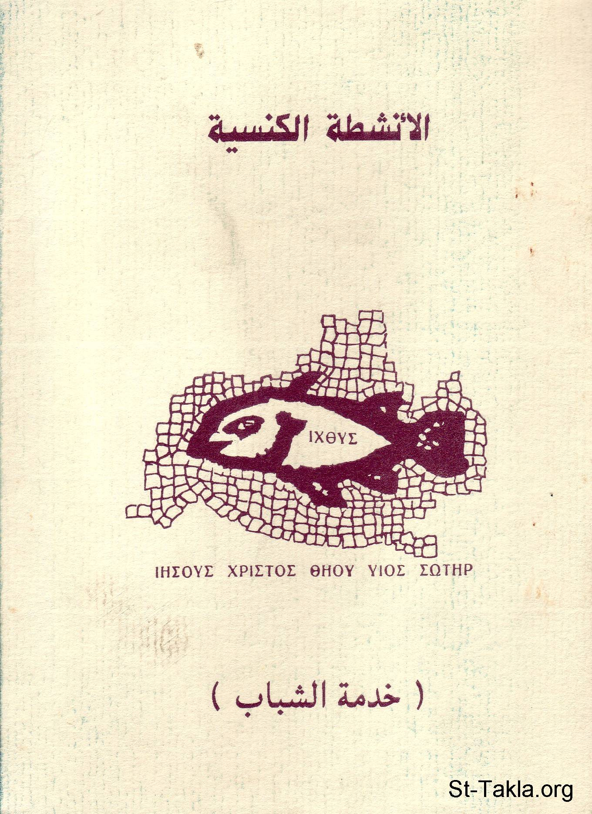

# الأنشطة الكنسية (خدمة الشباب)

**المؤلف / Author:** القمص أثناسيوس فهمي جورج
**المصدر / Source:** [st-takla.org](https://st-takla.org/books/fr-athnasius-fahmy/activities/index.html)
**الموضوعات / Topics:** —

📘 **[Download EPUB / تحميل الكتاب](activities.epub)**

## نبذة

نشكر قدس أبونا القمص أثناسيوس فهمي چورچ لسماحه لموقع الأنبا تكلاهيمانوت بوضع هذا الكتاب هنا. وهو من سلسلة "شبابيات -1" (جزء من سلسلة "إكثوس"). وقد نُشِرَ أولًا تحت الاسم العِلماني: إعداد: أنطون فهمي جورج ، ولم يُكتَب في الكتاب بيانات الطبعة أو رقم الإيداع أو سنة النشر (ربما في أواخر الثمانينيات من القرن العشرين).

## الفصول / Chapters (15)

1. [الأنشطة الكنسية](chapters/01-intro/)
2. [الخدمة المتكاملة - كتاب الأنشطة الكنسية](chapters/02-integration/)
3. [تحديات معاصرة - كتاب الأنشطة الكنسية](chapters/03-contemporary/)
4. [لماذا الأنشطة؟ - كتاب الأنشطة الكنسية](chapters/04-why/)
5. [الأداء المثمر للأنشطة - كتاب الأنشطة الكنسية](chapters/05-fruitful/)
6. [عيوب بعض النشاطات - كتاب الأنشطة الكنسية](chapters/06-flaws/)
7. [ما ينبغي توافره لكي تثمر الأنشطة - كتاب الأنشطة الكنسية](chapters/07-needed/)
8. [أنواع الأنشطة الكنسية ومجالاتها - كتاب الأنشطة الكنسية](chapters/08-kinds/)
9. [متاهات في خدمة الأنشطة - كتاب الأنشطة الكنسية](chapters/09-labyrinths/)
10. [المتاهة الروحية في الخدمة - كتاب الأنشطة الكنسية](chapters/10-spiritual/)
11. [المتاهة الاجتماعية في الخدمة - كتاب الأنشطة الكنسية](chapters/11-social/)
12. [المتاهة الأخلاقية في الخدمة - كتاب الأنشطة الكنسية](chapters/12-morality/)
13. [المتاهة الحزبية في الخدمة - كتاب الأنشطة الكنسية](chapters/13-parties/)
14. [المتاهة الذهنية والسلوكية في الخدمة - كتاب الأنشطة الكنسية](chapters/14-mind/)
15. [كيف نقيم الأنشطة؟ - كتاب الأنشطة الكنسية](chapters/15-evaluation/)

---
*هذا الكتاب مجاني للنشر والتوزيع لخلاص كل نفس. This book is free to share and distribute for the salvation of every soul.*
