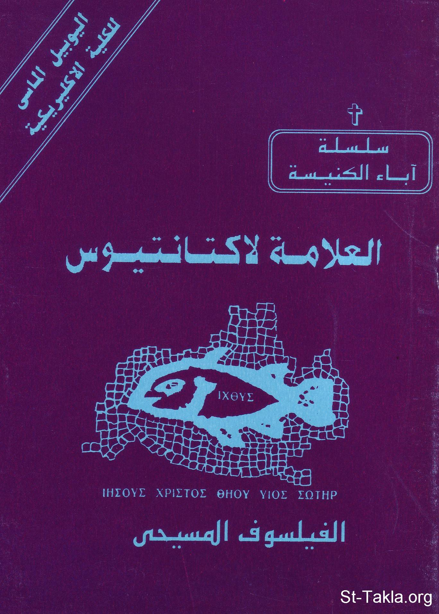

# العلامة لاكتانتيوس الفيلسوف المسيحي، القمص أثناسيوس فهمي جورج

**المؤلف / Author:** القمص أثناسيوس فهمي جورج
**المصدر / Source:** [st-takla.org](https://st-takla.org/Full-Free-Coptic-Books/FreeCopticBooks-018-Father-Athanasius-Fahmy-George/009-Al-3allama-Laktantios/Lactantius-the-Philosopher--00-index.html)
**الموضوعات / Topics:** —

📘 **[Download EPUB / تحميل الكتاب](al-3allama-laktantios.epub)**

## نبذة

نشكر قدس أبونا القمص أثناسيوس فهمي چورچ لسماحه لموقع الأنبا تكلاهيمانوت بوضع هذا الكتاب هنا. وهو من سلسلة آباء الكنيسة (جزء من سلسلة "إكثوس").

## الفصول / Chapters (11)

1. [العلامة لاكتانتيوس الفيلسوف المسيحي](chapters/01-Lactantius-the-Philosopher--01-Intro/)
2. [لوسياس كاليوس فيرميانوس لاكتانتيوس - كتاب العلامة لاكتانتيوس الفيلسوف المسيحي](chapters/02-Lactantius-the-Philosopher--02-Story/)
3. [كتابات لاكتانتيوس - كتاب العلامة لاكتانتيوس الفيلسوف المسيحي](chapters/03-Lactantius-the-Philosopher--03-Writings/)
4. [عن صنعة الله - كتاب العلامة لاكتانتيوس الفيلسوف المسيحي](chapters/04-Lactantius-the-Philosopher--04-On-Gods-Workmanship/)
5. [القوانين الإلهية - كتاب العلامة لاكتانتيوس الفيلسوف المسيحي](chapters/05-Lactantius-the-Philosopher--05-The-Divine-Institutes/)
6. [الملخص - كتاب العلامة لاكتانتيوس الفيلسوف المسيحي](chapters/06-Lactantius-the-Philosopher--06-The-Epitome/)
7. [غضب الله - كتاب العلامة لاكتانتيوس الفيلسوف المسيحي](chapters/07-Lactantius-the-Philosopher--07-The-Anger-of-God/)
8. [موت المضطهدين - كتاب العلامة لاكتانتيوس الفيلسوف المسيحي](chapters/08-Lactantius-the-Philosopher--08-The-Death-of-The-Persecutors/)
9. [طائر العنقاء](chapters/09-Lactantius-the-Philosopher--09-The-Bird-Phoenix/)
10. [أعمال مفقود للاكتانتيوس العلامة - كتاب العلامة لاكتانتيوس الفيلسوف المسيحي](chapters/10-Lactantius-the-Philosopher--10-Lost-Works/)
11. [المصادر والمراجع - كتاب العلامة لاكتانتيوس الفيلسوف المسيحي](chapters/11-Lactantius-the-Philosopher--11-References/)

---
*هذا الكتاب مجاني للنشر والتوزيع لخلاص كل نفس. This book is free to share and distribute for the salvation of every soul.*
