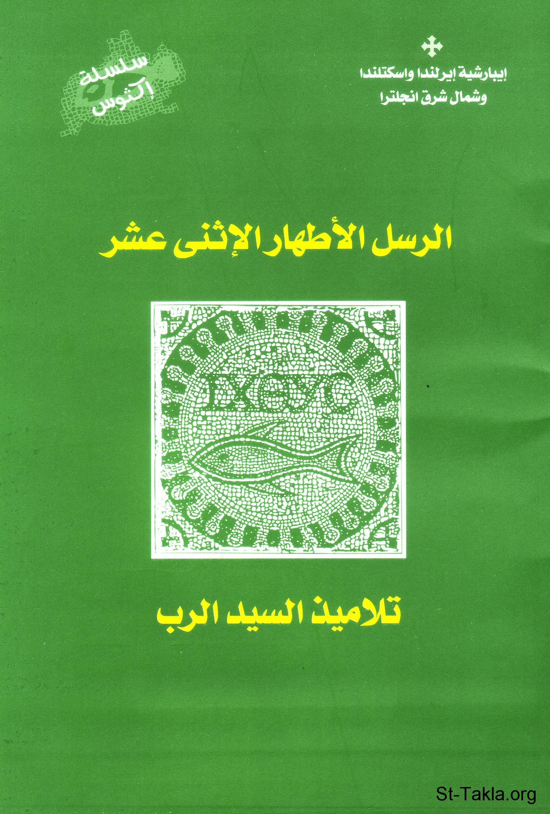

# الرسل الأطهار الإثنى عشر تلاميذ السيد الرب

**المؤلف / Author:** القمص أثناسيوس فهمي جورج
**المصدر / Source:** [st-takla.org](https://st-takla.org/Full-Free-Coptic-Books/FreeCopticBooks-018-Father-Athanasius-Fahmy-George/008-Al-Rosol-Al-Athar/Twelve-Disciples-00-index.html)
**الموضوعات / Topics:** —

📘 **[Download EPUB / تحميل الكتاب](al-rosol-al-athar.epub)**

## نبذة

نشكر قدس أبونا القمص أثناسيوس فهمي چورچ لسماحه لموقع الأنبا تكلاهيمانوت بوضع هذا الكتاب هنا.

## الفصول / Chapters (7)

1. [الرسل الأطهار الاثني عشر تلاميذ السيد الرب](chapters/01-Twelve-Disciples-01-Intro/)
2. [اختيار التلاميذ وتعيينهم](chapters/02-Twelve-Disciples-02-Choice/)
3. [تكريس الاثني عشر](chapters/03-Twelve-Disciples-03-Consecration/)
4. [الرسل شهود القيامة - كتاب الرسل الأطهار الاثني عشر تلاميذ السيد الرب](chapters/04-Twelve-Disciples-04-Resurrection/)
5. [نالوا قوة من الأعالي - كتاب الرسل الأطهار الاثني عشر تلاميذ السيد الرب](chapters/05-Twelve-Disciples-05-Power/)
6. [شهادة الرسل - كتاب الرسل الأطهار الاثني عشر تلاميذ السيد الرب](chapters/06-Twelve-Disciples-06-Testimony/)
7. [آلام الرسل - كتاب الرسل الأطهار الاثني عشر تلاميذ السيد الرب](chapters/07-Twelve-Disciples-07-Pain/)

---
*هذا الكتاب مجاني للنشر والتوزيع لخلاص كل نفس. This book is free to share and distribute for the salvation of every soul.*
