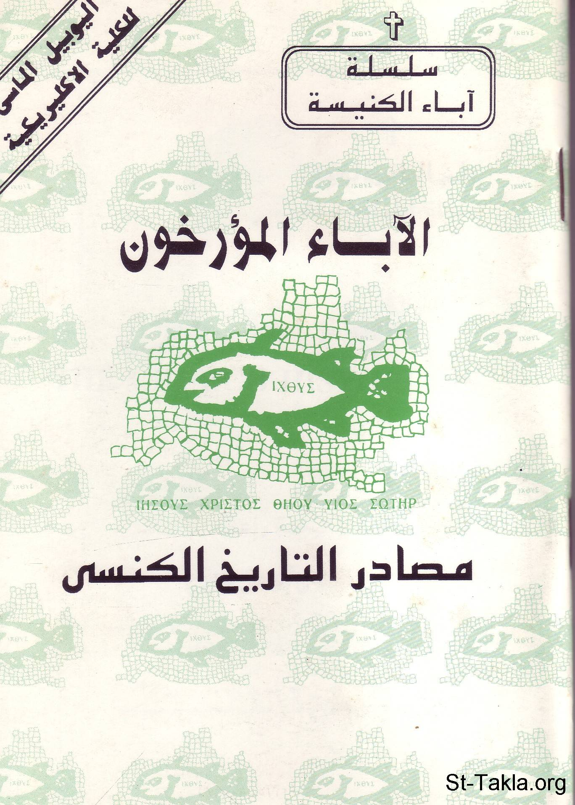

# الآباء المؤرخون: مصادر التاريخ الكنسي للقمص أثناسيوس فهمي جورج

**المؤلف / Author:** ترجمة وإعداد: القمص أثناسيوس فهمي جورج
**المصدر / Source:** [st-takla.org](https://st-takla.org/Full-Free-Coptic-Books/FreeCopticBooks-018-Father-Athanasius-Fahmy-George/012-AlAbaa2-Al-Mo2arekhoun/Church-Historians-00-index.html)
**الموضوعات / Topics:** —

📘 **[Download EPUB / تحميل الكتاب](alabaa2-al-mo2arekhoun.epub)**

## نبذة

نشكر قدس أبونا القمص أثناسيوس فهمي چورچ لسماحه لموقع الأنبا تكلاهيمانوت بوضع هذا الكتاب هنا. وهو من سلسلة آباء الكنيسة (جزء من سلسلة "إكثوس").

## الفصول / Chapters (21)

1. [المصادر والمراجع - كتاب الآباء المؤرخون: مصادر التاريخ الكنسي](chapters/01-Church-Historians-21-References/)
2. [مقدمة ومدخل - كتاب الآباء المؤرخون: مصادر التاريخ الكنسي](chapters/02-Church-Historians-01-Intro/)
3. [مصادر تاريخنا الكنسي - كتاب الآباء المؤرخون: مصادر التاريخ الكنسي](chapters/03-Church-Historians-02-Sources/)
4. [يوليوس أفريقانوس - كتاب الآباء المؤرخون: مصادر التاريخ الكنسي](chapters/04-Church-Historians-03-Julius-Africanus/)
5. [العلامة يوسابيوس القيصري - كتاب الآباء المؤرخون: مصادر التاريخ الكنسي](chapters/05-Church-Historians-04-Eusebius-of-Caesarea/)
6. [القديس جيروم - كتاب الآباء المؤرخون: مصادر التاريخ الكنسي](chapters/06-Church-Historians-05-Jerome/)
7. [جناديوس المؤرخ - كتاب الآباء المؤرخون: مصادر التاريخ الكنسي](chapters/07-Church-Historians-06-Gennadius-of-Marseillies/)
8. [روفينوس المؤرخ](chapters/08-Church-Historians-07-Rufinus-of-Aquieia/)
9. [يوحنا كاسيان - كتاب الآباء المؤرخون: مصادر التاريخ الكنسي](chapters/09-Church-Historians-08-John-Cassian/)
10. [بالاديوس - كتاب الآباء المؤرخون: مصادر التاريخ الكنسي](chapters/10-Church-Historians-09-Palladius/)
11. [سلبيسيوس ساويرس - كتاب الآباء المؤرخون: مصادر التاريخ الكنسي](chapters/11-Church-Historians-10-Sulpicius-Severus/)
12. [سقراط المؤرخ - كتاب الآباء المؤرخون: مصادر التاريخ الكنسي](chapters/12-Church-Historians-11-Socrates/)
13. [سوزومين المؤرخ - كتاب الآباء المؤرخون: مصادر التاريخ الكنسي](chapters/13-Church-Historians-12-Sozomen/)
14. [فيلبس المؤرخ - كتاب الآباء المؤرخون: مصادر التاريخ الكنسي](chapters/14-Church-Historians-13-Philip-Sidetes/)
15. [فيلاستورجيوس - كتاب الآباء المؤرخون: مصادر التاريخ الكنسي](chapters/15-Church-Historians-14-Philastorgius/)
16. [ثيودورت اسقف قورش - كتاب الآباء المؤرخون: مصادر التاريخ الكنسي](chapters/16-Church-Historians-15-Theodoret-of-Cyrus/)
17. [كاسيودورس - كتاب الآباء المؤرخون: مصادر التاريخ الكنسي](chapters/17-Church-Historians-16-Cassiodorus/)
18. [إيفاجريوس المؤرخ - كتاب الآباء المؤرخون: مصادر التاريخ الكنسي](chapters/18-Church-Historians-17-Evagrius-Scholasticus/)
19. [زكريا البليغ - كتاب الآباء المؤرخون: مصادر التاريخ الكنسي](chapters/19-Church-Historians-18-Zacharias-Rhetor/)
20. [يوحنا النيقيوسي - كتاب الآباء المؤرخون: مصادر التاريخ الكنسي](chapters/20-Church-Historians-19-John-of-Nicosia/)
21. [ساويرس بن المقفع - كتاب الآباء المؤرخون: مصادر التاريخ الكنسي](chapters/21-Church-Historians-20-Severios-Ibn-ElMokaffa/)

---
*هذا الكتاب مجاني للنشر والتوزيع لخلاص كل نفس. This book is free to share and distribute for the salvation of every soul.*
