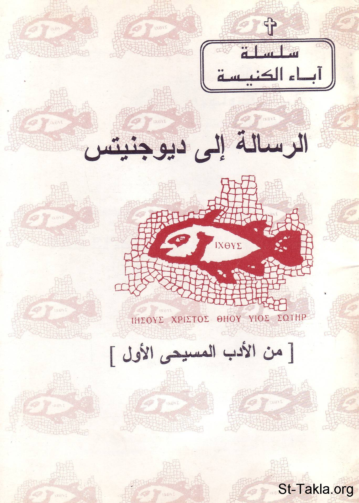

# الرسالة إلى ديوجنيتس (من الأدب المسيحي الأول)

**المؤلف / Author:** القمص أثناسيوس فهمي جورج
**المصدر / Source:** [st-takla.org](https://st-takla.org/books/fr-athnasius-fahmy/diognetus/index.html)
**الموضوعات / Topics:** —

📘 **[Download EPUB / تحميل الكتاب](diognetus.epub)**

## نبذة

نشكر قدس أبونا القمص أثناسيوس فهمي چورچ لسماحه لموقع الأنبا تكلاهيمانوت بوضع هذا الكتاب هنا.

## الفصول / Chapters (19)

1. [مقدمة ومدخل للرسالة إلى ديوجنيتس](chapters/01-intro/)
2. [أهمية الرسالة واكتشافها - كتاب الرسالة إلى ديوجنيتس](chapters/02-importance/)
3. [كاتب الرسالة - كتاب الرسالة إلى ديوجنيتس](chapters/03-writer/)
4. [من هو ديوجنيتوس؟ - كتاب الرسالة إلى ديوجنيتس](chapters/04-who/)
5. [السمات الأساسية في الرسالة - كتاب الرسالة إلى ديوجنيتس](chapters/05-characteristic/)
6. [أقسام الرسالة - كتاب الرسالة إلى ديوجنيتس](chapters/06-parts/)
7. [نص الرسالة - كتاب الرسالة إلى ديوجنيتس](chapters/07-epistle/)
8. [غيرة ديوجينيتس وأسئلته](chapters/08-reason/)
9. [سمو المسيحية على الوثنية](chapters/09-idols/)
10. [سمو المسيحية على اليهودية](chapters/10-judaism/)
11. [سمو الحياة المسيحية - كتاب الرسالة إلى ديوجنيتس](chapters/11-high/)
12. [المسيحية وروح العالم - كتاب الرسالة إلى ديوجنيتس](chapters/12-world/)
13. [أصل المسيحية الإلهي - كتاب الرسالة إلى ديوجنيتس](chapters/13-origin/)
14. [الإيمان بالله - كتاب الرسالة إلى ديوجنيتس](chapters/14-god/)
15. [المعرفة الإلهية والحياة - كتاب الرسالة إلى ديوجنيتس](chapters/15-knowledge/)
16. [دعوة ديوجنيتس لقبول الإيمان - كتاب الرسالة إلى ديوجنيتس](chapters/16-asking/)
17. [قبول النعمة الإلهية - كتاب الرسالة إلى ديوجنيتس](chapters/17-accept/)
18. [الدعوة للإيمان - كتاب الرسالة إلى ديوجنيتس](chapters/18-faith/)
19. [المصادر والمراجع - كتاب الرسالة إلى ديوجنيتس](chapters/19-ref/)

---
*هذا الكتاب مجاني للنشر والتوزيع لخلاص كل نفس. This book is free to share and distribute for the salvation of every soul.*
