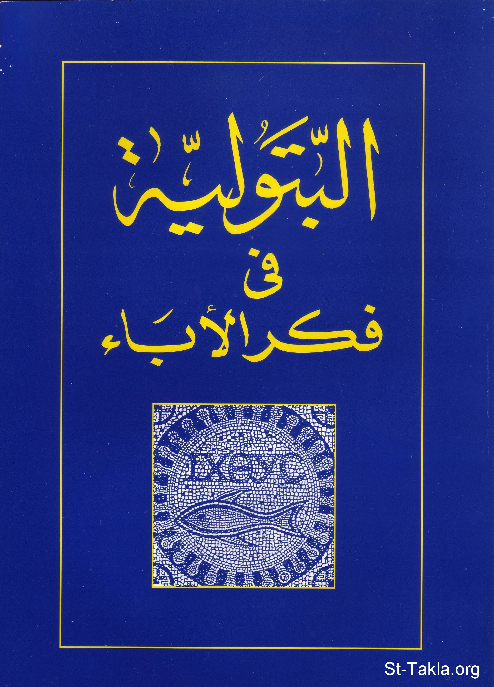

# البتولية في فكر الآباء

**المؤلف / Author:** القمص أثناسيوس فهمي جورج
**المصدر / Source:** [st-takla.org](https://st-takla.org/Full-Free-Coptic-Books/FreeCopticBooks-018-Father-Athanasius-Fahmy-George/002-El-Batolya/Virginity-in-the-Patristic-Thought__00-index.html)
**الموضوعات / Topics:** —

📘 **[Download EPUB / تحميل الكتاب](el-batolya.epub)**

## نبذة

نشكر قدس أبونا القمص أثناسيوس فهمي چورچ لسماحه لموقع الأنبا تكلاهيمانوت بوضع هذا الكتاب هنا. وهو من سلسلة دراسات آبائية (جزء من سلسلة "إكثوس").

## الفصول / Chapters (53)

1. [البتولية](chapters/01-Virginity-in-the-Patristic-Thought__01-Intro/)
2. [البتولية عند الآباء الرسوليين](chapters/02-Virginity-in-the-Patristic-Thought__02-Apostolic-Fathers/)
3. [البتولية عند الآباء المدافعين](chapters/03-Virginity-in-the-Patristic-Thought__03-Defenders/)
4. [البتولية عند آباء الإسكندرية](chapters/04-Virginity-in-the-Patristic-Thought__04-Alexandrians-1/)
5. [البتولية عند مُعَلِّمي الإسكندرية](chapters/05-Virginity-in-the-Patristic-Thought__05-Alexandrians-2/)
6. [البتولية عند القديس باسيليوس الكبير](chapters/06-Virginity-in-the-Patristic-Thought__06-St-Basil/)
7. [البتولية عند القديس اغريغوريوس النزينزي](chapters/07-Virginity-in-the-Patristic-Thought__07-St-Gregory-1/)
8. [البتولية عند القديس يوحنا فم الذهب](chapters/08-Virginity-in-the-Patristic-Thought__08-St-John-Golden-Mouth/)
9. [البتولية عند مار آفرآم السرياني](chapters/09-Virginity-in-the-Patristic-Thought__09-St-Afram/)
10. [البتولية عند القديس يعقوب السروجي](chapters/10-Virginity-in-the-Patristic-Thought__10-St-Yacob-El-Sorogy/)
11. [البتولية عند الأب يوحنا الدمشقي](chapters/11-Virginity-in-the-Patristic-Thought__11-St-Yohana-El-Demashki/)
12. [وليمة العشر عذارى - القديس ميثوديوس الأوليمبي](chapters/12-Virginity-in-the-Patristic-Thought__12-Banquet-of-10-Virgins-1/)
13. [سمات كتابات الأنبا ميثوديوس الأسلوبية والفكرية](chapters/13-Virginity-in-the-Patristic-Thought__13-St-Mithodios/)
14. [البتولية والسلوك العذراوي](chapters/14-Virginity-in-the-Patristic-Thought__14-Attitude/)
15. [تدرجية فكر البتولية](chapters/15-Virginity-in-the-Patristic-Thought__15-Steps/)
16. [المسح مُعَلِّم البتولية](chapters/16-Virginity-in-the-Patristic-Thought__16-Jesus/)
17. [بين الزيجة والبتولية](chapters/17-Virginity-in-the-Patristic-Thought__17-Marriage-1/)
18. [دعوة البتولية](chapters/18-Virginity-in-the-Patristic-Thought__18-Invitation/)
19. [مديح العفة](chapters/19-Virginity-in-the-Patristic-Thought__19-Praise/)
20. [الطريق إلى حِفظ العفة](chapters/20-Virginity-in-the-Patristic-Thought__20-Road/)
21. [عظمة السلوك البتولية](chapters/21-Virginity-in-the-Patristic-Thought__21-Glory/)
22. [نذر البتولية (اللسان - العينان - الأذنان - اليدان - القدمان - القلب والعقل)](chapters/22-Virginity-in-the-Patristic-Thought__22-Vow/)
23. [واجبات العذارى](chapters/23-Virginity-in-the-Patristic-Thought__23-Duties/)
24. [قدسية البتولية](chapters/24-Virginity-in-the-Patristic-Thought__24-Sanctify/)
25. [هدف الحياة العذراوية](chapters/25-Virginity-in-the-Patristic-Thought__25-Aim/)
26. [جعالة البتولية](chapters/26-Virginity-in-the-Patristic-Thought__26-Prize/)
27. [البتولية والكنيسة](chapters/27-Virginity-in-the-Patristic-Thought__27-Church/)
28. [مجد البتولية](chapters/28-Virginity-in-the-Patristic-Thought__28-Grace/)
29. [اقتناء البتولية بالجهاد الروحي](chapters/29-Virginity-in-the-Patristic-Thought__29-Strife-1/)
30. [الجهاد والبتولية](chapters/30-Virginity-in-the-Patristic-Thought__30-Strife-2/)
31. [أطوار الحياة الروحية وبلوغ الفضيلة](chapters/31-Virginity-in-the-Patristic-Thought__31-Phases/)
32. [تسبحة تكلة العذراء القديسة](chapters/32-Virginity-in-the-Patristic-Thought__32-Teckla-1/)
33. [ثياب العذارى - القديس كبريانوس](chapters/33-Virginity-in-the-Patristic-Thought__33-Dress-of-Virgins/)
34. [الشهيد كبريانوس ونصائح للنساء عن الزينة](chapters/34-Virginity-in-the-Patristic-Thought__34-Makeup/)
35. [نصائح للعذارى من القديس كيبريانوس](chapters/35-Virginity-in-the-Patristic-Thought__35-Virgins/)
36. [البتولية والقديس اغريغوريوس النيصي](chapters/36-Virginity-in-the-Patristic-Thought__36-St-Gregory-2/)
37. [القديس أمبروسيوس عن البتولية](chapters/37-Virginity-in-the-Patristic-Thought__37-St-Abrosios/)
38. [كرامات البتولية](chapters/38-Virginity-in-the-Patristic-Thought__38-Honor/)
39. [الزواج عند القديس أمبروسيوس](chapters/39-Virginity-in-the-Patristic-Thought__39-Matrimony-2/)
40. [نصائح للعذارى](chapters/40-Virginity-in-the-Patristic-Thought__40-Advise/)
41. [القديس أمبرسيوس عن العذارى](chapters/41-Virginity-in-the-Patristic-Thought__41-To-Virgins/)
42. [العذراء مريم كمثال للعذارى](chapters/42-Virginity-in-the-Patristic-Thought__42-St-Mary/)
43. [القديسة تكلة كمثال للعذارى](chapters/43-Virginity-in-the-Patristic-Thought__43-St-Taqla-2/)
44. [عذراء من أنطاكية](chapters/44-Virginity-in-the-Patristic-Thought__44-Antakia-Virgin/)
45. [الفضائل التي يجب أن تتحلى بها العذراء](chapters/45-Virginity-in-the-Patristic-Thought__45-Virtues/)
46. [الرسالة إلى القديسة أستوكيوم من القديس جيروم](chapters/46-Virginity-in-the-Patristic-Thought__46-St-Jerome-to-Eustochium-1/)
47. [من رسالة جيروم إلى أستوخيوم](chapters/47-Virginity-in-the-Patristic-Thought__47-St-Jerome-to-Eustochium-2/)
48. [من رسالة إيرونيموس إلى يوستوكيوم](chapters/48-Virginity-in-the-Patristic-Thought__48-St-Jerome-to-Eustochium-3/)
49. [القديس أوغوسطينوس عن البتولية](chapters/49-Virginity-in-the-Patristic-Thought__49-St-Augustinos/)
50. [الزواج والبتولية](chapters/50-Virginity-in-the-Patristic-Thought__50-Marriage-3/)
51. [نصائح أغسطينوس للعذارى](chapters/51-Virginity-in-the-Patristic-Thought__51-Advise-for-Virgins/)
52. [الخلاصة عن موضوع البتولية](chapters/52-Virginity-in-the-Patristic-Thought__52-Outro/)
53. [مراجع البحث](chapters/53-Virginity-in-the-Patristic-Thought__53-References/)

---
*هذا الكتاب مجاني للنشر والتوزيع لخلاص كل نفس. This book is free to share and distribute for the salvation of every soul.*
