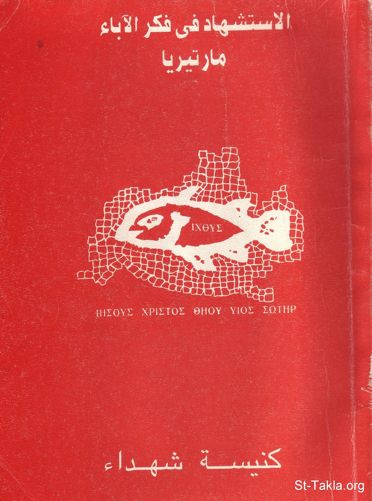

# الاستشهاد في فكر الآباء للقمص أثناسيوس فهمي جورج

**المؤلف / Author:** القمص أثناسيوس فهمي جورج
**المصدر / Source:** [st-takla.org](https://st-takla.org/Full-Free-Coptic-Books/FreeCopticBooks-018-Father-Athanasius-Fahmy-George/003-El-Esteshhad/Martyrdom-in-the-Patristic-Thgought__000-index.html)
**الموضوعات / Topics:** —

📘 **[Download EPUB / تحميل الكتاب](el-esteshhad.epub)**

## نبذة

· يتناول هذا البحث ”عصر الاستشهاد المسيحي“ (عن عِلْم المارتيرولوچي)، وتطوُر مفهوم الشهادة في الكتاب المُقدس ، وفي العصر الرَّسولي الأوَّل مرورًا بآباء الكنيسة الأولين .

## الفصول / Chapters (108)

1. [مقدمة للأنبا بنيامين - كتاب الاستشهاد في فكر الآباء](chapters/01-Martyrdom-in-the-Patristic-Thgought__001-Intro/)
2. [تقديم - كتاب الاستشهاد في فكر الآباء](chapters/02-Martyrdom-in-the-Patristic-Thgought__002-Preface/)
3. [كلمة شكر - كتاب الاستشهاد في فكر الآباء](chapters/03-Martyrdom-in-the-Patristic-Thgought__003-Thanks/)
4. [حياة الكنيسة في عصور الاستشهاد](chapters/04-Martyrdom-in-the-Patristic-Thgought__004-Life/)
5. [عائلة الله عبر التاريخ - كتاب الاستشهاد في فكر الآباء](chapters/05-Martyrdom-in-the-Patristic-Thgought__005-History-1/)
6. [اضطهاد الوثنية للكنيسة المسيحية - كتاب الاستشهاد في فكر الآباء](chapters/06-Martyrdom-in-the-Patristic-Thgought__006-Idols/)
7. [الاضطهادات العشرة التي عبرت على الكنيسة في العصر الروماني - كتاب الاستشهاد في فكر الآباء](chapters/07-Martyrdom-in-the-Patristic-Thgought__007-Ten/)
8. [الاضطهاد الأول تحت حكم الإمبراطور نيرون سنة 64 م. - كتاب الاستشهاد في فكر الآباء](chapters/08-Martyrdom-in-the-Patristic-Thgought__008-One-Nairoun/)
9. [الاضطهاد الثاني تحت حكم الإمبراطور دوميتيان سنة 81 م. - كتاب الاستشهاد في فكر الآباء](chapters/09-Martyrdom-in-the-Patristic-Thgought__009-Two-Dometian/)
10. [الاضطهاد الثالث الذي بدأ في عصر تراجان سنة 106 م. - كتاب الاستشهاد في فكر الآباء](chapters/10-Martyrdom-in-the-Patristic-Thgought__010-Three-Trajan/)
11. [الاضطهاد الرابع تحت حكم مرقس أوريليوس أنطونيوس عام 166 م. - كتاب الاستشهاد في فكر الآباء](chapters/11-Martyrdom-in-the-Patristic-Thgought__011-Four-Orilios-Antonious/)
12. [الاضطهاد الخامس الذي بدأ مع ساويرس عام 193 م. - كتاب الاستشهاد في فكر الآباء](chapters/12-Martyrdom-in-the-Patristic-Thgought__012-Five-Saweeros/)
13. [الاضطهاد السادس في عهد مكسيميانوس التراقي سنة 235 م. - كتاب الاستشهاد في فكر الآباء](chapters/13-Martyrdom-in-the-Patristic-Thgought__013-Six-Maximianos/)
14. [الاضطهاد السابع في عهد ديسيوس سنة 250 م. - كتاب الاستشهاد في فكر الآباء](chapters/14-Martyrdom-in-the-Patristic-Thgought__014-Seven-Disios/)
15. [الاضطهاد الثامن على يد فاليريان الطاغية سنة 257 م. - كتاب الاستشهاد في فكر الآباء](chapters/15-Martyrdom-in-the-Patristic-Thgought__015-Eight-Valerian/)
16. [الاضطهاد التاسع في عهد أوريليان سنة 274 م. - كتاب الاستشهاد في فكر الآباء](chapters/16-Martyrdom-in-the-Patristic-Thgought__016-Nine-Orilian/)
17. [الاضطهاد العاشر في عهد دقليديانوس (ديوكلتيانوس)](chapters/17-Martyrdom-in-the-Patristic-Thgought__017-Ten-Deocletean/)
18. [موقف المسيحيين في وسط العالم في أيام الاضطهاد - كتاب الاستشهاد في فكر الآباء](chapters/18-Martyrdom-in-the-Patristic-Thgought__018-Attitude/)
19. [عدم مقاومة الشر - كتاب الاستشهاد في فكر الآباء](chapters/19-Martyrdom-in-the-Patristic-Thgought__019-Evil/)
20. [الصلاة - كتاب الاستشهاد في فكر الآباء](chapters/20-Martyrdom-in-the-Patristic-Thgought__020-Pray/)
21. [المحبة - كتاب الاستشهاد في فكر الآباء](chapters/21-Martyrdom-in-the-Patristic-Thgought__021-Love/)
22. [الارتباط السري بين الصلاة وقبول الآلام - كتاب الاستشهاد في فكر الآباء](chapters/22-Martyrdom-in-the-Patristic-Thgought__022-Pain/)
23. [الاستعداد للآلام بفرح - كتاب الاستشهاد في فكر الآباء](chapters/23-Martyrdom-in-the-Patristic-Thgought__023-Happiness/)
24. [كيف أعدت الكنيسة أولادها للاستشهاد؟ - كتاب الاستشهاد في فكر الآباء](chapters/24-Martyrdom-in-the-Patristic-Thgought__024-How/)
25. [دور الكنيسة في الاستعداد للاستشهاد - كتاب الاستشهاد في فكر الآباء](chapters/25-Martyrdom-in-the-Patristic-Thgought__025-Church/)
26. [الكتاب المقدس المُعاش - كتاب الاستشهاد في فكر الآباء](chapters/26-Martyrdom-in-the-Patristic-Thgought__026-Bible/)
27. [الثقافة الروحية والتعليم الكنسي - كتاب الاستشهاد في فكر الآباء](chapters/27-Martyrdom-in-the-Patristic-Thgought__027-Teachings/)
28. [الثبات في روح الحب للجميع حتى المُضطهِدين - كتاب الاستشهاد في فكر الآباء](chapters/28-Martyrdom-in-the-Patristic-Thgought__028-Loving/)
29. [عمل الرعاية والخدمة في الكنيسة - كتاب الاستشهاد في فكر الآباء](chapters/29-Martyrdom-in-the-Patristic-Thgought__029-Care/)
30. [ديمومة الاستشهاد في المسيحية - كتاب الاستشهاد في فكر الآباء](chapters/30-Martyrdom-in-the-Patristic-Thgought__030-Always/)
31. [أسباب انتصار المسيحية - كتاب الاستشهاد في فكر الآباء](chapters/31-Martyrdom-in-the-Patristic-Thgought__031-Reasons/)
32. [سر انتصار الإيمان المسيحي](chapters/32-Martyrdom-in-the-Patristic-Thgought__032-Secret/)
33. [الأساس الكنسي السرّي لديمومة الاستشهاد - كتاب الاستشهاد في فكر الآباء](chapters/33-Martyrdom-in-the-Patristic-Thgought__033-Main/)
34. [القيم الروحية للاستشهاد المسيحي - كتاب الاستشهاد في فكر الآباء](chapters/34-Martyrdom-in-the-Patristic-Thgought__034-Values/)
35. [أنواع شهادات كثيرة - كتاب الاستشهاد في فكر الآباء](chapters/35-Martyrdom-in-the-Patristic-Thgought__035-Kinds/)
36. [معمودية الدم - كتاب الاستشهاد في فكر الآباء](chapters/36-Martyrdom-in-the-Patristic-Thgought__036-Blood-Baptism/)
37. [الشهادة ذبيحة افخارستيا - كتاب الاستشهاد في فكر الآباء](chapters/37-Martyrdom-in-the-Patristic-Thgought__037-Eukharist/)
38. [قوة الاستشهاد وامتداد الكرازة - كتاب الاستشهاد في فكر الآباء](chapters/38-Martyrdom-in-the-Patristic-Thgought__038-Power/)
39. [الشهادة كتابيًا](chapters/39-Martyrdom-in-the-Patristic-Thgought__039-Biblical/)
40. [أطفال بيت لحم الشهداء - كتاب الاستشهاد في فكر الآباء](chapters/40-Martyrdom-in-the-Patristic-Thgought__040-Beit-Lahm/)
41. [مفهوم كلمة "شاهد" - كتاب الاستشهاد في فكر الآباء](chapters/41-Martyrdom-in-the-Patristic-Thgought__041-Witness/)
42. [القديس إسطفانوس أول الشهداء - كتاب الاستشهاد في فكر الآباء](chapters/42-Martyrdom-in-the-Patristic-Thgought__042-Es6afanous/)
43. [الشهادة في رسالة بولس الرسول إلى العبرانيين - كتاب الاستشهاد في فكر الآباء](chapters/43-Martyrdom-in-the-Patristic-Thgought__043-3ebranieyeen/)
44. [الشهادة في سفر الرؤيا - كتاب الاستشهاد في فكر الآباء](chapters/44-Martyrdom-in-the-Patristic-Thgought__044-Revelations/)
45. [الشهادة في المنظور الكنسي - كتاب الاستشهاد في فكر الآباء](chapters/45-Martyrdom-in-the-Patristic-Thgought__045-View/)
46. [الاستشهاد سرّ كنسي - كتاب الاستشهاد في فكر الآباء](chapters/46-Martyrdom-in-the-Patristic-Thgought__046-Sacrament/)
47. [الشهادة في المبنى الكنسي - كتاب الاستشهاد في فكر الآباء](chapters/47-Martyrdom-in-the-Patristic-Thgought__047-Building/)
48. [الروح القدس والاستشهاد - كتاب الاستشهاد في فكر الآباء](chapters/48-Martyrdom-in-the-Patristic-Thgought__048-El-Roo7-Al-Kodos/)
49. [الشهادة في التاريخ الكنسي القبطي - كتاب الاستشهاد في فكر الآباء](chapters/49-Martyrdom-in-the-Patristic-Thgought__049-Tarikh-2/)
50. [وثائق تاريخية عن عصر وأعمال الشهداء](chapters/50-Martyrdom-in-the-Patristic-Thgought__050-Documents/)
51. [نهاية المُضطهدين - كتاب الاستشهاد في فكر الآباء](chapters/51-Martyrdom-in-the-Patristic-Thgought__051-Ending/)
52. [علم المارتيرولوجي - كتاب الاستشهاد في فكر الآباء](chapters/52-Martyrdom-in-the-Patristic-Thgought__052-Martyrology/)
53. [كلمنت السكندري ومفاهيم استشهادية - كتاب الاستشهاد في فكر الآباء](chapters/53-Martyrdom-in-the-Patristic-Thgought__053-Klement/)
54. [أوريجانوس العلامة ونفسية الاستشهاد - كتاب الاستشهاد في فكر الآباء](chapters/54-Martyrdom-in-the-Patristic-Thgought__054-Origin/)
55. [الاستشهاد من الأسرار الكنسية](chapters/55-Martyrdom-in-the-Patristic-Thgought__055-Peter-I/)
56. [ترتليان العلامة والاستشهاد - كتاب الاستشهاد في فكر الآباء](chapters/56-Martyrdom-in-the-Patristic-Thgought__056-Tertelianos/)
57. [القديس يوحنا فم الذهب والاستشهاد - كتاب الاستشهاد في فكر الآباء](chapters/57-Martyrdom-in-the-Patristic-Thgought__057-Fam-El-Zahab/)
58. [القديس كبريانوس والاستشهاد - كتاب الاستشهاد في فكر الآباء](chapters/58-Martyrdom-in-the-Patristic-Thgought__058-Keprianos/)
59. [القديس أمبروسيوس الميلاني والاستشهاد - كتاب الاستشهاد في فكر الآباء](chapters/59-Martyrdom-in-the-Patristic-Thgought__059-Amprosios/)
60. [الأنبا أغسطينوس شفيع التائبين والاستشهاد - كتاب الاستشهاد في فكر الآباء](chapters/60-Martyrdom-in-the-Patristic-Thgought__060-Oghosteenus/)
61. [سيكلوجية الشهداء](chapters/61-Martyrdom-in-the-Patristic-Thgought__061-Psychology/)
62. [روائع من صلوات الشهداء قبل استشهادهم - كتاب الاستشهاد في فكر الآباء](chapters/62-Martyrdom-in-the-Patristic-Thgought__062-Prayers/)
63. [من صلوات القديس أغناطيوس الأنطاكي قبل استشهاده - كتاب الاستشهاد في فكر الآباء](chapters/63-Martyrdom-in-the-Patristic-Thgought__063-Aghnatios/)
64. [من صلوات الشهيد بوليكاربوس قبل استشهاده - كتاب الاستشهاد في فكر الآباء](chapters/64-Martyrdom-in-the-Patristic-Thgought__064-Bolikarbos/)
65. [شهداء ليون - كتاب الاستشهاد في فكر الآباء](chapters/65-Martyrdom-in-the-Patristic-Thgought__065-Lyons/)
66. [من صلوات الأسقف الشهيد فيلكس قبل استشهاده - كتاب الاستشهاد في فكر الآباء](chapters/66-Martyrdom-in-the-Patristic-Thgought__066-Phileox/)
67. [من صلوات الأسقف إيريناوس سيرميوم قبل استشهاده - كتاب الاستشهاد في فكر الآباء](chapters/67-Martyrdom-in-the-Patristic-Thgought__067-Erenaos/)
68. [من صلوات شهداء أبيتين قبل استشهادهم - كتاب الاستشهاد في فكر الآباء](chapters/68-Martyrdom-in-the-Patristic-Thgought__068-Abitine/)
69. [من صلوات كاربوس، بابيليوس، أجاثونيك قبل استشهادهم - كتاب الاستشهاد في فكر الآباء](chapters/69-Martyrdom-in-the-Patristic-Thgought__069-Karbos/)
70. [من صلوات لوسيان، مرقيان قبل استشهادهم - كتاب الاستشهاد في فكر الآباء](chapters/70-Martyrdom-in-the-Patristic-Thgought__070-Losian/)
71. [من صلوات بيونيوس، مثرودوروس قبل استشهادهم - كتاب الاستشهاد في فكر الآباء](chapters/71-Martyrdom-in-the-Patristic-Thgought__071-Pionios/)
72. [من صلوات روجاتيان وأخيه دونيان قبل استشهادهم - كتاب الاستشهاد في فكر الآباء](chapters/72-Martyrdom-in-the-Patristic-Thgought__072-Rogatian/)
73. [من صلوات الشهيد إيبولوس في صقلية قبل استشهاده - كتاب الاستشهاد في فكر الآباء](chapters/73-Martyrdom-in-the-Patristic-Thgought__073-Epolos/)
74. [من صلوات ثيؤدوسيوس والعذراى السبع قبل استشهادهم - كتاب الاستشهاد في فكر الآباء](chapters/74-Martyrdom-in-the-Patristic-Thgought__074-Theodocios/)
75. [من صلوات جينسيوس الممثل قبل استشهاده - كتاب الاستشهاد في فكر الآباء](chapters/75-Martyrdom-in-the-Patristic-Thgought__075-Ginsios/)
76. [من صلوات بونيفان الطرسوسي قبل استشهاده - كتاب الاستشهاد في فكر الآباء](chapters/76-Martyrdom-in-the-Patristic-Thgought__076-Bonfan/)
77. [من صلوات الشهيد برلعام قبل استشهاده - كتاب الاستشهاد في فكر الآباء](chapters/77-Martyrdom-in-the-Patristic-Thgought__077-Barleam/)
78. [من صلوات الشهيد نكفوروس قبل استشهاده - كتاب الاستشهاد في فكر الآباء](chapters/78-Martyrdom-in-the-Patristic-Thgought__078-Nekforos/)
79. [من صلوات القديسة تكلة الرسولة قبل استشهادها - كتاب الاستشهاد في فكر الآباء](chapters/79-Martyrdom-in-the-Patristic-Thgought__079-Techkla/)
80. [من صلوات الشهيدة آجنس قبل استشهادها - كتاب الاستشهاد في فكر الآباء](chapters/80-Martyrdom-in-the-Patristic-Thgought__080-Agnes/)
81. [من صلوات الشهداء بابياس ورفقاؤه قبل استشهادهم - كتاب الاستشهاد في فكر الآباء](chapters/81-Martyrdom-in-the-Patristic-Thgought__081-Papias/)
82. [من صلوات بابيلاس قبل استشهاده - كتاب الاستشهاد في فكر الآباء](chapters/82-Martyrdom-in-the-Patristic-Thgought__082-Papilas/)
83. [من صلوات بتروكليوس قبل استشهاده - كتاب الاستشهاد في فكر الآباء](chapters/83-Martyrdom-in-the-Patristic-Thgought__083-Betroclios/)
84. [من صلوات الشهيد ببلياس قبل استشهاده - كتاب الاستشهاد في فكر الآباء](chapters/84-Martyrdom-in-the-Patristic-Thgought__084-Beblias/)
85. [من صلوات الشهيد برصنوفيوس قبل استشهاده - كتاب الاستشهاد في فكر الآباء](chapters/85-Martyrdom-in-the-Patristic-Thgought__085-Barsenuphius/)
86. [من صلوات الشهيدان بروتاسيوس وجرفاسيوس قبل استشهادهما - كتاب الاستشهاد في فكر الآباء](chapters/86-Martyrdom-in-the-Patristic-Thgought__086-Brotasios/)
87. [من صلوات الشهيدة بربتوا وفيليستاس قبل استشهادهم - كتاب الاستشهاد في فكر الآباء](chapters/87-Martyrdom-in-the-Patristic-Thgought__087-Perpetua/)
88. [من صلوات الأنبا بسادة قبل استشهاده - كتاب الاستشهاد في فكر الآباء](chapters/88-Martyrdom-in-the-Patristic-Thgought__088-Besada/)
89. [من صلوات الشهيد أبوفام الأوسيمي قبل استشهاده - كتاب الاستشهاد في فكر الآباء](chapters/89-Martyrdom-in-the-Patristic-Thgought__089-AboFam/)
90. [من صلوات الشهيد أبوانا قبل استشهاده - كتاب الاستشهاد في فكر الآباء](chapters/90-Martyrdom-in-the-Patristic-Thgought__090-Ebwana/)
91. [من صلوات الشهيد سانكتوس قبل استشهاده - كتاب الاستشهاد في فكر الآباء](chapters/91-Martyrdom-in-the-Patristic-Thgought__091-Sanktos/)
92. [من صلوات الأنبا ديسقورس البابا قبل استشهاده - كتاب الاستشهاد في فكر الآباء](chapters/92-Martyrdom-in-the-Patristic-Thgought__092-Dioscorus/)
93. [من صلوات الجندي بقطر قبل استشهاده - كتاب الاستشهاد في فكر الآباء](chapters/93-Martyrdom-in-the-Patristic-Thgought__093-Boktor/)
94. [من صلوات أبا هور سرياقوسي قبل استشهاده - كتاب الاستشهاد في فكر الآباء](chapters/94-Martyrdom-in-the-Patristic-Thgought__094-Abahor/)
95. [من صلوات الشهيد اسحق الدفراوي قبل استشهاده - كتاب الاستشهاد في فكر الآباء](chapters/95-Martyrdom-in-the-Patristic-Thgought__095-Eshak/)
96. [من صلوات شهداء الكتيبة الطيبية قبل استشهادهم - كتاب الاستشهاد في فكر الآباء](chapters/96-Martyrdom-in-the-Patristic-Thgought__096-Kateeba/)
97. [من صلوات شهداء إسنا الأماجد قبل استشهادهم - كتاب الاستشهاد في فكر الآباء](chapters/97-Martyrdom-in-the-Patristic-Thgought__097-Esna/)
98. [من صلوات الأم دولاجي وأولادها الأربعة قبل استشهادهم - كتاب الاستشهاد في فكر الآباء](chapters/98-Martyrdom-in-the-Patristic-Thgought__098-Doulagy/)
99. [عيد النيروز في المنهج الكنسي الليتورجي - كتاب الاستشهاد في فكر الآباء](chapters/99-Martyrdom-in-the-Patristic-Thgought__099-Nairouz/)
100. [تطويب و تكريم الشهداء في الطقس القبطي - كتاب الاستشهاد في فكر الآباء](chapters/100-Martyrdom-in-the-Patristic-Thgought__100-Blessed/)
101. [رتبة الشهداء ومكانتهم في العبادة الليتورجية القبطية - كتاب الاستشهاد في فكر الآباء](chapters/101-Martyrdom-in-the-Patristic-Thgought__101-Rank/)
102. [سلام الشهداء - كتاب الاستشهاد في فكر الآباء](chapters/102-Martyrdom-in-the-Patristic-Thgought__102-Peace/)
103. [شفاعة الشهداء وصلواتهم عنا - كتاب الاستشهاد في فكر الآباء](chapters/103-Martyrdom-in-the-Patristic-Thgought__103-Inercession/)
104. [تكريم أجساد الشهداء حسب التقليد الكنسي - كتاب الاستشهاد في فكر الآباء](chapters/104-Martyrdom-in-the-Patristic-Thgought__104-Relics/)
105. [تِذكارات الشهداء وأعيادهم - كتاب الاستشهاد في فكر الآباء](chapters/105-Martyrdom-in-the-Patristic-Thgought__105-Remembrance/)
106. [هل انتهى عصر الاستشهاد وبطلت الشهادة؟ - كتاب الاستشهاد في فكر الآباء](chapters/106-Martyrdom-in-the-Patristic-Thgought__106-Did/)
107. [شهادتنا نحن اليوم - كتاب الاستشهاد في فكر الآباء](chapters/107-Martyrdom-in-the-Patristic-Thgought__107-Today/)
108. [المراجع والحواشي - كتاب الاستشهاد في فكر الآباء](chapters/108-Martyrdom-in-the-Patristic-Thgought__108-References/)

---
*هذا الكتاب مجاني للنشر والتوزيع لخلاص كل نفس. This book is free to share and distribute for the salvation of every soul.*
