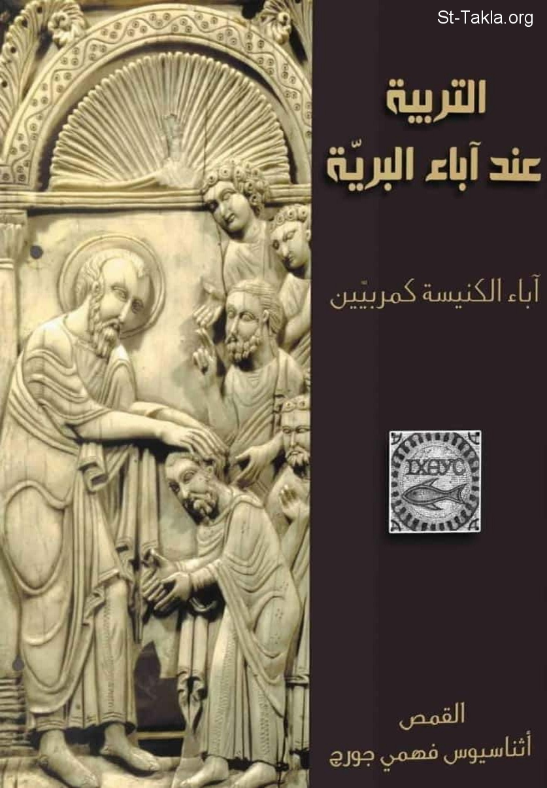

# التربية عند آباء البرية

**المؤلف / Author:** القمص 
أثناسيوس فهمي جورج
**المصدر / Source:** [st-takla.org](https://st-takla.org/Full-Free-Coptic-Books/FreeCopticBooks-018-Father-Athanasius-Fahmy-George/006-El-Tarbeya/The-Early-Church-Fathers-as-Educators-00-index.html)
**الموضوعات / Topics:** —

📘 **[Download EPUB / تحميل الكتاب](el-tarbeya.epub)**

## نبذة

نشكر قدس أبونا القمص أثناسيوس فهمي چورچ لسماحه لموقع الأنبا تكلاهيمانوت بوضع هذا الكتاب هنا. وهو من سلسلة دراسات آبائية (جزء من سلسلة "إكثوس").

## الفصول / Chapters (62)

1. [التربية عند آباء البرية](chapters/01-The-Early-Church-Fathers-as-Educators-01-Intro/)
2. [هدف الدراسة](chapters/02-The-Early-Church-Fathers-as-Educators-02-Aim/)
3. [تاريخ الرهبنة](chapters/03-The-Early-Church-Fathers-as-Educators-03-History/)
4. [أصول ونشأة الرهبنة](chapters/04-The-Early-Church-Fathers-as-Educators-04-Monasticism/)
5. [نمو الروح الرهبانية](chapters/05-The-Early-Church-Fathers-as-Educators-05-Growth/)
6. [مراجع](chapters/06-The-Early-Church-Fathers-as-Educators-06-References-1/)
7. [الأنشطة التربوية في الكنيسة الأولى](chapters/07-The-Early-Church-Fathers-as-Educators-07-Educational-Activities/)
8. [الهيللينية والمسيحية](chapters/08-The-Early-Church-Fathers-as-Educators-08-Hellenism-Christianity-/)
9. [المرحلة الأولى في موضوع الهيلينية و المسيحية](chapters/09-The-Early-Church-Fathers-as-Educators-09-Hellenism-Christianity-I/)
10. [المرحلة الثانية بين المسيحية والهيللينية](chapters/10-The-Early-Church-Fathers-as-Educators-10-Hellenism-Christianity-II/)
11. [موقف الكنيسة من المدارس والتربية الوثنية الكلاسيكية](chapters/11-The-Early-Church-Fathers-as-Educators-11-Classic/)
12. [التربية المسيحية](chapters/12-The-Early-Church-Fathers-as-Educators-12-Christian-Education/)
13. [دور الأسرة في المسيحية](chapters/13-The-Early-Church-Fathers-as-Educators-13-Family/)
14. [دور الكنيسة في التربية المسيحية](chapters/14-The-Early-Church-Fathers-as-Educators-14-Church/)
15. [مدارس الموعوظين](chapters/15-The-Early-Church-Fathers-as-Educators-15-Catechumenal-Schools/)
16. [المدارس التعليمية](chapters/16-The-Early-Church-Fathers-as-Educators-16-Catechetical-Schools/)
17. [مدرسة الأسكندرية](chapters/17-The-Early-Church-Fathers-as-Educators-17-School-of-Alexandria/)
18. [مدرسة أنطاكية](chapters/18-The-Early-Church-Fathers-as-Educators-18-School-of-Antioch/)
19. [مدرسة نصيبين](chapters/19-The-Early-Church-Fathers-as-Educators-19-School-of-Nasibein-Edissa/)
20. [المراجع](chapters/20-The-Early-Church-Fathers-as-Educators-20-References-2/)
21. [النظريات التربوية عند الآباء](chapters/21-The-Early-Church-Fathers-as-Educators-21-Educational/)
22. [الوراثة والبيئة](chapters/22-The-Early-Church-Fathers-as-Educators-22-Heredity/)
23. [النعمة الإلهية](chapters/23-The-Early-Church-Fathers-as-Educators-23-Grace/)
24. [إمكانية التربية](chapters/24-The-Early-Church-Fathers-as-Educators-24-Possibility/)
25. [هدف التربية الرهبانية](chapters/25-The-Early-Church-Fathers-as-Educators-25-Point/)
26. [الحياة النسكية كوسيلة للتربية الرهبانية](chapters/26-The-Early-Church-Fathers-as-Educators-26-Life/)
27. [مراجع الجزء السابق](chapters/27-The-Early-Church-Fathers-as-Educators-27-References-3/)
28. [الأب والتلميذ](chapters/28-The-Early-Church-Fathers-as-Educators-28-Father-and-Son/)
29. [الأب](chapters/29-The-Early-Church-Fathers-as-Educators-29-Father/)
30. [التلميذ](chapters/30-The-Early-Church-Fathers-as-Educators-30-Disciple/)
31. [فرادة شخصية التلميذ](chapters/31-The-Early-Church-Fathers-as-Educators-31-Disciples-Individuality/)
32. [مراجع هذا القسم](chapters/32-The-Early-Church-Fathers-as-Educators-32-References-4/)
33. [الوسائل التعليمية في التربية الرهبانية](chapters/33-The-Early-Church-Fathers-as-Educators-33-Methods-1/)
34. [الوسائل التعليمية](chapters/34-The-Early-Church-Fathers-as-Educators-34-Methods-2/)
35. [الطرق التعليمية وأكثرها انتشارًا](chapters/35-The-Early-Church-Fathers-as-Educators-35-Most/)
36. [التعليم بالوسائل اللفظية الشفاهية والمكتوبة](chapters/36-The-Early-Church-Fathers-as-Educators-36-Written/)
37. [الوسائل العامة](chapters/37-The-Early-Church-Fathers-as-Educators-37-General-Methods/)
38. [العظة](chapters/38-The-Early-Church-Fathers-as-Educators-38-Lecture/)
39. [الحوار](chapters/39-The-Early-Church-Fathers-as-Educators-39-Conversations/)
40. [التوبيخ](chapters/40-The-Early-Church-Fathers-as-Educators-40-Scolding/)
41. [النصح والإرشاد](chapters/41-The-Early-Church-Fathers-as-Educators-41-Advice/)
42. [وسائل خاصة لحفظ الأفكار](chapters/42-The-Early-Church-Fathers-as-Educators-42-Perserving-Ideas/)
43. [المَثَل](chapters/43-The-Early-Church-Fathers-as-Educators-43-Proverb/)
44. [المجاز والرمزية](chapters/44-The-Early-Church-Fathers-as-Educators-44-Metaphors/)
45. [الأقوال](chapters/45-The-Early-Church-Fathers-as-Educators-45-Quotes/)
46. [التعليم بوسائل غير لفظية](chapters/46-The-Early-Church-Fathers-as-Educators-46-Non-Verbal-Means/)
47. [رمزية الزيّ الرهباني](chapters/47-The-Early-Church-Fathers-as-Educators-47-Attire/)
48. [الوسائل الصامتة في التعليم](chapters/48-The-Early-Church-Fathers-as-Educators-48-Silent/)
49. [التأمل في الطبيعة](chapters/49-The-Early-Church-Fathers-as-Educators-49-Contemplation/)
50. [القدوة الشخصية](chapters/50-The-Early-Church-Fathers-as-Educators-50-Example/)
51. [اختبار النظام الرهباني](chapters/51-The-Early-Church-Fathers-as-Educators-51-Test/)
52. [فحص الذات](chapters/52-The-Early-Church-Fathers-as-Educators-52-Checkup/)
53. [الاعتراف](chapters/53-The-Early-Church-Fathers-as-Educators-53-Confession/)
54. [التلمذة في النظام التربوي الرهباني](chapters/54-The-Early-Church-Fathers-as-Educators-54-Discipleship/)
55. [العقوبات الرهبانية](chapters/55-The-Early-Church-Fathers-as-Educators-55-Punishment/)
56. [أنواع العقوبات](chapters/56-The-Early-Church-Fathers-as-Educators-56-Punishment-Kinds/)
57. [الجِعالات](chapters/57-The-Early-Church-Fathers-as-Educators-57-Rewards/)
58. [مراجع ما سبق](chapters/58-The-Early-Church-Fathers-as-Educators-58-References-5/)
59. [الرهبان والثقافة](chapters/59-The-Early-Church-Fathers-as-Educators-59-Monks-and-Culture/)
60. [موقف الرهبان من الثقافة](chapters/60-The-Early-Church-Fathers-as-Educators-60-Culture/)
61. [المدارس الرهبانية](chapters/61-The-Early-Church-Fathers-as-Educators-61-Monastic-Schools/)
62. [مراجع الجزء الأخير](chapters/62-The-Early-Church-Fathers-as-Educators-62-References-6/)

---
*هذا الكتاب مجاني للنشر والتوزيع لخلاص كل نفس. This book is free to share and distribute for the salvation of every soul.*
