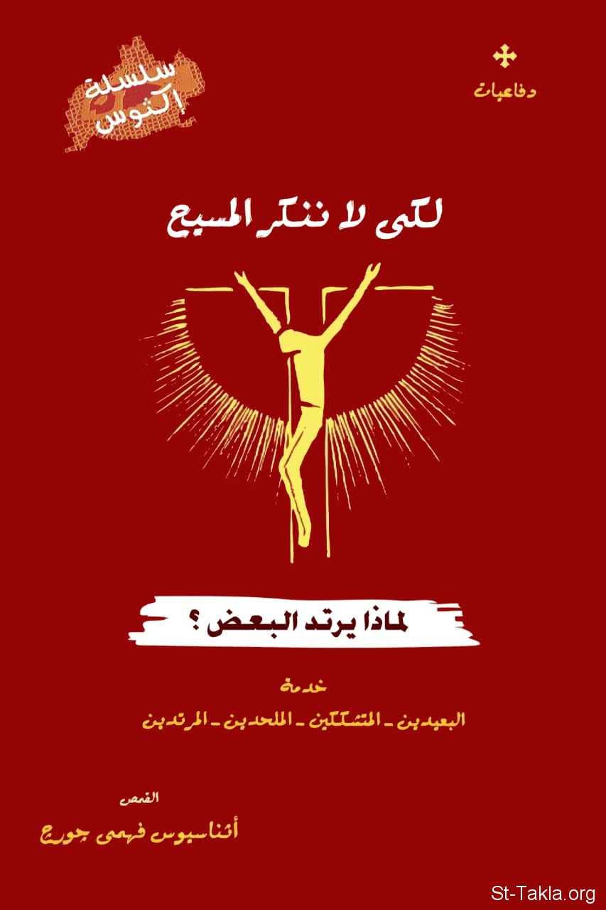

# لكي لا ننكر المسيح: لماذا يرتد البعض؟

**المؤلف / Author:** القمص أثناسيوس فهمي جورج
**المصدر / Source:** [st-takla.org](https://st-takla.org/Full-Free-Coptic-Books/FreeCopticBooks-018-Father-Athanasius-Fahmy-George/010-Lekay-La-Nonker-AlMasih/Do-Not-Deny-Christ-00-index.html)
**الموضوعات / Topics:** —

📘 **[Download EPUB / تحميل الكتاب](lekay-la-nonker-almasih.epub)**

## نبذة

نشكر قدس أبونا القمص أثناسيوس فهمي چورچ لسماحه لموقع الأنبا تكلاهيمانوت بوضع هذا الكتاب هنا. وهو من سلسلة "إكثوس".

## الفصول / Chapters (6)

1. [لكي لا ننكر المسيح: لماذا يرتد البعض؟](chapters/01-Do-Not-Deny-Christ-01-Intro/)
2. [آلام الرب الجديد](chapters/02-Do-Not-Deny-Christ-02-Pain/)
3. [الارتداد الجزئي](chapters/03-Do-Not-Deny-Christ-03-Partial/)
4. [الخطية أصل الداء](chapters/04-Do-Not-Deny-Christ-04-Sin/)
5. [هل يُجبر الإنسان على الارتداد عن الوصية؟](chapters/05-Do-Not-Deny-Christ-05-Choice/)
6. [هل يمكن أن يرتد خادم عن الإيمان؟](chapters/06-Do-Not-Deny-Christ-06-Servant/)

---
*هذا الكتاب مجاني للنشر والتوزيع لخلاص كل نفس. This book is free to share and distribute for the salvation of every soul.*
