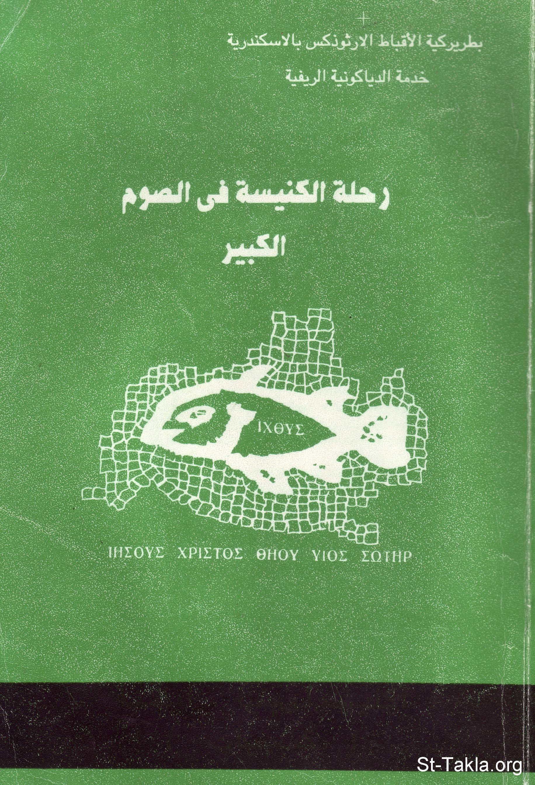

# رحلة الكنيسة في الصوم الكبير

**المؤلف / Author:** القمص أثناسيوس فهمي جورج
**المصدر / Source:** [st-takla.org](https://st-takla.org/books/fr-athnasius-fahmy/lent/index.html)
**الموضوعات / Topics:** —

📘 **[Download EPUB / تحميل الكتاب](lent.epub)**

## نبذة

نشكر قدس أبونا القمص أثناسيوس فهمي چورچ لسماحه لموقع الأنبا تكلاهيمانوت بوضع هذا الكتاب هنا. وهو من سلسلة دراسات آبائية (جزء من سلسلة "إكثوس"). ولم يُكتَب في الكتاب بيانات الطبعة أو رقم الإيداع أو سنة النشر (ربما في منتصف التسعينيات من القرن العشرين). والناشر حسب الغلاف: خدمة الدياكونية الريفية.

## الفصول / Chapters (36)

1. [الصوم الكبير كنسيًا](chapters/01-ecclesiastical/)
2. [الصوم الكبير تاريخيًا](chapters/02-historical/)
3. [الصوم عقيديًا](chapters/03-dogma/)
4. [برنامج الكنيسة في الصوم الكبير](chapters/04-program/)
5. [الصوم والتوبة "ميطانيا"](chapters/05-metania/)
6. [الصوم والجهاد الروحي](chapters/06-strife/)
7. [الصوم ومعالم الطريق للملكوت](chapters/07-way/)
8. [الصوم والصلاة](chapters/08-pray/)
9. [معنى الصوم](chapters/09-meaning/)
10. [ماهية الصوم (تعريف الصوم) في فكر الآباء](chapters/10-what/)
11. [لماذا صام المسيح وجرب؟](chapters/11-why/)
12. [أساس فعل الصوم](chapters/12-basis/)
13. [الصوم الحقيقي في نظر الآباء](chapters/13-real/)
14. [منافع الصوم روحيًا](chapters/14-benefits/)
15. [الصوم لابد أن يقترن بالصلاة](chapters/15-must/)
16. [الصوم يقترن بالصلاة وأعمال الرعاية الاجتماعية](chapters/16-works/)
17. [فاعلية الصوم وقوته](chapters/17-power/)
18. [الصوم كذبيحة](chapters/18-sacrifice/)
19. [الصوم وحياة الفضيلة](chapters/19-virtue/)
20. [الصوم في جنة عدن](chapters/20-eden/)
21. [الصوم مدخل إلى الفصح (القيامة)](chapters/21-pascha/)
22. [عبادة الصوم](chapters/22-worship/)
23. [الكتاب المقدس في عبادة الصوم](chapters/23-bible/)
24. [الصوم في حياتنا](chapters/24-life/)
25. [لكن بالصوم والصلاة](chapters/25-fasting/)
26. [وأخيرًا يصير لنا الصوم نمط الحياة](chapters/26-style/)
27. [آحاد الصوم الكبير](chapters/27-sundays/)
28. [الأحد الأول للصوم الكبير](chapters/28-sunday1/)
29. [الأحد الثاني من الصوم الكبير](chapters/29-sunday2/)
30. [الأحد الثالث للصوم الكبير](chapters/30-sunday3/)
31. [الأحد الرابع للصوم الكبير](chapters/31-sunday4/)
32. [الأحد الخامس للصوم الكبير](chapters/32-sunday5/)
33. [الأحد السادس للصوم الكبير](chapters/33-sunday6/)
34. [الأحد السابع للصوم الكبير](chapters/34-sunday7/)
35. [الصوم الكبير والإفخارستيا](chapters/35-eucharist/)
36. [مراجع البحث](chapters/36-ref/)

---
*هذا الكتاب مجاني للنشر والتوزيع لخلاص كل نفس. This book is free to share and distribute for the salvation of every soul.*
