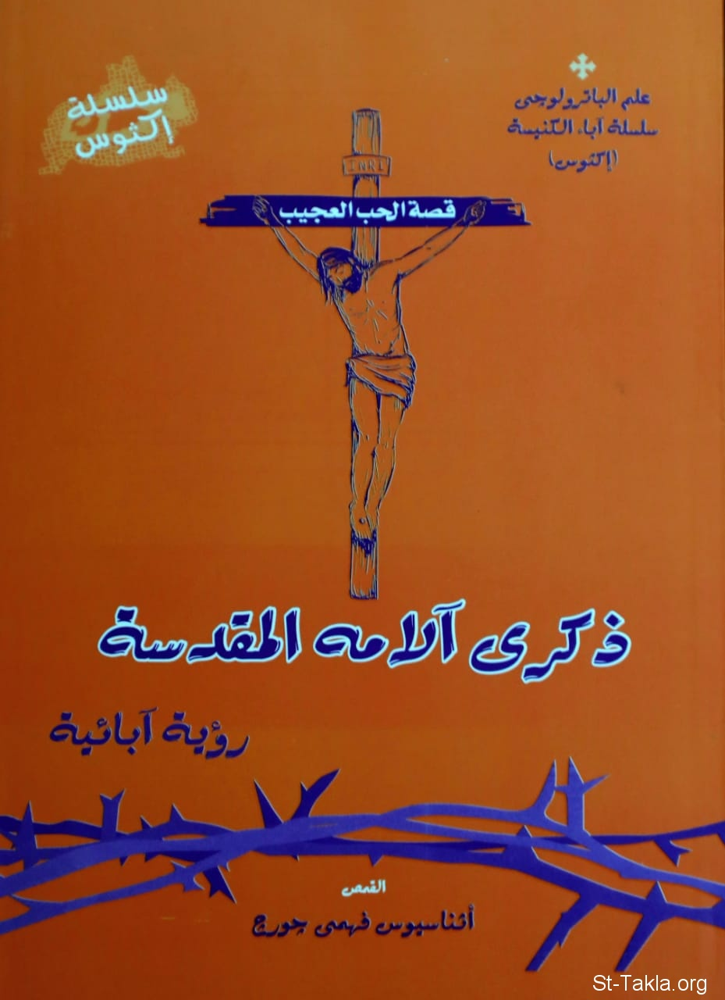

# ذكرى آلامه المقدسة

**المؤلف / Author:** القمص أثناسيوس فهمي جورج
**المصدر / Source:** [st-takla.org](https://st-takla.org/books/fr-athnasius-fahmy/passion/index.html)
**الموضوعات / Topics:** —

📘 **[Download EPUB / تحميل الكتاب](passion.epub)**

## نبذة

نشكر قدس أبونا القمص أثناسيوس فهمي چورچ لسماحه لموقع الأنبا تكلاهيمانوت بوضع هذا الكتاب هنا. وهو من سلسلة "إكثوس".

## الفصول / Chapters (15)

1. [مقدمة](chapters/01-intro/)
2. [أسبوع الآلام في طقوس الكنيسة](chapters/02-rituals/)
3. [كنوز ألحان أسبوع الآلام الفصحية](chapters/03-hymns/)
4. [قصة الحب العجيب](chapters/04-story/)
5. [عجائب حب الله](chapters/05-love/)
6. [أعاجيب محبة الله لنا](chapters/06-wow/)
7. [حبًا عجيبًا](chapters/07-magnificent/)
8. [أعاجيب الحب](chapters/08-super/)
9. [عجائب الحب الإلهي](chapters/09-divine/)
10. [أعاجيب الحب الإلهي](chapters/10-godly/)
11. [عجائب المحبة حتى الموت](chapters/11-death/)
12. [عجائب الصليب](chapters/12-cross/)
13. [أعاجيب المحبة الإلهية](chapters/13-golgotha/)
14. [محبة حتى الموت](chapters/14-until/)
15. [الفرح بالخلاص الإلهي](chapters/15-save/)

---
*هذا الكتاب مجاني للنشر والتوزيع لخلاص كل نفس. This book is free to share and distribute for the salvation of every soul.*
