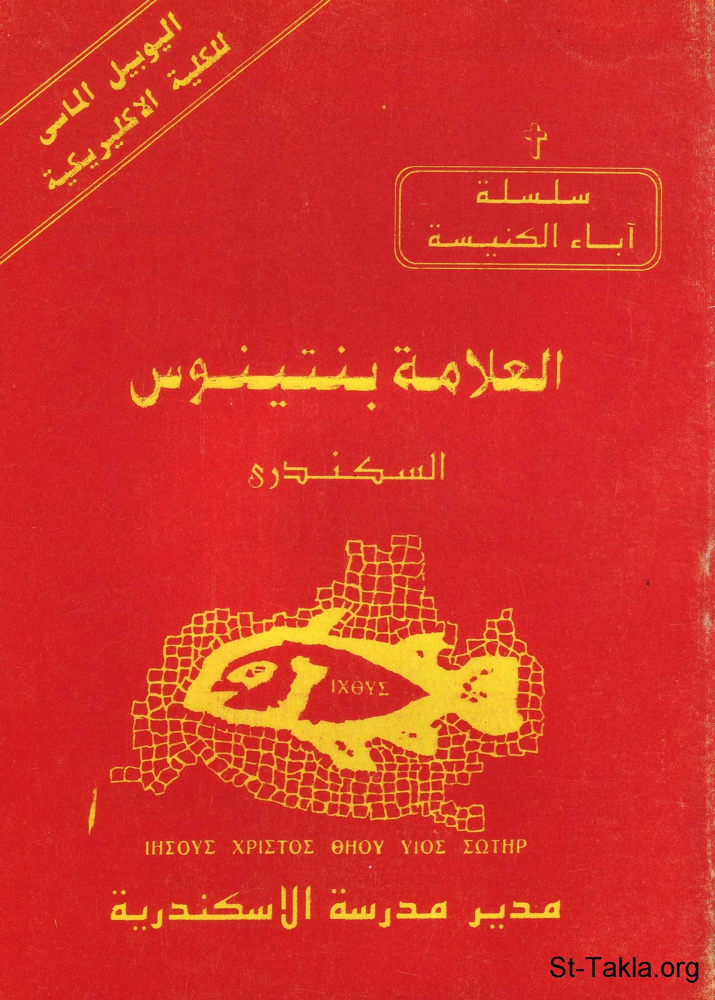

# العلامة بنتينوس السكندري

**المؤلف / Author:** القمص أثناسيوس فهمي جورج
**المصدر / Source:** [st-takla.org](https://st-takla.org/books/fr-athnasius-fahmy/pentinos/index.html)
**الموضوعات / Topics:** —

📘 **[Download EPUB / تحميل الكتاب](pentinos.epub)**

## نبذة

نشكر قدس أبونا القمص أثناسيوس فهمي چورچ لسماحه لموقع الأنبا تكلاهيمانوت بوضع هذا الكتاب هنا. وهو من سلسلة آباء الكنيسة (جزء من سلسلة "إكثوس").

## الفصول / Chapters (11)

1. [مقدمة](chapters/01-intro/)
2. [آباء كنيسة الإسكندرية](chapters/02-fathers/)
3. [من هو بنتينوس الإسكندري؟](chapters/03-who/)
4. [شهادة التاريخ المبكر للعلامة بنتينوس](chapters/04-history/)
5. [العلامة بنتينوس مديرًا لمدرسة الإسكندرية](chapters/05-alexandria/)
6. [بينتينوس ورحلاته التبشيرية](chapters/06-journeys/)
7. [بانتينوس وترجمة الكتاب المقدس](chapters/07-bible/)
8. [الاتجاه التفسيري والفكري عند القديس بنتينوس](chapters/08-commentary/)
9. [كتابات بنتينوس العلامة](chapters/09-writings/)
10. [خاتمة حياته](chapters/10-ending/)
11. [المصادر والمراجع](chapters/11-ref/)

---
*هذا الكتاب مجاني للنشر والتوزيع لخلاص كل نفس. This book is free to share and distribute for the salvation of every soul.*
