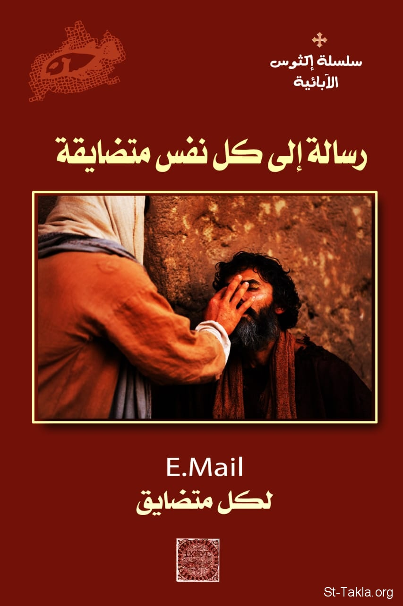

# رسالة إلى كل نفس متضايقة

**المؤلف / Author:** القمص أثناسيوس فهمي جورج
**المصدر / Source:** [st-takla.org](https://st-takla.org/Full-Free-Coptic-Books/FreeCopticBooks-018-Father-Athanasius-Fahmy-George/011-Resala-LeKol-Nafs-Motadika/Email-to-the-Disturbed-00-index.html)
**الموضوعات / Topics:** —

📘 **[Download EPUB / تحميل الكتاب](resala-lekol-nafs-motadika.epub)**

## نبذة

نشكر قدس أبونا القمص أثناسيوس فهمي چورچ لسماحه لموقع الأنبا تكلاهيمانوت بوضع هذا الكتاب هنا. وهو من سلسلة "إكثوس".

## الفصول / Chapters (23)

1. [رسالة إلى كل نفس متضايقة](chapters/01-Email-to-the-Disturbed-01-Intro/)
2. [منافع سماح الله بالآلام](chapters/02-Email-to-the-Disturbed-02-Use/)
3. [أسر بالضعفات والضرورات والضيقات](chapters/03-Email-to-the-Disturbed-03-Happy/)
4. [تأديبات الرب المحب والإعداد للمجد](chapters/04-Email-to-the-Disturbed-04-Loving/)
5. [الاستعداد للتجارب والتمحيص](chapters/05-Email-to-the-Disturbed-05-Ready/)
6. [أنواع التجارب والضيقات](chapters/06-Email-to-the-Disturbed-06-Kinds/)
7. [الضيقة واحتمال التجربة ترفع الإنسان](chapters/07-Email-to-the-Disturbed-07-Up/)
8. [مراجعة النفس وتحطيم القلب الحجري](chapters/08-Email-to-the-Disturbed-08-Heart/)
9. [الثقة في الله والمواعيد وقت التجربة](chapters/09-Email-to-the-Disturbed-09-Trust/)
10. [المطرقة والأكاليل والبركات](chapters/10-Email-to-the-Disturbed-10-Hammer/)
11. [عدم الخوف من تجارب الناس، الشياطين، الجسد](chapters/11-Email-to-the-Disturbed-11-No-Fear/)
12. [الثواب والمكافأة والمجازاة](chapters/12-Email-to-the-Disturbed-12-Crowns/)
13. [التأديبات: عقاب في العالم أم عقاب أبدي](chapters/13-Email-to-the-Disturbed-13-Punishments/)
14. [في الضيق رحبت بي](chapters/14-Email-to-the-Disturbed-14-Welcomed/)
15. [الضيقات والأكاليل](chapters/15-Email-to-the-Disturbed-15-Problems/)
16. [تجارب التأديب، وتجارب التنقية](chapters/16-Email-to-the-Disturbed-16-Two/)
17. [صلاة لاحتمال التجربة](chapters/17-Email-to-the-Disturbed-17-Prayer-Bear/)
18. [صلاة للشكر وقت التجربة](chapters/18-Email-to-the-Disturbed-18-Prayer-Thanks-1/)
19. [صلاة لرؤية الله وقت التجربة](chapters/19-Email-to-the-Disturbed-19-Prayer-See/)
20. [صلاة للثبات وقت التجربة](chapters/20-Email-to-the-Disturbed-20-Prayer-Stay/)
21. [صلاة لطلب معونة الله وقت التجربة](chapters/21-Email-to-the-Disturbed-21-Prayer-Help/)
22. [صلاة لتقوية الإيمان وقت التجربة](chapters/22-Email-to-the-Disturbed-22-Prayer-Faith/)
23. [صلاة شكر وقت التجربة](chapters/23-Email-to-the-Disturbed-23-Prayer-Thanks-2/)

---
*هذا الكتاب مجاني للنشر والتوزيع لخلاص كل نفس. This book is free to share and distribute for the salvation of every soul.*
