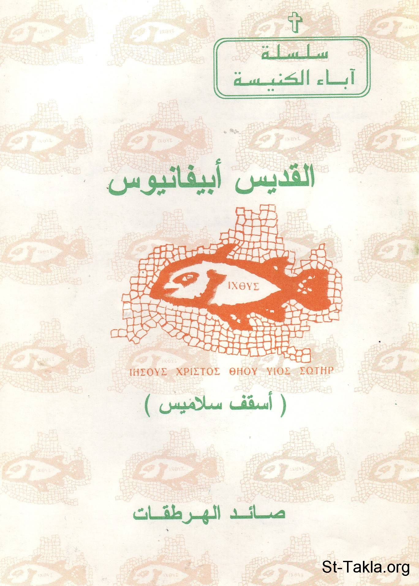

# القديس أبيفانيوس أسقف سلاميس: صائد الهرطقات

**المؤلف / Author:** القمص أثناسيوس فهمي جورج
**المصدر / Source:** [st-takla.org](https://st-takla.org/books/fr-athnasius-fahmy/st-abifanios/index.html)
**الموضوعات / Topics:** —

📘 **[Download EPUB / تحميل الكتاب](st-abifanios.epub)**

## نبذة

نشكر قدس أبونا القمص أثناسيوس فهمي چورچ لسماحه لموقع الأنبا تكلاهيمانوت بوضع هذا الكتاب هنا. وهو من سلسلة آباء الكنيسة (جزء من سلسلة "إكثوس").

## الفصول / Chapters (7)

1. [مقدمة - كتاب القديس أبيفانيوس أسقف سلاميس](chapters/01-intro/)
2. [شخصية القديس ابيفانيوس اسقف سلاميس - كتاب القديس أبيفانيوس أسقف سلاميس](chapters/02-epiphanius/)
3. [كتابات القديس ابيفانيوس - كتاب القديس أبيفانيوس أسقف سلاميس](chapters/03-writing/)
4. [الأعمال المنسوبة إلى ابيفانيوس - كتاب القديس أبيفانيوس أسقف سلاميس](chapters/04-works/)
5. [الفكر النسكى للقديس ابيفانيوس - كتاب القديس أبيفانيوس أسقف سلاميس](chapters/05-asceticism/)
6. [اللاهوت في فكر القديس ابيفانيوس - كتاب القديس أبيفانيوس أسقف سلاميس](chapters/06-theology/)
7. [المصادر والمراجع - كتاب القديس أبيفانيوس أسقف سلاميس](chapters/07-ref/)

---
*هذا الكتاب مجاني للنشر والتوزيع لخلاص كل نفس. This book is free to share and distribute for the salvation of every soul.*
