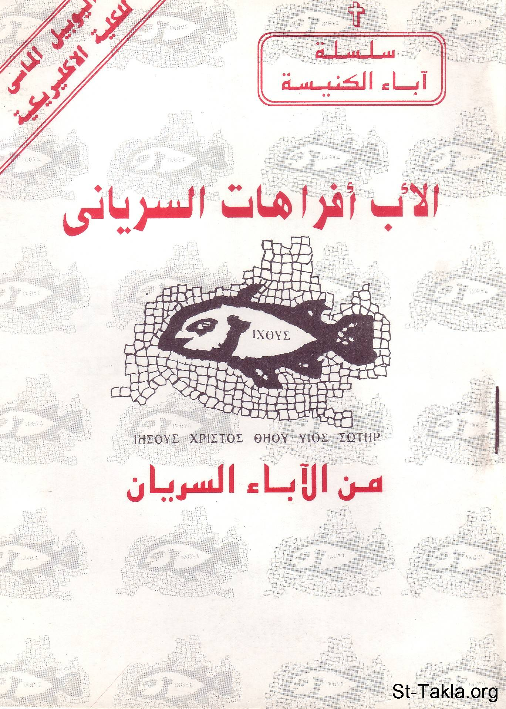

# الأب أفراهات السرياني

**المؤلف / Author:** القمص أثناسيوس فهمي جورج
**المصدر / Source:** [st-takla.org](https://st-takla.org/books/fr-athnasius-fahmy/st-afrahat/index.html)
**الموضوعات / Topics:** —

📘 **[Download EPUB / تحميل الكتاب](st-afrahat.epub)**

## نبذة

نشكر قدس أبونا القمص أثناسيوس فهمي چورچ لسماحه لموقع الأنبا تكلاهيمانوت بوضع هذا الكتاب هنا . وهو من سلسلة آباء الكنيسة (جزء من سلسلة "إكثوس"). ولم يتم كتابة تاريخ وبيانات الطبعة (ربما في أواخر الثمانينيات من القرن العشرين).

## الفصول / Chapters (7)

1. [مقدمة](chapters/01-intro/)
2. [أفراهات الحكيم الفارسي](chapters/02-sage/)
3. [ملامح من فكره: من مقالته عن الاضطهاد](chapters/03-persecution/)
4. [من مقالته عن الرعاة](chapters/04-pastors/)
5. [من رسالته إلى الرهبان](chapters/05-monks/)
6. [من مقالته عن الإيمان](chapters/06-faith/)
7. [المصادر والمراجع](chapters/07-ref/)

---
*هذا الكتاب مجاني للنشر والتوزيع لخلاص كل نفس. This book is free to share and distribute for the salvation of every soul.*
