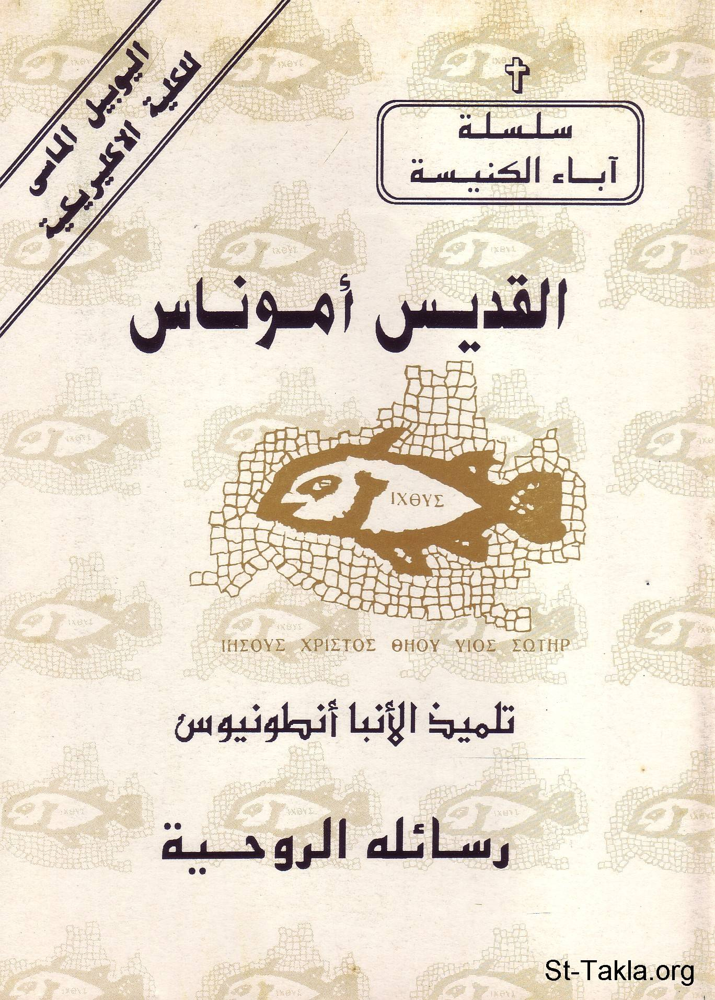

# القديس أموناس: رسائله الروحية

**المؤلف / Author:** القمص أثناسيوس فهمي جورج
**المصدر / Source:** [st-takla.org](https://st-takla.org/books/fr-athnasius-fahmy/st-amonas/index.html)
**الموضوعات / Topics:** —

📘 **[Download EPUB / تحميل الكتاب](st-amonas.epub)**

## نبذة

نشكر قدس أبونا القمص أثناسيوس فهمي چورچ لسماحه لموقع الأنبا تكلاهيمانوت بوضع هذا الكتاب هنا. وهو من سلسلة آباء الكنيسة (جزء من سلسلة "إكثوس").

## الفصول / Chapters (17)

1. [مقدمة](chapters/01-intro/)
2. [مدخل عن رسائل القديس أموناس](chapters/02-letters/)
3. [الرسالة الأولى](chapters/03-letter1/)
4. [الرسالة الثانية](chapters/04-letter2/)
5. [الرسالة الثالثة](chapters/05-letter3/)
6. [الرسالة الرابعة](chapters/06-letter4/)
7. [الرسالة الخامسة](chapters/07-letter5/)
8. [الرسالة السادسة](chapters/08-letter6/)
9. [الرسالة السابعة](chapters/09-letter7/)
10. [الرسالة الثامنة](chapters/10-letter8/)
11. [الرسالة التاسعة](chapters/11-letter9/)
12. [الرسالة العاشرة](chapters/12-letter10/)
13. [الرسالة الحادية عشر](chapters/13-letter11/)
14. [الرسالة الثانية عشر](chapters/14-letter12/)
15. [الرسالة الثالثة عشر](chapters/15-letter13/)
16. [الرسالة الرابعة عشر](chapters/16-letter14/)
17. [المصادر والمراجع](chapters/17-ref/)

---
*هذا الكتاب مجاني للنشر والتوزيع لخلاص كل نفس. This book is free to share and distribute for the salvation of every soul.*
