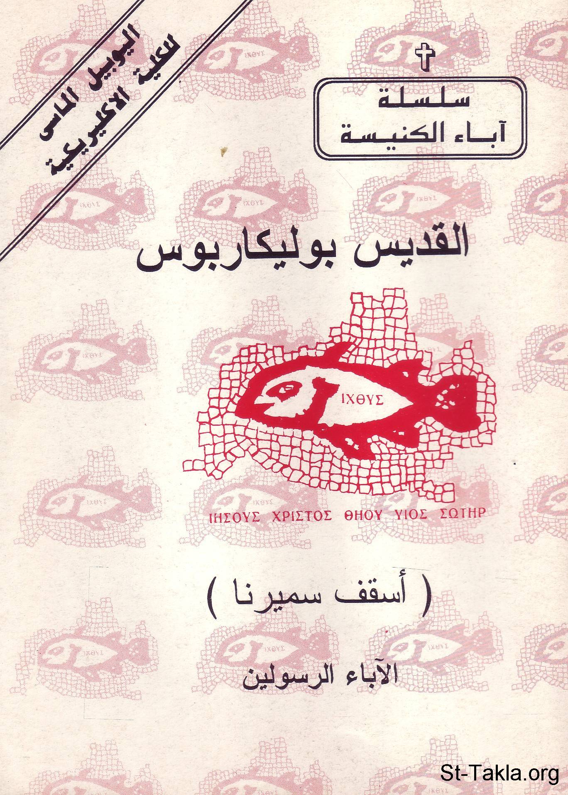

# القديس بوليكاربوس الشهيد أسقف سميرنا

**المؤلف / Author:** القمص أثناسيوس فهمي جورج
**المصدر / Source:** [st-takla.org](https://st-takla.org/books/fr-athnasius-fahmy/st-bolikarbos/index.html)
**الموضوعات / Topics:** —

📘 **[Download EPUB / تحميل الكتاب](st-bolikarbos.epub)**

## نبذة

نشكر قدس أبونا القمص أثناسيوس فهمي چورچ لسماحه لموقع الأنبا تكلاهيمانوت بوضع هذا الكتاب هنا. وهو من سلسلة آباء الكنيسة (جزء من سلسلة "إكثوس").

## الفصول / Chapters (12)

1. [مقدمة ومدخل](chapters/01-intro/)
2. [سيرة القديس بولكاربوس](chapters/02-who/)
3. [سماته الشخصية](chapters/03-aspects/)
4. [كهنوته](chapters/04-priesthood/)
5. [أسقفيته](chapters/05-bishophood/)
6. [القديسان أغناطيوس وبوليكاربوس](chapters/06-aghnatios/)
7. [بوليكاربوس والهراطقة](chapters/07-heretics/)
8. [القديس بوليكاربوس الشهيد (إستشهاده)](chapters/08-martyrdom/)
9. [قصة استشهاد القديس بوليكاربوس كما جاءت في رسالة كنيسة سميرنا إلى كنيسة فيلوميلوم](chapters/09-semirna/)
10. [أعمال القديس بوليكاربوس](chapters/10-works/)
11. [نص رسالة القديس بوليكاربوس الشهيد إلى أهل فيلبي](chapters/11-philippians/)
12. [المصادر والمراجع](chapters/12-ref/)

---
*هذا الكتاب مجاني للنشر والتوزيع لخلاص كل نفس. This book is free to share and distribute for the salvation of every soul.*
