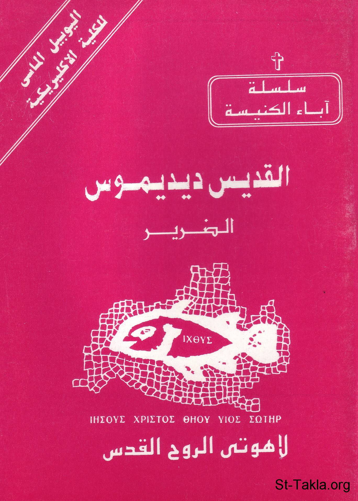

# القديس ديديموس الضرير: لاهوتي الروح القدس

**المؤلف / Author:** القمص أثناسيوس فهمي جورج
**المصدر / Source:** [st-takla.org](https://st-takla.org/books/fr-athnasius-fahmy/st-dedimos/index.html)
**الموضوعات / Topics:** —

📘 **[Download EPUB / تحميل الكتاب](st-dedimos.epub)**

## نبذة

نشكر قدس أبونا القمص أثناسيوس فهمي چورچ لسماحه لموقع الأنبا تكلاهيمانوت بوضع هذا الكتاب هنا. وهو من سلسلة آباء الكنيسة (جزء من سلسلة "إكثوس").

## الفصول / Chapters (15)

1. [مقدمة - كتاب القديس ديديموس الضرير](chapters/01-intro/)
2. [سيرة ديديموس الضرير - كتاب القديس ديديموس الضرير](chapters/02-who/)
3. [كتابات ديديموس - كتاب القديس ديديموس الضرير](chapters/03-writings/)
4. [الأعمال اللاهوتية - كتاب القديس ديديموس الضرير](chapters/04-theological/)
5. [الأعمال التفسيرية - كتاب القديس ديديموس الضرير](chapters/05-commentary/)
6. [لاهوت ديديموس - كتاب القديس ديديموس الضرير](chapters/06-theology/)
7. [الثالوث - كتاب القديس ديديموس الضرير](chapters/07-trinity/)
8. [الخريستولوچي (طبيعة المسيح) - كتاب القديس ديديموس الضرير](chapters/08-christology/)
9. [الروح القدس - كتاب القديس ديديموس الضرير](chapters/09-spirit/)
10. [الاكلسيولوچي (الكنيسة) - كتاب القديس ديديموس الضرير](chapters/10-ecclesiology/)
11. [المعمودية - كتاب القديس ديديموس الضرير](chapters/11-baptism/)
12. [الماريولوچي (والدة الإله) - كتاب القديس ديديموس الضرير](chapters/12-mariology/)
13. [منهجه اللاهوتي - كتاب القديس ديديموس الضرير](chapters/13-method/)
14. [الفكر الروحي عند القديس ديديموس - كتاب القديس ديديموس الضرير](chapters/14-thoughts/)
15. [المصادر والمراجع - كتاب القديس ديديموس الضرير](chapters/15-ref/)

---
*هذا الكتاب مجاني للنشر والتوزيع لخلاص كل نفس. This book is free to share and distribute for the salvation of every soul.*
