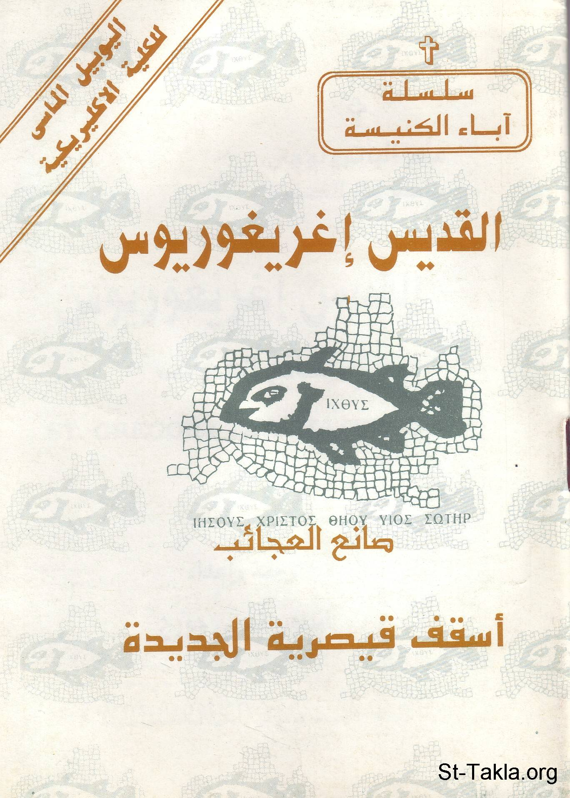

# القديس إغريغوريوس صانع العجائب، أسقف قيصرية الجديدة

**المؤلف / Author:** القمص أثناسيوس فهمي جورج
**المصدر / Source:** [st-takla.org](https://st-takla.org/books/fr-athnasius-fahmy/st-eghrighorios/index.html)
**الموضوعات / Topics:** —

📘 **[Download EPUB / تحميل الكتاب](st-eghrighorios.epub)**

## نبذة

نشكر قدس أبونا القمص أثناسيوس فهمي چورچ لسماحه لموقع الأنبا تكلاهيمانوت بوضع هذا الكتاب هنا. وهو من سلسلة آباء الكنيسة (جزء من سلسلة "إكثوس").

## الفصول / Chapters (9)

1. [مقدمة](chapters/01-intro/)
2. [سيرة القديس غريغوريوس العجائبي](chapters/02-story/)
3. [كتاباته](chapters/03-writings/)
4. [أهم ملامح فكره](chapters/04-aspects/)
5. [قانون إيمان لإغريغوريوس الصانع العجائب](chapters/05-faith/)
6. [من الكتابات المنسوبة إليه](chapters/06-other/)
7. [من عظة في عيد البشارة](chapters/07-annunciation/)
8. [من عظة في عيد الغطاس](chapters/08-baptism/)
9. [المصادر والمرجع](chapters/09-ref/)

---
*هذا الكتاب مجاني للنشر والتوزيع لخلاص كل نفس. This book is free to share and distribute for the salvation of every soul.*
