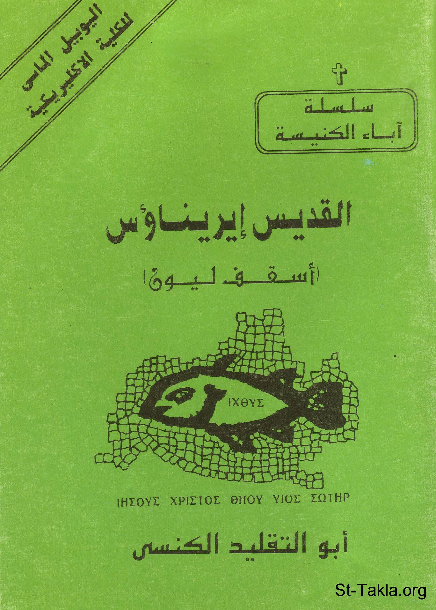

# القديس إيريناؤس أسقف ليون: أبو التقليد الكنسي

**المؤلف / Author:** القمص أثناسيوس فهمي جورج
**المصدر / Source:** [st-takla.org](https://st-takla.org/books/fr-athnasius-fahmy/st-erinaos/index.html)
**الموضوعات / Topics:** —

📘 **[Download EPUB / تحميل الكتاب](st-erinaos.epub)**

## نبذة

نشكر قدس أبونا القمص أثناسيوس فهمي چورچ لسماحه لموقع الأنبا تكلاهيمانوت بوضع هذا الكتاب هنا. وهو من سلسلة آباء الكنيسة (جزء من سلسلة "إكثوس").

## الفصول / Chapters (12)

1. [مقدمة - كتاب القديس إيريناؤس أسقف ليون](chapters/01-intro/)
2. [سيرة القديس إيريناوءس - كتاب القديس إيريناؤس أسقف ليون](chapters/02-story/)
3. [كتابات ايريناؤس - كتاب القديس إيريناؤس أسقف ليون](chapters/03-writings/)
4. [لاهوت ايريناؤس - كتاب القديس إيريناؤس أسقف ليون](chapters/04-theology/)
5. [الثالوث - كتاب القديس إيريناؤس أسقف ليون](chapters/05-trinity/)
6. [الخريستولوجي - كتاب القديس إيريناؤس أسقف ليون](chapters/06-christology/)
7. [الافخارستيا - كتاب القديس إيريناؤس أسقف ليون](chapters/07-euncarist/)
8. [الماريولوجي - كتاب القديس إيريناؤس أسقف ليون](chapters/08-mariology/)
9. [الكتاب المقدس - كتاب القديس إيريناؤس أسقف ليون](chapters/09-bible/)
10. [الكنيسة](chapters/10-ecclesiology/)
11. [خاتمة - كتاب القديس إيريناؤس أسقف ليون](chapters/11-death/)
12. [المصادر والمراجع - كتاب القديس إيريناؤس أسقف ليون](chapters/12-ref/)

---
*هذا الكتاب مجاني للنشر والتوزيع لخلاص كل نفس. This book is free to share and distribute for the salvation of every soul.*
