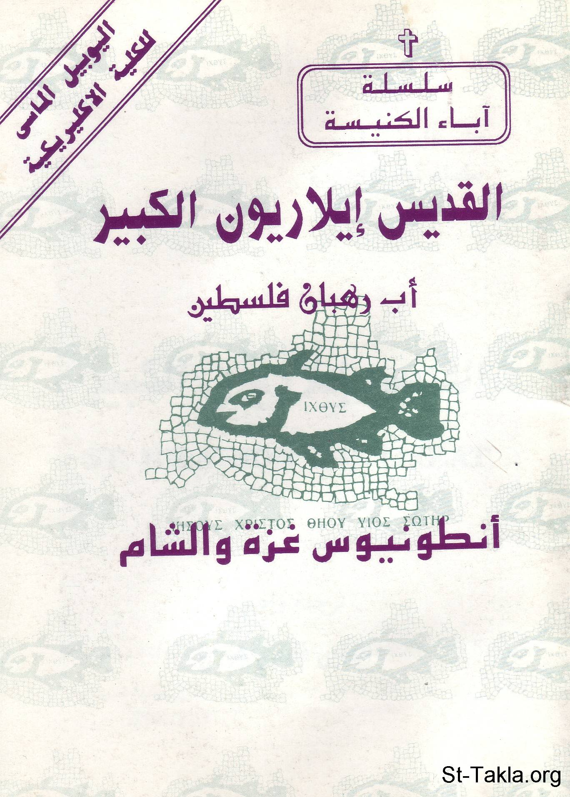

# القديس إيلاريون الكبير، أب رهبان فلسطين

**المؤلف / Author:** القمص أثناسيوس فهمي جورج
**المصدر / Source:** [st-takla.org](https://st-takla.org/books/fr-athnasius-fahmy/st-ilarion/index.html)
**الموضوعات / Topics:** —

📘 **[Download EPUB / تحميل الكتاب](st-ilarion.epub)**

## نبذة

نشكر قدس أبونا القمص أثناسيوس فهمي چورچ لسماحه لموقع الأنبا تكلاهيمانوت بوضع هذا الكتاب هنا. وهو من سلسلة آباء الكنيسة (جزء من سلسلة "إكثوس").

## الفصول / Chapters (13)

1. [مقدمة](chapters/01-intro/)
2. [نشأته](chapters/02-start/)
3. [إيمانه بالمسيح](chapters/03-faith/)
4. [لقاؤه مع القديس أنطونيوس](chapters/04-an6onios/)
5. [عودة القديس إيلاريون إلى فلسطين](chapters/05-Ilaryon/)
6. [نسكه وصموده أمام حروب الشيطان](chapters/06-wars/)
7. [جهاده وذيوع صيته](chapters/07-fame/)
8. [معجزاته](chapters/08-miracles/)
9. [القديس إيلاريون أب الرهبان (انطونيوس الشام)](chapters/09-sham/)
10. [تنقلاته لأجل حياة الوحدة](chapters/10-movings/)
11. [تعاليم القديس وإرشاداته](chapters/11-teachings/)
12. [نياحته ونقل جسده](chapters/12-death/)
13. [شهادة التاريخ له وتكريمه](chapters/13-history/)

---
*هذا الكتاب مجاني للنشر والتوزيع لخلاص كل نفس. This book is free to share and distribute for the salvation of every soul.*
