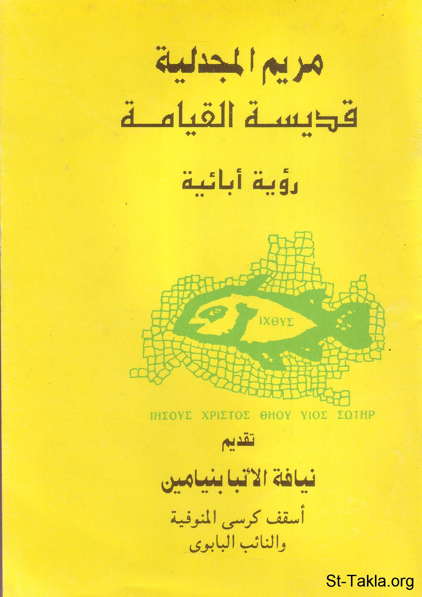

# مريم المجدلية، قديسة القيامة (رؤية آبائية)

**المؤلف / Author:** القمص أثناسيوس فهمي جورج
**المصدر / Source:** [st-takla.org](https://st-takla.org/books/fr-athnasius-fahmy/st-magdalene/index.html)
**الموضوعات / Topics:** —

📘 **[Download EPUB / تحميل الكتاب](st-magdalene.epub)**

## نبذة

نشكر قدس أبونا القمص أثناسيوس فهمي چورچ لسماحه لموقع الأنبا تكلاهيمانوت بوضع هذا الكتاب هنا. وهو من سلسلة دراسات آبائية (جزء من سلسلة "إكثوس").

## الفصول / Chapters (17)

1. [تقديم - كتاب مريم المجدلية، قديسة القيامة](chapters/01-preface/)
2. [كلمة شكر واجبة - كتاب مريم المجدلية، قديسة القيامة](chapters/02-thanks/)
3. [مقدمة - كتاب مريم المجدلية، قديسة القيامة](chapters/03-intro/)
4. [القديسة مريم المجدلية - كتاب مريم المجدلية، قديسة القيامة](chapters/04-who/)
5. [مريم المجدلية في الكتاب المقدس - كتاب مريم المجدلية، قديسة القيامة](chapters/05-bible/)
6. [مريم المجدلية ورباطات الشياطين - كتاب مريم المجدلية، قديسة القيامة](chapters/06-devils/)
7. [مريم المجدلية تلميذة للمسيح - كتاب مريم المجدلية، قديسة القيامة](chapters/07-christ/)
8. [مريم المجدلية عند أقدام المصلوب - كتاب مريم المجدلية، قديسة القيامة](chapters/08-cross/)
9. [مريم المجدلية في بستان القيامة باكرًا جدًا - كتاب مريم المجدلية، قديسة القيامة](chapters/09-resurrection/)
10. [حاملات الطيب - كتاب مريم المجدلية، قديسة القيامة](chapters/10-perfume/)
11. [لماذا تبكين؟ - كتاب مريم المجدلية، قديسة القيامة](chapters/11-cry/)
12. [لا تلمسيني - كتاب مريم المجدلية، قديسة القيامة](chapters/12-touch/)
13. [الكرازة بالقيامة - كتاب مريم المجدلية، قديسة القيامة](chapters/13-proclaim/)
14. [مريم المجدلية بعد صعود المسيح - كتاب مريم المجدلية، قديسة القيامة](chapters/14-ascension/)
15. [مكانة مريم المجدلية في كنيستنا القبطية - كتاب مريم المجدلية، قديسة القيامة](chapters/15-coptic/)
16. [صلاة المجدليات - كتاب مريم المجدلية، قديسة القيامة](chapters/16-prayers/)
17. [المراجع - كتاب مريم المجدلية، قديسة القيامة](chapters/17-ref/)

---
*هذا الكتاب مجاني للنشر والتوزيع لخلاص كل نفس. This book is free to share and distribute for the salvation of every soul.*
