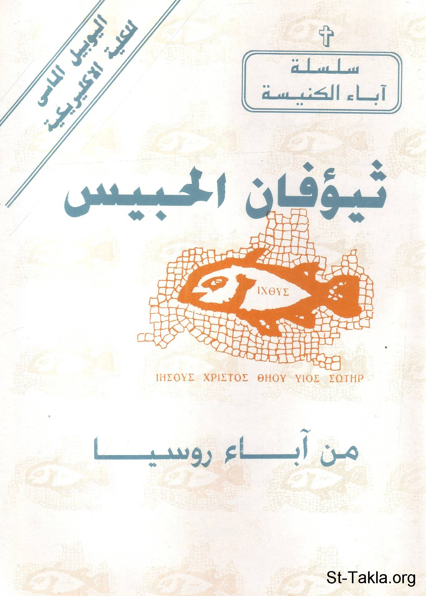

# القديس ثيؤفان الحبيس، من آباء روسيا

**المؤلف / Author:** القمص أثناسيوس فهمي جورج
**المصدر / Source:** [st-takla.org](https://st-takla.org/books/fr-athnasius-fahmy/st-theofan/index.html)
**الموضوعات / Topics:** —

📘 **[Download EPUB / تحميل الكتاب](st-theofan.epub)**

## نبذة

نشكر قدس أبونا القمص أثناسيوس فهمي چورچ لسماحه لموقع الأنبا تكلاهيمانوت بوضع هذا الكتاب هنا. وهو من سلسلة آباء الكنيسة (جزء من سلسلة "إكثوس").

## الفصول / Chapters (8)

1. [مقدمة](chapters/01-intro/)
2. [سيرة القديس ثيؤفان الحبيس](chapters/02-recluse/)
3. [أعماله](chapters/03-works/)
4. [الحرب اللامنظورة (الحروب الروحية)](chapters/04-warfare/)
5. [الفيلوكاليا الروسية (الدوبروتوليبي)](chapters/05-dobrotolublye/)
6. [ملامح من فكره](chapters/06-aspects/)
7. [رسائله](chapters/07-letters/)
8. [المصادر والمراجع](chapters/08-ref/)

---
*هذا الكتاب مجاني للنشر والتوزيع لخلاص كل نفس. This book is free to share and distribute for the salvation of every soul.*
