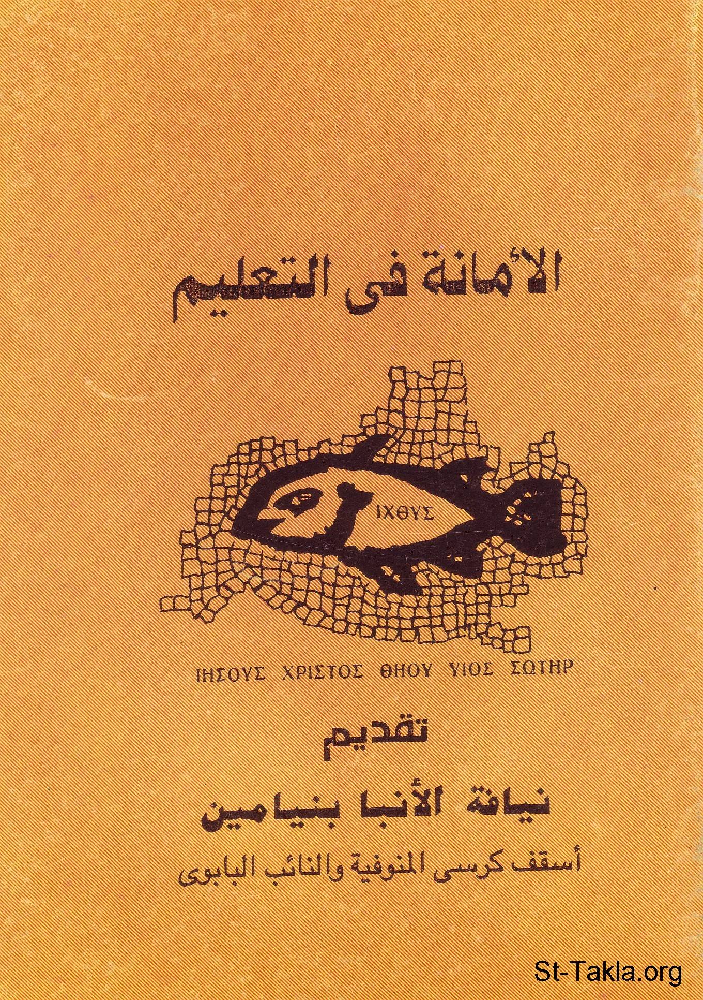

# الأمانة في التعليم

**المؤلف / Author:** القمص أثناسيوس فهمي جورج
**المصدر / Source:** [st-takla.org](https://st-takla.org/books/fr-athnasius-fahmy/teaching/index.html)
**الموضوعات / Topics:** —

📘 **[Download EPUB / تحميل الكتاب](teaching.epub)**

## نبذة

نشكر قدس أبونا القمص أثناسيوس فهمي چورچ لسماحه لموقع الأنبا تكلاهيمانوت بوضع هذا الكتاب هنا.

## الفصول / Chapters (21)

1. [تقديم الأنبا بنيامين](chapters/01-intro/)
2. [الأمانة في التعليم](chapters/02-preface/)
3. [حل تعاظم أهل البدع](chapters/03-untie/)
4. [مضار الهرطقات ومنافعها](chapters/04-bad/)
5. [سر وقانون الوحدانية](chapters/05-secret/)
6. [وحدة وسلام الكنيسة](chapters/06-church/)
7. [البناء الإيماني على الصخر](chapters/07-building/)
8. [الهرطقة أساس الانقسام](chapters/08-source/)
9. [الهرطقات علامة مجيئية](chapters/09-sign/)
10. [جنون الانقسام](chapters/10-madness/)
11. [بين المبتدع والمرتد](chapters/11-between/)
12. [موقف الكنيسة من الهراطقة](chapters/12-position/)
13. [الكنيسة والهراطقة](chapters/13-heretics/)
14. [المنحرفين والكنيسة](chapters/14-perverted/)
15. [اجتماعات الهراطقة والمنشقين](chapters/15-meetings/)
16. [مصير المبتدعين والهراطقة](chapters/16-fate/)
17. [البدع المُقَنَّعة والخلط في التعليم](chapters/17-mix/)
18. [أصحاب الأفكار المنحرفة](chapters/18-ideas/)
19. [البدع المُقَنَّعة](chapters/19-masked/)
20. [المنحرفون عقيديًا](chapters/20-deviants/)
21. [المراجع](chapters/21-refeances/)

---
*هذا الكتاب مجاني للنشر والتوزيع لخلاص كل نفس. This book is free to share and distribute for the salvation of every soul.*
