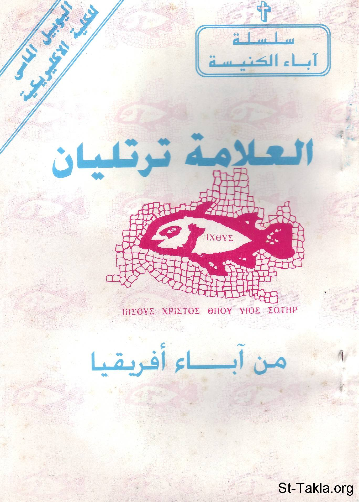

# العلامة ترتليان، من آباء أفريقيا

**المؤلف / Author:** القمص أثناسيوس فهمي جورج
**المصدر / Source:** [st-takla.org](https://st-takla.org/books/fr-athnasius-fahmy/tertelian/index.html)
**الموضوعات / Topics:** —

📘 **[Download EPUB / تحميل الكتاب](tertelian.epub)**

## نبذة

نشكر قدس أبونا القمص أثناسيوس فهمي چورچ لسماحه لموقع الأنبا تكلاهيمانوت بوضع هذا الكتاب هنا. وهو من سلسلة آباء الكنيسة (جزء من سلسلة "إكثوس").

## الفصول / Chapters (24)

1. [مقدمة](chapters/01-intro/)
2. [سيرة العلامة ترتليان](chapters/02-story/)
3. [كتاباته: الأعمال الدفاعية](chapters/03-apologetic/)
4. [كتاباته: الأعمال الجدلية](chapters/04-treatises/)
5. [كتاباته: الأعمال الأخلاقية والنسكية](chapters/05-moral/)
6. [ملامح من فكره](chapters/06-aspects/)
7. [التقليد](chapters/07-tradition/)
8. [الإكليسيولوجى](chapters/08-ecclesiology/)
9. [الثالوث](chapters/09-trinity/)
10. [الخريستولوجى](chapters/10-christology/)
11. [المعمودية](chapters/11-baptism/)
12. [الإفخارستيا](chapters/12-eucharist/)
13. [الماريولوجي](chapters/13-marology/)
14. [التوبة](chapters/14-repentance/)
15. [الصلاة الربانية](chapters/15-prayer/)
16. [ذبيحة الصلاة](chapters/16-pray/)
17. [إلى الشهداء](chapters/17-martyrs/)
18. [الصبر](chapters/18-patience/)
19. [اللاهوت والفلسفة](chapters/19-philosophy/)
20. [اللاهوت والقانون](chapters/20-law/)
21. [الدوسيتية (الظهوريون)](chapters/21-docetism/)
22. [الغنوصية](chapters/22-gnosticism/)
23. [مرقيون](chapters/23-marcion/)
24. [فالنتينوس](chapters/24-valentinus/)

---
*هذا الكتاب مجاني للنشر والتوزيع لخلاص كل نفس. This book is free to share and distribute for the salvation of every soul.*
