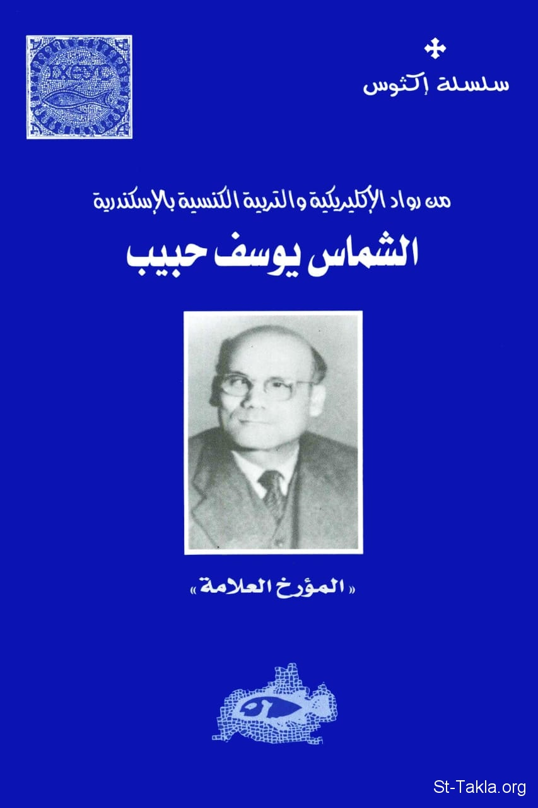

# الشماس يوسف حبيب، المؤرخ العلاّمة للقمص أثناسيوس فهمي جورج

**المؤلف / Author:** القمص أثناسيوس فهمي 
جورج
**المصدر / Source:** [st-takla.org](https://st-takla.org/Full-Free-Coptic-Books/FreeCopticBooks-018-Father-Athanasius-Fahmy-George/007-Yosef-Habib/Deacon-Youssef-Habeeb--00-index.html)
**الموضوعات / Topics:** —

📘 **[Download EPUB / تحميل الكتاب](yosef-habib.epub)**

## نبذة

المؤرِّخ العلامة يوسف حبيب هو من خدام المدينة العظمى الإسكندرية، الذي أثر في خدماتها وكنائسها كثيرًا.. خاصة كنيسة السيدة العذراء محرم بك، كنيسة مارجرجس سبورتنج، و كنيسة الأنبا تكلاهيمانوت بالإبراهيمية .. عرفناه شماسًا ومؤرخًا وباحثًا وخادمًا وبتولًا.. ونشكر الله أن أعطانا هنا في موقع الأنبا تكلاهيمانوت أن نبدأ في نشر التراث الروحي العميق الذي نشره طوال فترة حياته .. وأن يستمر تأثيره ويتسع أكثر وأكثر..

## الفصول / Chapters (13)

1. [مقدمة عن الخدمة في الإسكندرية - كتاب الشماس يوسف حبيب](chapters/01-Deacon-Youssef-Habeeb--01-Alexandria/)
2. [الشماس يوسف حبيب في سطور - كتاب الشماس يوسف حبيب](chapters/02-Deacon-Youssef-Habeeb--02-Notes/)
3. [قصة حياة وذكريات الشماس يوسف حبيب - كتاب الشماس يوسف حبيب](chapters/03-Deacon-Youssef-Habeeb--03-Life/)
4. [تكريسه - كتاب الشماس يوسف حبيب](chapters/04-Deacon-Youssef-Habeeb--04-Consecration/)
5. [شموسيته - كتاب الشماس يوسف حبيب](chapters/05-Deacon-Youssef-Habeeb--05-Deaconism/)
6. [فضائله - كتاب الشماس يوسف حبيب](chapters/06-Deacon-Youssef-Habeeb--06-Virtues/)
7. [نسكه وفقره الاختياري - كتاب الشماس يوسف حبيب](chapters/07-Deacon-Youssef-Habeeb--07-Poverty/)
8. [عشرته للقديسين - كتاب الشماس يوسف حبيب](chapters/08-Deacon-Youssef-Habeeb--08-Saints/)
9. [بتوليته - كتاب الشماس يوسف حبيب](chapters/09-Deacon-Youssef-Habeeb--09-Purity/)
10. [كمؤرخ ومعلم - كتاب الشماس يوسف حبيب](chapters/10-Deacon-Youssef-Habeeb--10-Historian/)
11. [علاقته بالمتنيح القمص بيشوي كامل - كتاب الشماس يوسف حبيب](chapters/11-Deacon-Youssef-Habeeb--11-Father-Bishoy-Kamel/)
12. [فقرات من المراسلات والخطابات - كتاب الشماس يوسف حبيب](chapters/12-Deacon-Youssef-Habeeb--12-Letters/)
13. [نياحته - كتاب الشماس يوسف حبيب](chapters/13-Deacon-Youssef-Habeeb--13-Death/)

---
*هذا الكتاب مجاني للنشر والتوزيع لخلاص كل نفس. This book is free to share and distribute for the salvation of every soul.*
