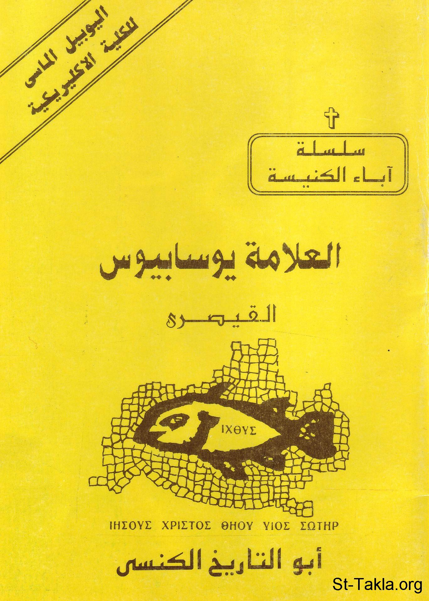

# العلامة يوسابيوس القيصري، أبو التاريخ الكنسي

**المؤلف / Author:** القمص أثناسيوس فهمي جورج
**المصدر / Source:** [st-takla.org](https://st-takla.org/books/fr-athnasius-fahmy/yousabios/index.html)
**الموضوعات / Topics:** —

📘 **[Download EPUB / تحميل الكتاب](yousabios.epub)**

## نبذة

نشكر قدس أبونا القمص أثناسيوس فهمي چورچ لسماحه لموقع الأنبا تكلاهيمانوت بوضع هذا الكتاب هنا. وهو من سلسلة آباء الكنيسة (جزء من سلسلة "إكثوس").

## الفصول / Chapters (10)

1. [مقدمة](chapters/01-intro/)
2. [شخصية العلامة يوسابيوس القيصرى](chapters/02-caesarea/)
3. [كتابات يوسابيوس](chapters/03-writings/)
4. [الأعمال التاريخية](chapters/04-chronicle/)
5. [أعماله في مدح قسطنطين](chapters/05-constantine/)
6. [الأعمال الدفاعية](chapters/06-apologetics/)
7. [الأعمال الكتابية والتفسيرية](chapters/07-commentary/)
8. [الأعمال العقيدية](chapters/08-dogma/)
9. [العظات](chapters/09-sermons/)
10. [الرسائل](chapters/10-letters/)

---
*هذا الكتاب مجاني للنشر والتوزيع لخلاص كل نفس. This book is free to share and distribute for the salvation of every soul.*
