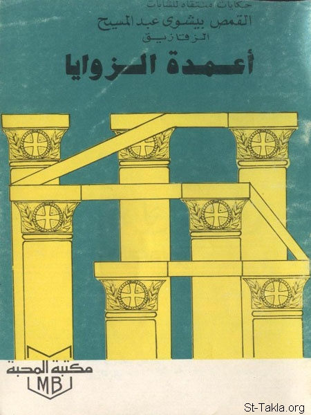

# أعمدة الزوايا

**المؤلف / Author:** القمص بيشوي عبد المسيح
**المصدر / Source:** [st-takla.org](https://st-takla.org/books/fr-bishoy-abdel-massih-z/corner-pillars/index.html)
**الموضوعات / Topics:** —

📘 **[Download EPUB / تحميل الكتاب](corner-pillars.epub)**

## نبذة

نشكر القمص بيشوي عبد المسيح (الزقازيق) على السماح لنا في موقع الأنبا تكلا هيمانوت بوضع هذا الكتاب هنا.

## الفصول / Chapters (11)

1. [الشهيدة صوفيا المنوفية ذات الجسد المشع](chapters/01-sophia/)
2. [الشهيدة رفقة شهيدة سنباط](chapters/02-rebecca/)
3. [الشهيدة يوليطة الشامية](chapters/03-julitta/)
4. [الشهيدة يوليطة أم قرياقوس](chapters/04-julitta-cyricus/)
5. [الشهيدة الملكة ألكسندرة](chapters/05-alexandra/)
6. [الشهيدة أربسيما العذراء العفيفة](chapters/06-arepsima/)
7. [الشهيدة أفرونية الناسكة](chapters/07-febronia/)
8. [القديسة براكسية العذراء](chapters/08-praxia/)
9. [القديسة أكساني الناسكة](chapters/09-axany/)
10. [الشهيدة سعدي القرطاجنية](chapters/10-saady/)
11. [ابتهال](chapters/11-prayer/)

---
*هذا الكتاب مجاني للنشر والتوزيع لخلاص كل نفس. This book is free to share and distribute for the salvation of every soul.*
