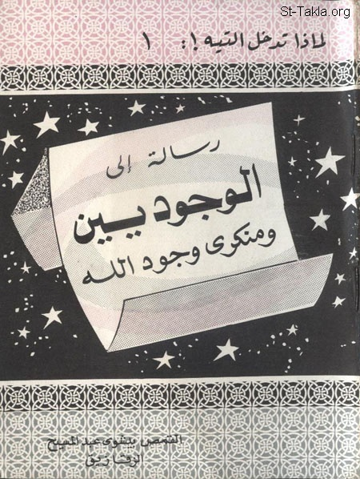

# رسالة إلى الوجوديين ومنكري وجود الله

**المؤلف / Author:** القمص بيشوي عبد المسيح
**المصدر / Source:** [st-takla.org](https://st-takla.org/books/fr-bishoy-abdel-massih-z/existentialists/index.html)
**الموضوعات / Topics:** —

📘 **[Download EPUB / تحميل الكتاب](existentialists.epub)**

## نبذة

نشكر القمص بيشوي عبد المسيح (الزقازيق) على السماح لنا في موقع الأنبا تكلا هيمانوت بوضع هذا الكتاب هنا. وهو من سلسلة "لماذا تدخل التيه!" (1).

## الفصول / Chapters (15)

1. [مقدمة](chapters/01-introduction/)
2. [الله... ماهيته](chapters/02-what/)
3. [براهين وجود الله](chapters/03-proofs/)
4. [أين يوجد الله؟](chapters/04-where-is-god/)
5. [صفات الله](chapters/05-attributes/)
6. [السرمدية: من صفات الله الجوهرية المطلقة](chapters/06-perpetuity/)
7. [البساطة: من صفات الله الجوهرية المطلقة](chapters/07-simplicity/)
8. [عدم تحيز الله: من صفات الله الجوهرية المطلقة](chapters/08-unbound/)
9. [علم الله: من صفات الله الجوهرية المطلقة](chapters/09-knowledge/)
10. [إرادة الله: من صفات الله الجوهرية المطلقة](chapters/10-gods-will/)
11. [صفات الله الإضافية](chapters/11-attributes-others/)
12. [الخلق: من صفات الله الإضافية](chapters/12-creation/)
13. [العناية: من صفات الله الإضافية](chapters/13-care/)
14. [الوحي: من صفات الله الإضافية](chapters/14-revelation/)
15. [عمل العجائب: من صفات الله الإضافية](chapters/15-miracles/)

---
*هذا الكتاب مجاني للنشر والتوزيع لخلاص كل نفس. This book is free to share and distribute for the salvation of every soul.*
