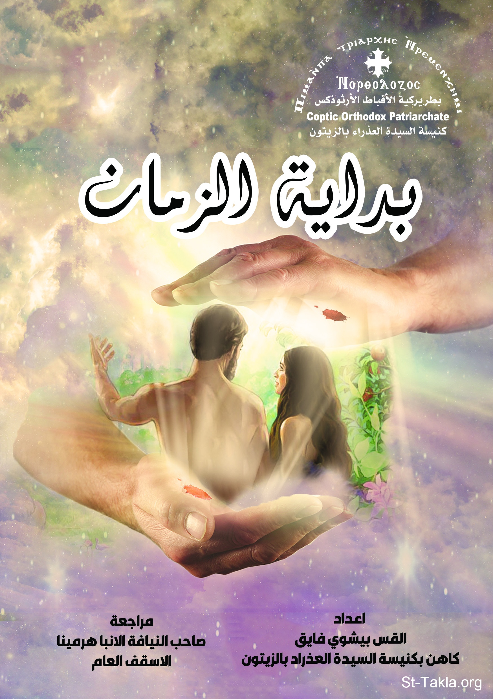

# بداية الزمان: الأصحاحات الأولى من سفر التكوين

**المؤلف / Author:** القس بيشوي فايق
**المصدر / Source:** [st-takla.org](https://st-takla.org/books/fr-bishoy-fayek/beginning-of-time/index.html)
**الموضوعات / Topics:** —

📘 **[Download EPUB / تحميل الكتاب](beginning-of-time.epub)**

## نبذة

نشكر القس بيشوي فايق يوسف على السماح لنا في موقع الأنبا تكلا هيمانوت بوضع هذا الكتاب هنا.

## الفصول / Chapters (48)

1. [شكر واجب](chapters/01-acknowledgment/)
2. [أحداث بداية الزمان](chapters/02-events/)
3. [هذا الكتاب](chapters/03-research/)
4. [أهمية هذه الدراسة](chapters/04-importance/)
5. [روح الله الخالق ومبدع الحياة](chapters/05-spirit/)
6. [الله الخالق مصدر وجودي](chapters/06-creator/)
7. [الخلقة تمت على سبيل الأمر المباشر](chapters/07-creation/)
8. [الخليقة خُلقت وفق خطة إلهية، لا مصادفة](chapters/08-plan/)
9. [خُلقت بترتيب ونظام](chapters/09-arrangement/)
10. [كلام الله قوة وحياة](chapters/10-words/)
11. [خليقة الله وأعماله هي أقوال وشهادات صادقة](chapters/11-true/)
12. [اليوم السابع](chapters/12-seventh-day/)
13. [خلق الله الإنسان من التراب](chapters/13-dust/)
14. [خلق الله الإنسان من جنس واحد](chapters/14-human/)
15. [البشر إخوة وأبناء لأب واحد](chapters/15-one-father/)
16. [الله هو إله كل بركة](chapters/16-blessing/)
17. [خلق الله الإنسان على صورته كشبهه](chapters/17-his-image/)
18. [خلق الله الإنسان على صورة مجده](chapters/18-his-grace/)
19. [خلق الله الإنسان ليعمل](chapters/19-work/)
20. [آدم الأول مثال الآتي](chapters/20-first-adam/)
21. [الزواج كما أراده الله](chapters/21-marriage/)
22. [الأسرة المسيحية موضع رضا الله](chapters/22-family/)
23. [يترك الرجل أباه وأمه ويلتصق بامرأته](chapters/23-man/)
24. [الخالق أمين في صنع الخير](chapters/24-good/)
25. [خُلق الإنسان ليحيا في فرح](chapters/25-joy/)
26. [نهر جنة عدن](chapters/26-river/)
27. [شجرة معرفة الخير والشر](chapters/27-tree/)
28. [الحضور الإلهي في حياة الإنسان الأول](chapters/28-life/)
29. [نعيم الفردوس الأول](chapters/29-paradise/)
30. [أهمية المعرفة وخطورتها](chapters/30-knowledge/)
31. [رفض الحكمة الإلهية كبرياء وعجرفة](chapters/31-divine-wisdom/)
32. [لا تدخلنا في تجربة](chapters/32-temptation/)
33. [والعداوة القديمة هدمتها](chapters/33-feud/)
34. [الله يعاقب الحية](chapters/34-serpent/)
35. [التعب دواء](chapters/35-toil/)
36. [الظنون الرديّة سلاح إبليس الماكر](chapters/36-assumptions/)
37. [الله الرحيم المتأني في العقاب](chapters/37-punishment/)
38. [شوكًا وحسكًا تُنبت لك الأرض](chapters/38-thorns/)
39. [وهو يسودُ عليكِ](chapters/39-dominate/)
40. [أجرة البطن ثمرة](chapters/40-belly/)
41. [وتأكل من عشب الحقل](chapters/41-eat/)
42. [شجرة الحياة](chapters/42-tree-of-life/)
43. [صنع لهما أقمصة من جلد وألبسهما](chapters/43-tunics/)
44. [أعظم خطية](chapters/44-sin/)
45. [فإنه ولو أحزن يعود ويرحم](chapters/45-mercy/)
46. [علامة النجاة من الموت](chapters/46-death/)
47. [ملعون أنتَ من الأرض](chapters/47-curse/)
48. [العدالة الإلهية](chapters/48-divine-equity/)

---
*هذا الكتاب مجاني للنشر والتوزيع لخلاص كل نفس. This book is free to share and distribute for the salvation of every soul.*
