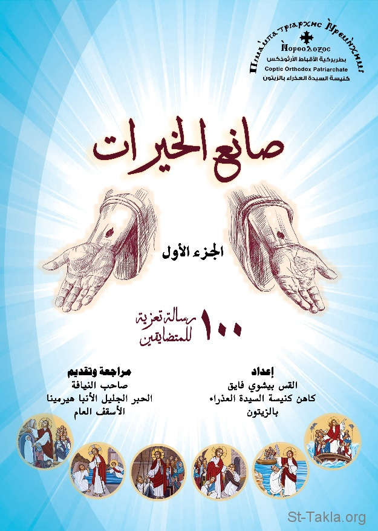

# صانع الخيرات: 100 رسالة تعزية للمتضايقين، الجزء الأول

**المؤلف / Author:** القس بيشوي فايق
**المصدر / Source:** [st-takla.org](https://st-takla.org/books/fr-bishoy-fayek/beneficent/index.html)
**الموضوعات / Topics:** —

📘 **[Download EPUB / تحميل الكتاب](beneficent.epub)**

## نبذة

نشكر القس بيشوي فايق يوسف على السماح لنا في موقع الأنبا تكلا هيمانوت بوضع هذا الكتاب هنا.

## الفصول / Chapters (108)

1. [قصة هذا الكتاب - كتاب صانع الخيرات: 100 رسالة تعزية للمتضايقين](chapters/01-story/)
2. [شكرٌ واجبٌ - كتاب صانع الخيرات: 100 رسالة تعزية للمتضايقين](chapters/02-gratitude/)
3. [المتضايقون أشبعهم بالخيرات - كتاب صانع الخيرات: 100 رسالة تعزية للمتضايقين](chapters/03-feed/)
4. [خطر الموت - كتاب صانع الخيرات: 100 رسالة تعزية للمتضايقين](chapters/04-death/)
5. [الصليب هو قوة الله للحفظ - كتاب صانع الخيرات: 100 رسالة تعزية للمتضايقين](chapters/05-cross/)
6. [الذعر والرعب القاتل - كتاب صانع الخيرات: 100 رسالة تعزية للمتضايقين](chapters/06-fear/)
7. [رتب أولوياتك - كتاب صانع الخيرات: 100 رسالة تعزية للمتضايقين](chapters/07-arrange/)
8. [أين أذهب من كورونا؟ - كتاب صانع الخيرات: 100 رسالة تعزية للمتضايقين](chapters/08-covid1/)
9. [الصلاة باب التعزيات السمائية - كتاب صانع الخيرات: 100 رسالة تعزية للمتضايقين](chapters/09-prayer/)
10. [انزل عن كرسيك - كتاب صانع الخيرات: 100 رسالة تعزية للمتضايقين](chapters/10-chair/)
11. [جهاد الصلاة يطرح عنّا ثقل الضيقة - كتاب صانع الخيرات: 100 رسالة تعزية للمتضايقين](chapters/11-pray/)
12. [الضيقة تدفعنا لتغيير أذهاننا - كتاب صانع الخيرات: 100 رسالة تعزية للمتضايقين](chapters/12-minds/)
13. [كيف سيذهب عنا وباء كورونا؟ - كتاب صانع الخيرات: 100 رسالة تعزية للمتضايقين](chapters/13-covid-19/)
14. [كيف أتوب، ليرفع عني الله الضيقة؟ - كتاب صانع الخيرات: 100 رسالة تعزية للمتضايقين](chapters/14-repentance/)
15. [كن حريصًا، والله يقيك ما خفيّ - كتاب صانع الخيرات: 100 رسالة تعزية للمتضايقين](chapters/15-care/)
16. [لو لم يقصر الله تلك الأيام - كتاب صانع الخيرات: 100 رسالة تعزية للمتضايقين](chapters/16-days/)
17. [احذر ما هو أخطر من الوباء - كتاب صانع الخيرات: 100 رسالة تعزية للمتضايقين](chapters/17-danger/)
18. [لماذا الوباء؟ - كتاب صانع الخيرات: 100 رسالة تعزية للمتضايقين](chapters/18-pandemic/)
19. [الوباء يفسد خططنا المستقبلية - كتاب صانع الخيرات: 100 رسالة تعزية للمتضايقين](chapters/19-plans/)
20. [الشكر الواجب في وسط الضيق - كتاب صانع الخيرات: 100 رسالة تعزية للمتضايقين](chapters/20-thanks/)
21. [صلاة مرتفعة كالبخور - كتاب صانع الخيرات: 100 رسالة تعزية للمتضايقين](chapters/21-incense/)
22. [تذكر إحسانات الله لك - كتاب صانع الخيرات: 100 رسالة تعزية للمتضايقين](chapters/22-reminiscence/)
23. [صلاة المُضطرّ - كتاب صانع الخيرات: 100 رسالة تعزية للمتضايقين](chapters/23-needy/)
24. [الله الحنون - كتاب صانع الخيرات: 100 رسالة تعزية للمتضايقين](chapters/24-loving-god/)
25. [طلبت لكي لا يفنى إيمانك - كتاب صانع الخيرات: 100 رسالة تعزية للمتضايقين](chapters/25-faith/)
26. [السكنى في البرية - كتاب صانع الخيرات: 100 رسالة تعزية للمتضايقين](chapters/26-desert/)
27. [سر الشركة المقدسة - كتاب صانع الخيرات: 100 رسالة تعزية للمتضايقين](chapters/27-secret/)
28. [كيف أتنقى وقت الضيقة؟ - كتاب صانع الخيرات: 100 رسالة تعزية للمتضايقين](chapters/28-pure/)
29. [يحفظ خروجك ودخولك - كتاب صانع الخيرات: 100 رسالة تعزية للمتضايقين](chapters/29-entrance/)
30. [انتظر الرب - كتاب صانع الخيرات: 100 رسالة تعزية للمتضايقين](chapters/30-wait-on-the-lord/)
31. [الله الحنون في تأديبه - كتاب صانع الخيرات: 100 رسالة تعزية للمتضايقين](chapters/31-sympathetic-god/)
32. [الله الرحوم صانع الخيرات - كتاب صانع الخيرات: 100 رسالة تعزية للمتضايقين](chapters/32-good/)
33. [البارَّ بالإيمان يحيا - كتاب صانع الخيرات: 100 رسالة تعزية للمتضايقين](chapters/33-pious/)
34. [الهروب بالتباعد الاجتماعي - كتاب صانع الخيرات: 100 رسالة تعزية للمتضايقين](chapters/34-social-distancing/)
35. [في المخدع ستجد ما ينقصك - كتاب صانع الخيرات: 100 رسالة تعزية للمتضايقين](chapters/35-room/)
36. [القوة المتدفقة من الصليب - كتاب صانع الخيرات: 100 رسالة تعزية للمتضايقين](chapters/36-power/)
37. [الحذر واليقظة - كتاب صانع الخيرات: 100 رسالة تعزية للمتضايقين](chapters/37-wake/)
38. [الصليب معصرة جازها الرب - كتاب صانع الخيرات: 100 رسالة تعزية للمتضايقين](chapters/38-press/)
39. [لا تخافا أنتما... - كتاب صانع الخيرات: 100 رسالة تعزية للمتضايقين](chapters/39-do-not-fear/)
40. [لماذا تخاف من النوم؟!! - كتاب صانع الخيرات: 100 رسالة تعزية للمتضايقين](chapters/40-sleep/)
41. [التسبيح الجديد - كتاب صانع الخيرات: 100 رسالة تعزية للمتضايقين](chapters/41-praise/)
42. [اتبعني أنت - كتاب صانع الخيرات: 100 رسالة تعزية للمتضايقين](chapters/42-follow-me/)
43. [خبز الحياة الذي لا حياة بدونه - كتاب صانع الخيرات: 100 رسالة تعزية للمتضايقين](chapters/43-bread/)
44. [سورٌ من نارِ وأبوابٌ مُحكمةٌ - كتاب صانع الخيرات: 100 رسالة تعزية للمتضايقين](chapters/44-fire/)
45. [إيمان يفيض فينا بالتسبيح - كتاب صانع الخيرات: 100 رسالة تعزية للمتضايقين](chapters/45-praising/)
46. [الكنيسة التي في بيتك - كتاب صانع الخيرات: 100 رسالة تعزية للمتضايقين](chapters/46-church/)
47. [اصعد... لترى مجد السماء - كتاب صانع الخيرات: 100 رسالة تعزية للمتضايقين](chapters/47-heaven/)
48. [اهدأ... وانصت باتضاع - كتاب صانع الخيرات: 100 رسالة تعزية للمتضايقين](chapters/48-calm-down/)
49. [اجذبني وراءك، فنجري - كتاب صانع الخيرات: 100 رسالة تعزية للمتضايقين](chapters/49-attract/)
50. [أبي وأمي قد تركاني.. أما الرب فقبلني - كتاب صانع الخيرات: 100 رسالة تعزية للمتضايقين](chapters/50-family/)
51. [لأنكم تحتاجون إلى الصبر - كتاب صانع الخيرات: 100 رسالة تعزية للمتضايقين](chapters/51-patience/)
52. [متى رجعت شَدّد إخوتك - كتاب صانع الخيرات: 100 رسالة تعزية للمتضايقين](chapters/52-aid/)
53. [حفل تكريم - كتاب صانع الخيرات: 100 رسالة تعزية للمتضايقين](chapters/53-celebration/)
54. [الملائكة تعسكر حول المختارين - كتاب صانع الخيرات: 100 رسالة تعزية للمتضايقين](chapters/54-angels/)
55. [أصعدني من جبّ الهلاك - كتاب صانع الخيرات: 100 رسالة تعزية للمتضايقين](chapters/55-up/)
56. [المختومين على جباههم - كتاب صانع الخيرات: 100 رسالة تعزية للمتضايقين](chapters/56-sealed-foreheads/)
57. [الثبات في المسيح يتطلب منك... - كتاب صانع الخيرات: 100 رسالة تعزية للمتضايقين](chapters/57-stay/)
58. [السلام من مانح السلام - كتاب صانع الخيرات: 100 رسالة تعزية للمتضايقين](chapters/58-giver-of-peace/)
59. [حصنًا للبائس في ضيقه - كتاب صانع الخيرات: 100 رسالة تعزية للمتضايقين](chapters/59-fortress/)
60. [انتظر حتى يتزكى إيمانك - كتاب صانع الخيرات: 100 رسالة تعزية للمتضايقين](chapters/60-your-faith/)
61. [نظرة الرب الحانية المقوية - كتاب صانع الخيرات: 100 رسالة تعزية للمتضايقين](chapters/61-look/)
62. [عدم الخوف... قرار شخصي - كتاب صانع الخيرات: 100 رسالة تعزية للمتضايقين](chapters/62-decision/)
63. [ضمّ صلوات الآخرين لصلاتك - كتاب صانع الخيرات: 100 رسالة تعزية للمتضايقين](chapters/63-your-prayers/)
64. [الطريق الآمن - كتاب صانع الخيرات: 100 رسالة تعزية للمتضايقين](chapters/64-road/)
65. [اقتنِ عظمة داود - كتاب صانع الخيرات: 100 رسالة تعزية للمتضايقين](chapters/65-david/)
66. [إنك لا تعلم ما هو صانعه - كتاب صانع الخيرات: 100 رسالة تعزية للمتضايقين](chapters/66-not-know/)
67. [ربُّ الجنود - كتاب صانع الخيرات: 100 رسالة تعزية للمتضايقين](chapters/67-lord-of-hosts/)
68. [اسعد بالشركة المقدسة مع الله - كتاب صانع الخيرات: 100 رسالة تعزية للمتضايقين](chapters/68-communion/)
69. [أجلسنا معه في السمَاويَّات - كتاب صانع الخيرات: 100 رسالة تعزية للمتضايقين](chapters/69-sit/)
70. [اقبل من يد أبيك الصالح - كتاب صانع الخيرات: 100 رسالة تعزية للمتضايقين](chapters/70-hand/)
71. [أسرع اهرب إلى حضن الله - كتاب صانع الخيرات: 100 رسالة تعزية للمتضايقين](chapters/71-bosom/)
72. [الرب قال له سب داود - كتاب صانع الخيرات: 100 رسالة تعزية للمتضايقين](chapters/72-tell/)
73. [اهتمّ بإنسانك الباطن - كتاب صانع الخيرات: 100 رسالة تعزية للمتضايقين](chapters/73-inner/)
74. [الضيقة أداة التجديد والنمو - كتاب صانع الخيرات: 100 رسالة تعزية للمتضايقين](chapters/74-tool/)
75. [أحضان الله الدافئة - كتاب صانع الخيرات: 100 رسالة تعزية للمتضايقين](chapters/75-breast/)
76. [قد ماتَ الَّذين يطلبون نفسَ الصبيِّ - كتاب صانع الخيرات: 100 رسالة تعزية للمتضايقين](chapters/76-died/)
77. [تقبل معونته، بدلًا من أن تخاصمه - كتاب صانع الخيرات: 100 رسالة تعزية للمتضايقين](chapters/77-instead/)
78. [الامتلاء يتطلب جهاد - كتاب صانع الخيرات: 100 رسالة تعزية للمتضايقين](chapters/78-fill/)
79. [مسحاء الرب - كتاب صانع الخيرات: 100 رسالة تعزية للمتضايقين](chapters/79-prophets/)
80. [أنِرْ عينيَّ - كتاب صانع الخيرات: 100 رسالة تعزية للمتضايقين](chapters/80-light-eye/)
81. [عون من لا عون له - كتاب صانع الخيرات: 100 رسالة تعزية للمتضايقين](chapters/81-support/)
82. [فرحَ الرَّب.. قوتك - كتاب صانع الخيرات: 100 رسالة تعزية للمتضايقين](chapters/82-your-power/)
83. [اللؤلؤة كثيرة الثمن - كتاب صانع الخيرات: 100 رسالة تعزية للمتضايقين](chapters/83-pearl/)
84. [الرحمة تحميك وتخلصك وقت الضيق - كتاب صانع الخيرات: 100 رسالة تعزية للمتضايقين](chapters/84-mercy/)
85. [شبيه ابن الآلهة - كتاب صانع الخيرات: 100 رسالة تعزية للمتضايقين](chapters/85-alike/)
86. [صخر الدهور الذي لا يتغير - كتاب صانع الخيرات: 100 رسالة تعزية للمتضايقين](chapters/86-rock/)
87. [الرب بار في كل طرقه - كتاب صانع الخيرات: 100 رسالة تعزية للمتضايقين](chapters/87-righteous/)
88. [خرج غالبًا ولكي يغلب - كتاب صانع الخيرات: 100 رسالة تعزية للمتضايقين](chapters/88-winner/)
89. [النعمة التي نحن مقيمون فيها - كتاب صانع الخيرات: 100 رسالة تعزية للمتضايقين](chapters/89-grace/)
90. [راعي الخراف الأعظم - كتاب صانع الخيرات: 100 رسالة تعزية للمتضايقين](chapters/90-shepherd/)
91. [القيادة بالروح - كتاب صانع الخيرات: 100 رسالة تعزية للمتضايقين](chapters/91-leadership/)
92. [الحب اختيار - كتاب صانع الخيرات: 100 رسالة تعزية للمتضايقين](chapters/92-love-is-choice/)
93. [قوتي في الضعف تُكمَل - كتاب صانع الخيرات: 100 رسالة تعزية للمتضايقين](chapters/93-my-power/)
94. [كن مستعدًا - كتاب صانع الخيرات: 100 رسالة تعزية للمتضايقين](chapters/94-be-ready/)
95. [لا تخف، بل تكلم ولا تسكت - كتاب صانع الخيرات: 100 رسالة تعزية للمتضايقين](chapters/95-talk/)
96. [حَمِّق يا ربُّ مشورة أخيتوفل - كتاب صانع الخيرات: 100 رسالة تعزية للمتضايقين](chapters/96-achitophel/)
97. [مخافة الله - كتاب صانع الخيرات: 100 رسالة تعزية للمتضايقين](chapters/97-fear-of-god/)
98. [القطيع الصغير - كتاب صانع الخيرات: 100 رسالة تعزية للمتضايقين](chapters/98-small-flock/)
99. [أسعى نحو الهدف - كتاب صانع الخيرات: 100 رسالة تعزية للمتضايقين](chapters/99-follow-aim/)
100. [أرُومُ أن تكون ناجحًا وصحيحًا - كتاب صانع الخيرات: 100 رسالة تعزية للمتضايقين](chapters/100-successful/)
101. [لأجل اسم الرب يسوع - كتاب صانع الخيرات: 100 رسالة تعزية للمتضايقين](chapters/101-jesus-name/)
102. [غنى المؤمنين بالمسيح - كتاب صانع الخيرات: 100 رسالة تعزية للمتضايقين](chapters/102-rich/)
103. [الفرصة الثمينة - كتاب صانع الخيرات: 100 رسالة تعزية للمتضايقين](chapters/103-chance/)
104. [روح الله يَفكّ عنك قيودك - كتاب صانع الخيرات: 100 رسالة تعزية للمتضايقين](chapters/104-bonds/)
105. [يشبع بالخير عمرك - كتاب صانع الخيرات: 100 رسالة تعزية للمتضايقين](chapters/105-your-life/)
106. [القلب المتسع - كتاب صانع الخيرات: 100 رسالة تعزية للمتضايقين](chapters/106-heart/)
107. [أجرك عظيم - كتاب صانع الخيرات: 100 رسالة تعزية للمتضايقين](chapters/107-wage/)
108. [الإيمان الحي - كتاب صانع الخيرات: 100 رسالة تعزية للمتضايقين](chapters/108-living-faith/)

---
*هذا الكتاب مجاني للنشر والتوزيع لخلاص كل نفس. This book is free to share and distribute for the salvation of every soul.*
