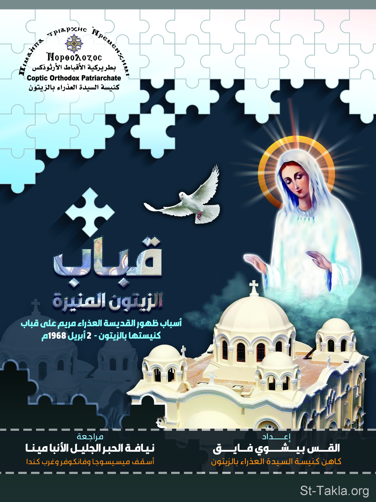

# قباب الزيتون المنيرة: أسباب ظهور القديسة العذراء مريم على قباب كنيستها بالزيتون في 2 أبريل 1968 م.

**المؤلف / Author:** القس بيشوي فايق
**المصدر / Source:** [st-takla.org](https://st-takla.org/books/fr-bishoy-fayek/mary-zaytoun/index.html)
**الموضوعات / Topics:** —

📘 **[Download EPUB / تحميل الكتاب](mary-zaytoun.epub)**

## نبذة

نشكر القس بيشوي فايق يوسف على السماح لنا في موقع الأنبا تكلا هيمانوت بوضع هذا الكتاب هنا.

## الفصول / Chapters (53)

1. [من أقوال قداسة البابا المعظم الأنبا تواضروس الثاني - كتاب قباب الزيتون المنيرة: أسباب ظهور العذراء مريم](chapters/01-quote/)
2. [شكرٌ واجبٌ - كتاب قباب الزيتون المنيرة: أسباب ظهور العذراء مريم](chapters/02-gratitude/)
3. [تقديم لنيافة الحبر الجليل الأنبا مينا - كتاب قباب الزيتون المنيرة: أسباب ظهور العذراء مريم](chapters/03-introduction/)
4. [هذا الكتاب - كتاب قباب الزيتون المنيرة: أسباب ظهور العذراء مريم](chapters/04-research/)
5. [الأفعال تتكلم - كتاب قباب الزيتون المنيرة: أسباب ظهور العذراء مريم](chapters/05-acts/)
6. [تمهيد - كتاب قباب الزيتون المنيرة: أسباب ظهور العذراء مريم](chapters/06-preface/)
7. [الفصل الأول: العذراء وتعاليم الكتاب المقدس - كتاب قباب الزيتون المنيرة: أسباب ظهور العذراء مريم](chapters/07-chapter1-bible/)
8. [منذ الآن جميع الأجيال تطوبني - كتاب قباب الزيتون المنيرة: أسباب ظهور العذراء مريم](chapters/08-call-me-blessed/)
9. [الملكة البارة - كتاب قباب الزيتون المنيرة: أسباب ظهور العذراء مريم](chapters/09-queen/)
10. [نفس العذراء الشَبعانة - كتاب قباب الزيتون المنيرة: أسباب ظهور العذراء مريم](chapters/10-full/)
11. [قلب العذراء يحفظ ويتفكر بكلام الله - كتاب قباب الزيتون المنيرة: أسباب ظهور العذراء مريم](chapters/11-heart/)
12. [تكريس العذراء القديسة - كتاب قباب الزيتون المنيرة: أسباب ظهور العذراء مريم](chapters/12-devotion/)
13. [فخر العذراء القديسة - كتاب قباب الزيتون المنيرة: أسباب ظهور العذراء مريم](chapters/13-pride/)
14. [العذراء القديسة عيناها حمامتان - كتاب قباب الزيتون المنيرة: أسباب ظهور العذراء مريم](chapters/14-eyes/)
15. [العذراء القديسة أم كل الأحياء - كتاب قباب الزيتون المنيرة: أسباب ظهور العذراء مريم](chapters/15-mother/)
16. [مريم أم النور، هي أعظم الأمهات - كتاب قباب الزيتون المنيرة: أسباب ظهور العذراء مريم](chapters/16-mother-of-light/)
17. [السحابة السريعة القادمة إلى مصر - كتاب قباب الزيتون المنيرة: أسباب ظهور العذراء مريم](chapters/17-cloud/)
18. [أم الوداعة - كتاب قباب الزيتون المنيرة: أسباب ظهور العذراء مريم](chapters/18-meek/)
19. [العذراء الأَمَةُ والخادمةُ - كتاب قباب الزيتون المنيرة: أسباب ظهور العذراء مريم](chapters/19-servant/)
20. [نظر لاِتضاع أَمَته - كتاب قباب الزيتون المنيرة: أسباب ظهور العذراء مريم](chapters/20-humble/)
21. [العذراء وحياة التسليم - كتاب قباب الزيتون المنيرة: أسباب ظهور العذراء مريم](chapters/21-submission/)
22. [العذراء القديسة الوفية - كتاب قباب الزيتون المنيرة: أسباب ظهور العذراء مريم](chapters/22-faithful/)
23. [الفصل الثاني: العذراء وصلوات وتسابيح الكنيسة - كتاب قباب الزيتون المنيرة: أسباب ظهور العذراء مريم](chapters/23-chapter2-parayers/)
24. [مهمة الملكة والدة الإله - كتاب قباب الزيتون المنيرة: أسباب ظهور العذراء مريم](chapters/24-job/)
25. [كرامة والدة الإله عند الله - كتاب قباب الزيتون المنيرة: أسباب ظهور العذراء مريم](chapters/25-dignity/)
26. [العذراء فرح الأجيال - كتاب قباب الزيتون المنيرة: أسباب ظهور العذراء مريم](chapters/26-joy/)
27. [غير الدنسة الهادئة - كتاب قباب الزيتون المنيرة: أسباب ظهور العذراء مريم](chapters/27-calm/)
28. [أم النور فاقت السمائيين والأرضيين - كتاب قباب الزيتون المنيرة: أسباب ظهور العذراء مريم](chapters/28-hosts/)
29. [الشفيع الأكرم - كتاب قباب الزيتون المنيرة: أسباب ظهور العذراء مريم](chapters/29-intercessor/)
30. [الفرح لك يا والدة الإله - كتاب قباب الزيتون المنيرة: أسباب ظهور العذراء مريم](chapters/30-happiness/)
31. [الحصن المنيع وسور الخلاص - كتاب قباب الزيتون المنيرة: أسباب ظهور العذراء مريم](chapters/31-wall/)
32. [الفصل الثالث: بركات التجلي - كتاب قباب الزيتون المنيرة: أسباب ظهور العذراء مريم](chapters/32-chapter3-blessings/)
33. [السماء تفتح أبوابها - كتاب قباب الزيتون المنيرة: أسباب ظهور العذراء مريم](chapters/33-gates/)
34. [العذراء تفتقد أهل مصر - كتاب قباب الزيتون المنيرة: أسباب ظهور العذراء مريم](chapters/34-egypt/)
35. [ظلُّ العذراءِ السريع المعونة - كتاب قباب الزيتون المنيرة: أسباب ظهور العذراء مريم](chapters/35-shadow/)
36. [العذراء أم المعونة - كتاب قباب الزيتون المنيرة: أسباب ظهور العذراء مريم](chapters/36-help/)
37. [سفيرة فوق العادة - كتاب قباب الزيتون المنيرة: أسباب ظهور العذراء مريم](chapters/37-ambassador/)
38. [الفصل الرابع: أشكال ومناظر التجلي - كتاب قباب الزيتون المنيرة: أسباب ظهور العذراء مريم](chapters/38-chapter4-shapes/)
39. [ظهور أم تجلّي - كتاب قباب الزيتون المنيرة: أسباب ظهور العذراء مريم](chapters/39-apparition/)
40. [مريم أم النور - كتاب قباب الزيتون المنيرة: أسباب ظهور العذراء مريم](chapters/40-maryam/)
41. [أم النور تمسك بغصن الزيتون - كتاب قباب الزيتون المنيرة: أسباب ظهور العذراء مريم](chapters/41-olive/)
42. [مريم العذراء أمٌ لا تَشيخ - كتاب قباب الزيتون المنيرة: أسباب ظهور العذراء مريم](chapters/42-young/)
43. [العذراء قائمة تصلي باستمرار - كتاب قباب الزيتون المنيرة: أسباب ظهور العذراء مريم](chapters/43-pray/)
44. [العذراء الصامتة فوق القباب - كتاب قباب الزيتون المنيرة: أسباب ظهور العذراء مريم](chapters/44-silent/)
45. [أم النور تنحني عند الصليب - كتاب قباب الزيتون المنيرة: أسباب ظهور العذراء مريم](chapters/45-cross/)
46. [منظر العذراء الحزينة - كتاب قباب الزيتون المنيرة: أسباب ظهور العذراء مريم](chapters/46-sad/)
47. [الفصل الخامس: الظواهر الروحانية - كتاب قباب الزيتون المنيرة: أسباب ظهور العذراء مريم](chapters/47-chapter1-apparitions/)
48. [الحمام النوراني في الزيتون - كتاب قباب الزيتون المنيرة: أسباب ظهور العذراء مريم](chapters/48-doves/)
49. [النجوم اللامعة فوق قباب الكنيسة - كتاب قباب الزيتون المنيرة: أسباب ظهور العذراء مريم](chapters/49-stars/)
50. [البخور العطر ينطلق فوق القباب - كتاب قباب الزيتون المنيرة: أسباب ظهور العذراء مريم](chapters/50-incense/)
51. [ظاهرة النور - كتاب قباب الزيتون المنيرة: أسباب ظهور العذراء مريم](chapters/51-light/)
52. [الخاتمة: حرارة الإيمان - كتاب قباب الزيتون المنيرة: أسباب ظهور العذراء مريم](chapters/52-faith/)
53. [المراجع - كتاب قباب الزيتون المنيرة: أسباب ظهور العذراء مريم](chapters/53-references/)

---
*هذا الكتاب مجاني للنشر والتوزيع لخلاص كل نفس. This book is free to share and distribute for the salvation of every soul.*
