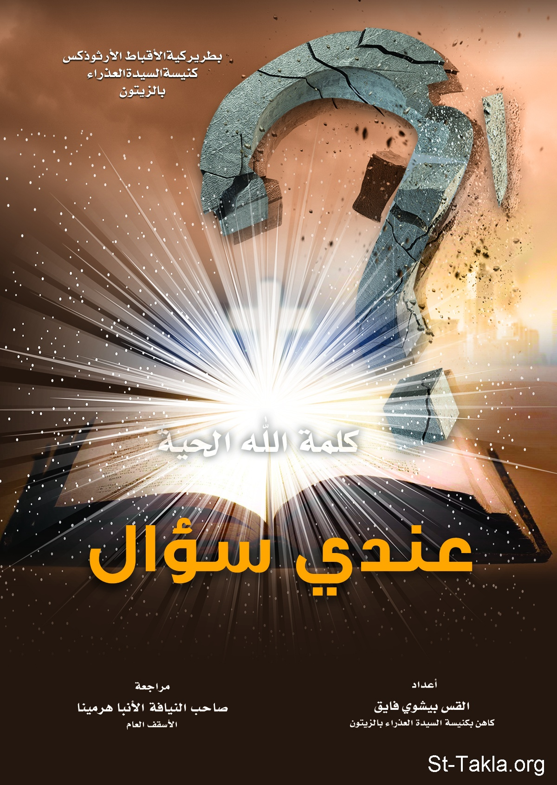

# عندي سؤال (الجزء الأول)

**المؤلف / Author:** القس بيشوي فايق
**المصدر / Source:** [st-takla.org](https://st-takla.org/books/fr-bishoy-fayek/question-1/index.html)
**الموضوعات / Topics:** —

📘 **[Download EPUB / تحميل الكتاب](question-1.epub)**

## نبذة

نشكر القس بيشوي فايق يوسف على السماح لنا في موقع الأنبا تكلا هيمانوت بوضع هذا الكتاب هنا.

## الفصول / Chapters (32)

1. [شكر واجب](chapters/01-acknowledgment/)
2. [مقدمة](chapters/02-introduction/)
3. [لماذا يلوم المسيح مَن لطمه وتفل عليه؟ هل اغتاظ أو غضب منه؟](chapters/03-01/)
4. [هل يحتاج الله أن يتجسد من مريم العذراء وهو الخالق (خالق الناسوت)؟](chapters/04-02/)
5. [هل يقبل الله التحدي؟ لو افترضنا جدلًا أن الرب يسوع المسيح قبل تحدي إبليس له، وحوَّل الحجارة إلى خبز فوق جبل التجربة، ألم يكن ذلك أفضل؟ فكم مِن الناس ستؤمن بألوهيته؟](chapters/05-03/)
6. [هل يعلم الابن (الرب يسوع المسيح) باليوم والساعة؟](chapters/06-04/)
7. [كيف تكون العذراء مكرسة من الصغر ونذيرة للرب منذ طفولتها، وهي في نفس الوقت مخطوبة للقديس يوسف النجار؟](chapters/07-05/)
8. [كيف أقبل بهذا الرب الذي يحب المذنبين والمجرمين والقتلة فيضحي بالبريء من أجل محو خطاياهم... فهل هذا عدل؟](chapters/08-06/)
9. [بما أن نوح يعتبر الأب الثاني للبشرية، فأنه قد ارتكب خطية كبيرة وهي أعظم من أكل آدم وحواء الثمرة، فلماذا لم ترث البشرية هذه الخطية؟](chapters/09-07/)
10. [لماذا تأخر الله كل هذا الوقت للتكفير عن خطية آدم وحواء؟](chapters/10-08/)
11. [هل توجد نبوات في العهد الجديد، أو القديم تقول أن الذبائح من آدم إلى المسيح ترمز للمسيح، إلا عند بولس الرسول الذي لم ير المسيح أو عاصره؟ وهل علم بولس الرسول بأسرار لم يعلمها غيره؟](chapters/11-09/)
12. [ما هي علاقة صوم الميلاد بصوم موسى النبي أربعين يومًا؟](chapters/12-10/)
13. [لماذا اختار الله وسطاء بينه وبين البشرية (المقصود الكهنة)؟ ولماذا لم يكن الاتصال بين الله والناس مباشرًا؟](chapters/13-11/)
14. [هل كهنة العهد الجديد وسطاء بين الله والناس؟](chapters/14-12/)
15. [لماذا سلطان الحل والربط من الكنيسة؟ هل هو للتحكم في الناس؟ ولماذا لا تكتفي الكنيسة بالنصيحة؟](chapters/15-13/)
16. [هل منهج التسليم والتقليد مقدسين، وما الدليل على ذلك؟](chapters/16-14/)
17. [الله لديه علم ومعرفة بكل شيء قبل حدوثه ويعلم من سيكون له نصيب في الملكوت ومن سيحرم منه: لماذا خلق الله الإنسان مع معرفته أنه سيسقط؟ لماذا خلق الإنسان مع معرفته أن البعض فقط "سيخلصون"؟ لماذا أرسل الآب المسيح ليموت بدلًا عن أناس عرف من البداية أنهم سيسقطون؟](chapters/17-15/)
18. [مَن الذي خلق الله؟](chapters/18-16/)
19. [ماذا كان يفعل الله قبل خلقته للإنسان؟](chapters/19-17/)
20. [لماذا خلق الله الخليقة؟](chapters/20-18/)
21. [كيف يشبه الكتاب الله بالحيوانات وخاصة بالخروف.. فهل الله في كل مجده يشبه بحيوان؟](chapters/21-19/)
22. [هل هناك مبدأ لتكافؤ الفرص في المسيحية، أو بمعنى آخر هل الله سيعطي كل شخص نصيبه على الأرض أم في السماء فقط؟ وهل سيظل كثيرون مظلومين إلى الموت؟](chapters/22-20/)
23. [هل انتهى دور ناموس موسى وشريعة ونبوات العهد القديم ولا داعي لدراسة أسفار العهد القديم؟](chapters/23-21/)
24. [لماذا منع الله أبانا آدم وأمنا حواء من الأكل من شجرة معرفة الخير والشر؟ ولماذا لم يقل لهما سبب عدم الأكل منها؟ وهل لهما عذر في السقوط؟ وإن لم يكن، فما الذي كان مفترضًا أن يجيبا به الحية حتى ينجوا من حيلتها الماكرة؟](chapters/24-22/)
25. [لماذا يعاقب الله الإنسان ولا يكتفي بنصحه؟ وهل عقوبات الله تتنافي مع رحمته؟](chapters/25-23/)
26. [لماذا تتميز شرائع العهد القديم بالأحكام القاسية مثل أحكام القتل بالرجم -مثلًا- بينما العهد الجديد يتميز بحنان الله وتسامحه مع الخطاة؟](chapters/26-24/)
27. [هل حكم الله بإبادة شعوبًا بأكملها بما فيهم النساء والأطفال يعتبر عدلًا؟](chapters/27-25/)
28. [البعض يتهم الله أنه كان يأمر شعبه بمحاربة الشعوب الأخرى فهل الله إله حروب؟](chapters/28-26/)
29. [هل إله العهد القديم يختلف عن إله العهد الجديد، فالأول قاسٍ والثاني حنون وشفوق؟!](chapters/29-27/)
30. [هل الموت وفساد الطبيعة الإنسانية عقوبة عادلة لخطية واحدة مثل الأكل من شجرة معرفة الخير والشر؟](chapters/30-28/)
31. [هل الله يقسي قلب فرعون أو يغوي آخاب الملك، أو يرسل عمل الضلال للناس؟ ما هو تفسير ذلك؟](chapters/31-29/)
32. [لماذا يسمح الله لأطفال أبرياء بالموت بطريقة بشعة، أو للأبرياء من النساء أو الشيوخ بموت رديء سواء كان بفعل البشر كما في الحروب أو بفعل الكوارث الطبيعة المدمرة؟](chapters/32-30/)

---
*هذا الكتاب مجاني للنشر والتوزيع لخلاص كل نفس. This book is free to share and distribute for the salvation of every soul.*
