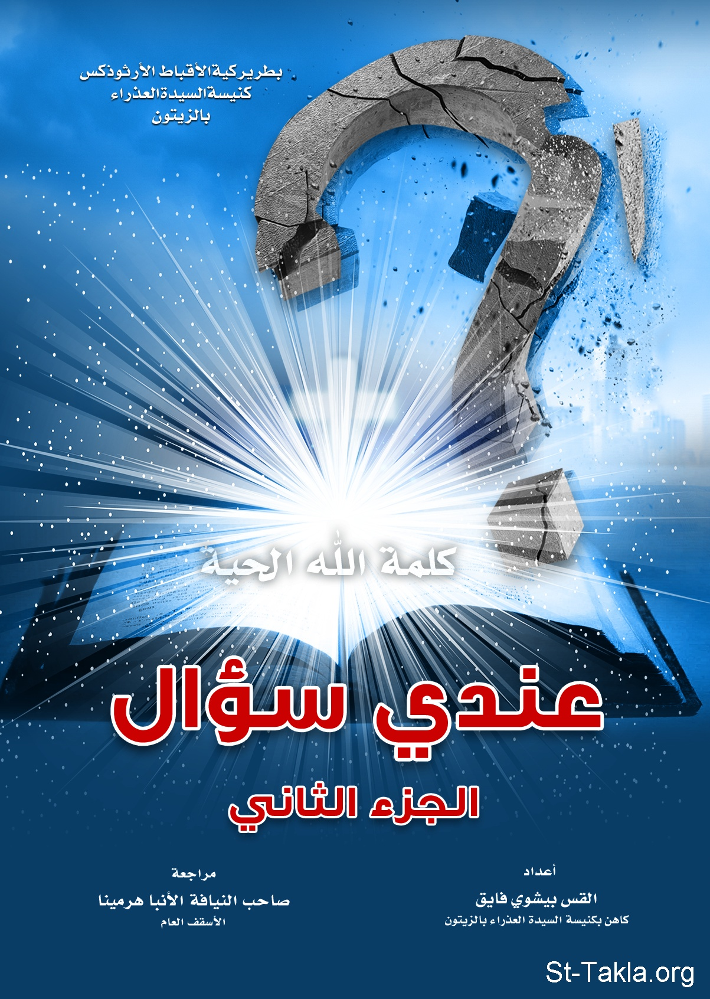

# عندي سؤال (الجزء الثاني)

**المؤلف / Author:** القس بيشوي فايق
**المصدر / Source:** [st-takla.org](https://st-takla.org/books/fr-bishoy-fayek/question-2/index.html)
**الموضوعات / Topics:** —

📘 **[Download EPUB / تحميل الكتاب](question-2.epub)**

## نبذة

نشكر القس بيشوي فايق يوسف على السماح لنا في موقع الأنبا تكلا هيمانوت بوضع هذا الكتاب هنا.

## الفصول / Chapters (21)

1. [مقدمة](chapters/01-introduction/)
2. [ما ذنب عيسو الذي أبغضه الله، ولم يحبه كيعقوب أخيه؟ ولماذا لم يقبل الله توبته حينما تاب؟ ولماذا فضل الله عليه أخاه يعقوب وهما في رحم أمهما: "لأَنَّهُ وَهُمَا لَمْ يُولَدَا بَعْدُ، وَلاَ فَعَلاَ خَيْرًا أَوْ شَرًّا، لِكَيْ يَثْبُتَ قَصْدُ اللهِ حَسَبَ الاخْتِيَارِ، لَيْسَ مِنَ الأَعْمَالِ بَلْ مِنَ الَّذِي يَدْعُو، قِيلَ لَهَا:«إِنَّ الْكَبِيرَ يُسْتَعْبَدُ لِلصَّغِيرِ». كَمَا هُوَ مَكْتُوبٌ:«أَحْبَبْتُ يَعْقُوبَ وَأَبْغَضْتُ عِيسُوَ».](chapters/02-01/)
3. [ينسب الكتاب المقدس لله صفات بشرية كالغضب، أو الندم والأسف. ألا يُعتبر ذلك لونًا من الضعف، الذي لا يليق بالله الخالق العظيم؟](chapters/03-02/)
4. [هل هناك تناقض بين: "كُلَّ مَنْ يَغْضَبُ عَلَى أَخِيهِ بَاطِلًا يَكُونُ مُسْتَوْجِبَ الْحُكْمِ، وَمَنْ قَالَ لأَخِيهِ: رَقَا، يَكُونُ مُسْتَوْجِبَ الْمَجْمَعِ، وَمَنْ قَالَ: يَا أَحْمَقُ، يَكُونُ مُسْتَوْجِبَ نَارِ جَهَنَّمَ" مع آية: "أَيُّهَا الْغَبِيَّانِ وَالْبَطِيئَا الْقُلُوبِ فِي الإِيمَانِ"، و توبيخ الرب الكتبة والكهنة والفريسيين في الإنجيل واصفًا إياهم بالرياء أو بالعمى أو.. أو... ألا يُعتبر ذلك نوع من الشتيمة والتي تنهي عنها وصايا الإنجيل؟](chapters/04-03/)
5. [لماذا أهان الرب المرأة الكنعانية عندما شبهها بالكلاب قائلًا: "لَيْسَ حَسَنًا أَنْ يُؤْخَذَ خُبْزُ الْبَنِينَ وَيُطْرَحَ لِلْكِلاَب"؟](chapters/05-04/)
6. [هل يصح أن يلعن إليشع النبي صِبْية صغار لأنهم هزأوا به، ألا ينم ذلك عن قساوة شديدة؟ ولماذا استجاب له الله، وأرسل دبتين من الوعر فافترستا منهم إثنين وأربعين ولدًا؟!](chapters/06-05/)
7. [لماذا ضرب الرب عُزَّةُ وأماته عندما مد يده ليسند تابوت العهد خوفًا عليه من السقوط؟ ألم يكن خوف عُزَّةُ على التابوت يعبر عن نية حسنة، ويحسب له على سبيل التكريم لتابوت عهد الله؟](chapters/07-06/)
8. [لماذا التركيز على خطية يهوذا، واعتباره خائن؟ ألا تُعتَبر خطية بطرس الرسول مثل خطية يهوذا؟ ولماذا نتغنَّى بتوبة بطرس الرسول بينما لا نُقَدِّر توبة يهوذا وندمه الشديد؟](chapters/08-07/)
9. [لماذا حكم الرب على يهوذا مُسلمه مسّبقًا بالويل؟ ولماذا يلام يهوذا مع أن الرب قد اختاره ليتمم به الفداء عندما أعطاه اللقمة، وقال له ما أنت فاعله، فافعله سريعًا؟](chapters/09-08/)
10. [كيف يحاسب الله مَن ولد، وتربى في وسط شرير؟ وما ذنبه في هذا الشر الذي وجد نفسه فيه دون إرادته؟](chapters/10-09/)
11. [هناك أناس لهم قلب طيب وأعمالهم صالحة مع أنهم لا علاقة لهم بالمسيح فهل أمثال هؤلاء يحرمهم الله من ملكوت السماء لأنهم لم يعتمدوا؟](chapters/11-10/)
12. [هل يمكن أن يسمح الله كأب حنون بعذاب الجحيم القاسي للأشرار؟ وهل لا يتعارض ذلك مع أبوته الحانية؟](chapters/12-11/)
13. [هل مجازاة الأشرار أبدية فيظل الأشرار يعاقبون دون شفقة إلى أبد الآبدين؟!! وهل لا يعتبر ذلك قسوة من الله الحنون؟](chapters/13-12/)
14. [هل من حكمة وراء ما تعانيه البشرية من أتعاب وأوجاع وآلام كثيرة؟](chapters/14-13/)
15. [هل الخطيئة حقًا هي السبب لآلام البشرية؟ ولماذا لم يتدخل الله لمنع أبوينا الأولين من السقوط فيها؟ وكيف تتسبب الخطية في الآلام؟](chapters/15-14/)
16. [هل الله هو المؤدب للبشر، أم هو المعاقب الذي يترقب أخطاءهم لينزل عليهم عقوباته؟ وهل الأمراض والكوارث هي غضب إلهي؟](chapters/16-15/)
17. [إن كانت الخطية وراء آلام البشر، فلماذا يتألم الأبرار الذين لم يخطئوا؟](chapters/17-16/)
18. [يشكك البعض في السلام، والفرح الداخلي الذي يتمتع به المؤمنون ويتساءلون: لماذا لا يكون ذلك وهمًا، وإيحاء صنعوه لأنفسهم؟](chapters/18-17/)
19. [يدعي البعض بأن ابتعاده عن الممارسات الروحية من صلاة وصوم وقراءة للكتاب المقدس و.. و... يجنبه مشاكل، ومتاعب كثيرة؛ لأن إبليس لن يجربه، أو يحاربه. فهل هذا حق؟](chapters/19-18/)
20. [كيف يطلب الشهداء القديسون من الله في السماء الانتقام ممن قتلوهم: "وَصَرَخُوا بِصَوْتٍ عَظِيمٍ قَائِلِينَ: «حَتَّى مَتَى أَيُّهَا السَّيِّدُ الْقُدُّوسُ وَالْحَقُّ، لاَ تَقْضِي وَتَنْتَقِمُ لِدِمَائِنَا مِنَ السَّاكِنِينَ عَلَى الأَرْضِ؟»"؟](chapters/20-19/)
21. [تبث وسائل الإعلام بين الحين والآخر مقاطع من التسجيلات المرئية لمتطرفين إرهابيين يقتلون بوحشية المؤمنين بالمسيح في أنحاء متفرقة من العالم... هل لو أتت ضيقات واضطهادات على جيلنا هذا... ترى من هم الذين سيثبتون للنهاية؟ وكيف أستعد أنا من الآن لمثل هذه الأزمنة الصعبة؟](chapters/21-20/)

---
*هذا الكتاب مجاني للنشر والتوزيع لخلاص كل نفس. This book is free to share and distribute for the salvation of every soul.*
